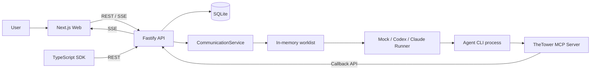

# TheTower

TheTower 是一个本地优先的多 Agent 协作平台。它把用户、Agent、消息、工具调用和交接过程统一放进可审计的 Thread，通过可见性规则、动态 worklist、Skills 和 MCP 工具组织 Codex CLI、Claude CLI 或 Mock Agent 的协作。

项目目前处于可运行的 MVP 阶段，包含完整 Web 工作台、Fastify API、SQLite 持久化、TypeScript SDK 和随 invocation 动态挂载的 MCP Server。

## 核心能力

- **多 Agent 调度**：通过 `@mention` 或结构化 `targetAgents` 创建 invocation，并用动态 worklist 顺序执行 Agent。
- **受控 A2A 协作**：支持公开/私密 callback、结构化 handoff、重复投递防护、深度限制和 ping-pong 阻断。
- **上下文隔离**：按 Thread 模式、消息来源、可见范围和 Agent 身份构造上下文。
- **本地 CLI Runner**：原生接入 Codex CLI 和 Claude CLI，保留 Mock Runner 供开发与测试使用。
- **Skills 注入**：按 worklist 位置、handoff 状态和关键词动态加载协作规范。
- **MCP 工具集**：为 Agent 提供协作消息、上下文读取、受限文件读写和白名单命令执行。
- **Workspace 边界**：Thread 可绑定可信项目目录；文件工具和命令工具均检查路径边界。
- **实时可观测性**：通过 SSE 展示消息、运行状态、工具调用、token usage、liveness 和 invocation 生命周期。
- **Web 工作台**：提供 Command、Threads、Agents、Capabilities、Telemetry、Workspaces、Tasks 和 Settings 页面。

## 系统概览



更完整的模块职责、数据模型和调用时序见 [当前项目架构](./docs/architecture/current-project-architecture.md)。A2A 的协议细节见 [当前 A2A 整体架构](./docs/architecture/current-a2a-architecture.md)。

## Monorepo 结构

```text
.
├── packages/
│   ├── shared/       共享领域模型、请求/响应和事件类型
│   ├── api/          Fastify API、SQLite、调度、Runner、Workspace 与 SSE
│   ├── sdk/          平台 HTTP Client 和 Agent Callback Client
│   ├── mcp-server/   invocation 级 MCP Server 与工具集
│   └── web/          Next.js 16 + React 19 管理与审计界面
├── skills/           内置协作 Skills 和 manifest
├── docs/             架构、设计、前端和阶段文档
├── scripts/dev.mjs   本地多进程开发启动器
└── agent-template.json
```

包依赖方向：

```text
web ───────> sdk ───────> shared
web ────────────────────> shared
api ────────────────────> shared
api ───────> mcp-server
```

## 快速开始

### 环境要求

- Node.js `>= 20`
- pnpm `>= 9`；仓库锁定的 package manager 为 `pnpm@11.7.0`
- 可选：本机 `codex` 或 `claude` CLI，用于真实 Agent 调用

### 安装与启动

```bash
pnpm install
pnpm dev
```

`pnpm dev` 会同时启动 MCP 构建监听、API 和 Web：

| 服务 | 默认地址 | 说明 |
| --- | --- | --- |
| Web | `http://127.0.0.1:5173` | Next.js 工作台 |
| API | `http://127.0.0.1:3001` | Fastify REST 与 SSE |
| SQLite | `packages/api/data/app.db` | 从仓库开发脚本启动时的默认数据库 |

打开 Web 后可以直接使用默认 Mock Agents，无需配置模型凭证。推荐流程：

1. 在 **Workspaces** 注册一个可信项目目录。
2. 新建 Thread 并绑定该 Workspace。
3. 在 **Agents** 保持 `mock` 做演示，或切换为本机已安装的 `codex` / `claude`。
4. 在 Command 或 Thread 中发送消息，例如 `@zavala 拆解这个需求，并交给合适的 Agent 继续。`
5. 在 **Telemetry** 查看 invocation、工具调用、运行状态和上下文投影。

### 单独启动

```bash
pnpm dev:api
pnpm dev:web
pnpm dev:mcp
```

注意：API 运行真实 CLI Agent 时需要已构建的 `packages/mcp-server/dist/index.js`。首次使用建议运行完整的 `pnpm dev`，或先执行 `pnpm --filter @the-tower/mcp-server build`。

## 常用命令

```bash
# 全仓类型检查
pnpm lint

# 全仓测试
pnpm test

# 全仓构建
pnpm build

# 文档 metadata、链接与真相源检查
pnpm docs:lint

# 根据 docs/metadata.json 重新生成文档入口
pnpm docs:generate

# CI 使用：检查 metadata、链接及生成入口是否同步
pnpm docs:check

# 单包验证
pnpm --filter @the-tower/api test
pnpm --filter @the-tower/mcp-server test
pnpm --filter @the-tower/web test
pnpm --filter @the-tower/sdk test
```

生产构建的 Playwright 浏览器门禁会自动构建 Web，并在隔离端口、临时数据库和临时 Agent catalog 上启动 API/Web：

```bash
pnpm test:migration
pnpm test:e2e
pnpm test:ci
```

`test:ci` 与 GitHub Actions 使用同一入口，依次执行文档门禁、lint、build、unit、integration、migration 和浏览器主链。当前 Playwright 覆盖创建 Thread、发送并展示 Mock CLI Output、Stop 并验证 Invocation 取消、private callback reveal、稳定 Provider 失败展示，以及 SSE 断线重连。

R0.8 提供三组发布验收工具：

```bash
# 会调用已登录的外部模型；运行前确认数据披露范围
pnpm test:e2e:real

# 在 SQLite backup 副本上演练，不修改源库
pnpm rehearse:migration -- --db /path/to/app.db --output /path/to/output

# 观察 agent_stream 行数与 payload 预算
pnpm observe:streams -- --db /path/to/app.db
```

详细前置条件、证据字段与退出码见 [R0.8 A2A isolation 验收手册](./docs/runbooks/r0.8-a2a-isolation-acceptance.md)。真实 Runner 验收不进入默认 CI，避免无凭证环境误调用外部模型。

## Agent 配置

默认模板位于 [`agent-template.json`](./agent-template.json)。API 首次启动时会生成：

```text
.the-tower/agent-catalog.json
```

运行时以 catalog 为准；通过 Web 或 API 修改 Agent 时，会同步更新 catalog、SQLite 和内存注册表。模板只负责首次初始化，不建议在 API 运行期间把它当作实时配置文件。

Agent provider 当前支持以下枚举值：

| Provider | 当前执行器 |
| --- | --- |
| `mock` | `MockRunner`，确定性本地响应 |
| `codex` | `CodexCliRunner`，调用本机 `codex exec --json` |
| `claude` | `ClaudeCliRunner`，调用本机 `claude -p --output-format stream-json` |
| `gemini` | 未实现；调度时返回 `unsupported_agent_provider` |
| `openai-api` | 未实现；调度时返回 `unsupported_agent_provider` |
| `custom` | 未实现；调度时返回 `unsupported_agent_provider` |

切换 Agent 示例：

```bash
curl -X PATCH http://127.0.0.1:3001/api/agents/zavala \
  -H 'content-type: application/json' \
  -d '{"provider":"codex","model":"gpt-5"}'
```

Codex、Claude 要求 Thread 绑定有效 Workspace；Mock 不要求。其余 Provider 只保留领域枚举和配置兼容，尚无可用 Runner。

## API 与 SDK 示例

健康检查：

```bash
curl http://127.0.0.1:3001/health
```

发送消息并启动 invocation：

```bash
curl -X POST http://127.0.0.1:3001/api/messages \
  -H 'content-type: application/json' \
  -d '{
    "content":"@ikora 分析方案，再请 @banshee 实现",
    "targetAgents":["ikora","banshee"],
    "routeMode":"serial"
  }'
```

订阅实时事件：

```bash
curl -N http://127.0.0.1:3001/api/events
```

平台侧 SDK：

```ts
import { TheTowerClient } from "@the-tower/sdk";

const tower = new TheTowerClient({ baseUrl: "http://127.0.0.1:3001" });

const result = await tower.postUserMessage({
  content: "@ikora 分析这个问题",
  projectPath: "/absolute/path/to/project",
});

const messages = await tower.getThreadMessages(result.threadId);
```

失败响应使用共享的稳定错误契约：

```json
{
  "error": "private callback requires at least one visible recipient other than the sender",
  "code": "private_recipient_required",
  "details": { "senderAgentId": "zavala" }
}
```

SDK 会抛出 `TheTowerApiError`，调用方应依据 `code` 分支处理，`error` 只用于展示和诊断。MCP callback client 同样保留服务端 `code` 与 `details`。

Agent callback 通常由动态挂载的 MCP Server 代为调用。需要直接使用 SDK 时：

```ts
const callback = tower.createAgentCallbackClient({
  invocationId: process.env.THE_TOWER_INVOCATION_ID!,
  callbackToken: process.env.THE_TOWER_CALLBACK_TOKEN!,
  agentId: process.env.THE_TOWER_AGENT_ID!,
});

await callback.postMessage({
  content: "@banshee 请继续实现",
  visibility: "private",
  visibleToAgentIds: ["banshee"],
});
```

## MCP 工具

MCP Server 默认提供：

| 类别 | 工具 |
| --- | --- |
| 协作 | `post_message`、`get_thread_context` |
| Workspace 文件 | `read_file`、`read_file_slice`、`list_files`、`write_file` |
| 命令 | `shell_exec` |

`shell_exec` 不是任意 shell：它只允许白名单命令，拒绝管道、重定向、变量展开、glob、shell substitution 和 Workspace 外路径。可通过 `THE_TOWER_MCP_PROFILE=full|collab-only|read-only` 缩小工具面。

## 关键环境变量

### 通用

| 变量 | 默认值 | 用途 |
| --- | --- | --- |
| `PORT` | `3001` | API 端口 |
| `HOST` | `127.0.0.1` | API 监听地址 |
| `APP_DB` | `<api cwd>/data/app.db` | SQLite 文件 |
| `PROJECT_ROOT` | 从 API cwd 推导仓库根目录 | 模板、catalog 和 Skills 根目录 |
| `AGENT_TEMPLATE_PATH` | `<projectRoot>/agent-template.json` | Agent 初始模板 |
| `THE_TOWER_API_URL` | `http://127.0.0.1:3001` | Runner/MCP callback 地址 |
| `THE_TOWER_API_TARGET` | `http://127.0.0.1:3001` | Next.js REST 代理目标 |
| `NEXT_PUBLIC_SSE_ORIGIN` | `http://127.0.0.1:3001` | 浏览器 SSE 直连 origin；设为空可走同源 |

### Workspace

| 变量 | 用途 |
| --- | --- |
| `THE_TOWER_PROJECT_ALLOWED_ROOTS` | 覆盖允许注册为 Workspace 的根目录列表 |
| `THE_TOWER_PROJECT_ALLOWED_ROOTS_APPEND=true` | 将自定义根目录追加到默认值，而不是覆盖 |
| `THE_TOWER_PROJECT_DENIED_ROOTS` | 追加禁止目录 |

当前代码中的默认 allowed root 为 `/Users/xuchenyang`，在其他机器上运行时应显式设置 `THE_TOWER_PROJECT_ALLOWED_ROOTS`。

### Codex Runner

| 变量 | 默认值 |
| --- | --- |
| `CODEX_CLI_BIN` | `codex` |
| `CODEX_AGENT_MODEL` | `gpt-5` |
| `CODEX_RUNNER_CWD` | API 进程 cwd |
| `CODEX_RUNNER_SANDBOX` | `read-only` |
| `CODEX_RUNNER_APPROVAL` | `untrusted` |
| `CODEX_RUNNER_MCP_ENABLED` | `true` |
| `CODEX_RUNNER_CALLBACK_NETWORK` | `false` |
| `CODEX_RUNNER_TIMEOUT_MS` | `300000` |

### Claude Runner

| 变量 | 默认值 |
| --- | --- |
| `CLAUDE_CLI_BIN` | `claude` |
| `CLAUDE_AGENT_MODEL` | `sonnet` |
| `CLAUDE_RUNNER_CWD` | API 进程 cwd |
| `CLAUDE_RUNNER_PERMISSION_MODE` | `default` |
| `CLAUDE_RUNNER_MCP_ENABLED` | `true` |
| `CLAUDE_RUNNER_TIMEOUT_MS` | `600000` |
| `CLAUDE_RUNNER_LIVENESS_STALL_AUTO_KILL` | `true` |

> 安全提示：真实 Runner 默认采用受限权限；扩大 Codex sandbox、Claude permission mode、callback network 或 MCP profile 都应是可信环境中的显式部署决策。

## 当前边界

- Worklist 与 EventBus 位于单个 API 进程内；进程重启后，运行中的 invocation 不能恢复。
- 当前只接受 `single` 和 `serial`；`fanout`、`parallel` 为历史协议值，新请求返回 `unsupported_route_mode`，真正并行尚未实现。
- SSE 事件日志、消息、invocation 和 runtime status 写入 SQLite；Telemetry 聚合、工具审计与执行恢复仍未形成统一的事务 outbox/Step 真相源。
- Workspace 文件树、Workspace 搜索、Agent 工具权限矩阵、Agent runtime 配置写入和完整配置审计仍是占位能力。
- API 默认仅允许本地 Web origin；非 loopback 绑定必须配置 Operator Token，但尚无面向多用户部署的 RBAC 与租户隔离。
- Callback grant 绑定 invocation 与 Agent，可选携带 stepId；持久 Step 状态机完成前仍不是完整的 Step-scoped 授权模型。

## 文档

- [项目 Roadmap](./docs/ROADMAP.md)
- [产品成熟度路线图](./docs/PRODUCT_MATURITY_ROADMAP.md)
- [文档总索引](./docs/README.md)
- [能力矩阵（发布能力真相源）](./docs/design/capability-matrix.md)
- [当前项目架构](./docs/architecture/current-project-architecture.md)
- [当前 A2A 整体架构](./docs/architecture/current-a2a-architecture.md)
- [Agent 交互协议](./docs/architecture/agent-interaction-protocol.md)
- [多 Agent 通信内核设计](./docs/architecture/multi-agent-communication-architecture.md)
