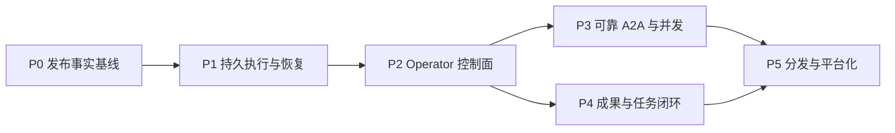

# TheTower 产品成熟度路线图

> 状态：Active  
> 基线日期：2026-07-22  
> 当前阶段：可信本地 MVP → 可发布 Beta  
> 产品边界：local-first、single-operator、多 CLI Agent 协作运行时

## 1. 文档定位

本文回答两个问题：

1. TheTower 距离成熟产品还缺哪些能力；
2. 应该以什么顺序补齐，才能形成可靠、可控制、可交付的产品闭环。

本文是产品层路线图，负责定义产品缺口、优先级、阶段目标、验收结果和产品指标。技术实施顺序、数据模型和架构约束继续以 [TheTower Roadmap](./ROADMAP.md) 为准；两者冲突时，应先修正文档，不允许长期保留两套事实。

配套真相源：

- [当前项目架构](./architecture/current-project-architecture.md)：当前代码事实；
- [能力矩阵](./design/capability-matrix.md)：能力是否真正支持；
- [TheTower Roadmap](./ROADMAP.md)：技术阶段、依赖和实施验收；
- 本文：产品成熟度、用户结果和发布门槛。

## 2. 执行摘要

TheTower 已经具备可靠 MVP 的大部分骨架：Thread / Message / Invocation、Codex 与 Claude Runner、A2A callback、私密可见性、Workspace 边界、SQLite 持久化、SSE 重放、Telemetry、SDK 和 Web 工作台。

当前阻碍产品成熟的不是页面或 Agent 数量，而是三个尚未闭环的结果：

1. **可靠执行**：崩溃、重启、取消和重试后，任务仍有唯一且可解释的状态；
2. **Operator 控制**：用户能配置、观察、停止、恢复和诊断每一次运行；
3. **成果交付**：用户能快速找到最终文件、报告、证据和决策，而不是在消息时间线中手工查找。

产品演进顺序：

在 P0–P2 完成前，产品对外阶段应保持为 MVP / Alpha；P0–P2 完成并通过真实运行验收后，可以进入可信 Beta。

## 3. 当前成熟度评估

| 维度 | 当前判断 | 主要依据 | 目标状态 |
| --- | --- | --- | --- |
| 核心协作 | 良好 | single/serial、callback、handoff、上下文隔离已实现 | 可靠、可恢复的 Step 状态机 |
| 执行可靠性 | 不足 | Worklist 在内存中，Step/Attempt/Edge 未持久化 | 崩溃点可恢复、操作幂等、无永久 running |
| 安全边界 | 本地场景良好 | Workspace realpath、symlink escape、callback grant、非 loopback token | 配置化权限、secret 管理、完整审计 |
| 可观测性 | 中等 | SSE、event log、runtime status、Telemetry 已有 | Step/Attempt/Tool trace、诊断包、权威状态投影 |
| Operator 控制 | 不足 | Stop 已有；Retry/Resume/Reset、runtime/tool 配置仍缺失 | UI 完成配置、恢复、预算和诊断闭环 |
| 产品交付 | 不足 | Thread/Task 已有；Artifact、Decision、Evidence 未建模 | 两次点击内找到成果及来源 |
| 测试发布 | 良好 | CI 已覆盖 lint/build/unit/integration/migration 和浏览器主链 | 干净 checkout 全门禁、真实 Runner 验收 |
| 安装运维 | 不足 | 依赖 Node/pnpm 和开发启动器 | 可安装、可升级、可备份恢复 |
| 多用户/远程 | 未就绪 | 当前是 local-first single-operator token 模型 | 独立立项，不在近期默认承诺 |

### 3.1 已验证的工程基线

2026-07-22 本地验证：

- 全仓 TypeScript 检查通过；
- 161 个单元测试通过；
- 3 个 API integration 测试通过；
- 全仓 production build 通过；
- `test:e2e` 已于 2026-07-22 切换为 production Playwright 主链，并纳入 GitHub Actions；
- 浏览器门禁覆盖 Web hydration、API 请求、健康代理、创建 Thread、发送、private callback reveal、Stop、稳定失败展示与 SSE 断线重连。

这说明项目已建立发布级 Mock 用户旅程门禁；真实 Codex/Claude Runner 和 isolation 验收仍是 Phase 0 的剩余发布基线。

## 4. 产品缺口与优先级

### 4.1 P0：发布前必须完成

#### A. 持久执行状态机

必须补齐：

- `invocation_steps`、`step_attempts`、`step_edges`；
- Step-scoped callback grant；
- Message、Invocation、Step、Event 的事务 Outbox；
- callback idempotency key；
- startup reconciler；
- `interrupted`、`retrying`、`blocked` 等明确状态；
- 安全 Retry、Resume 和 Force Reset 契约。

用户结果：API 强杀或机器重启后，不会出现无声丢失、重复执行或永久 `running`。

#### B. 发布门禁与契约真相源

必须补齐：

- GitHub Actions：lint、build、unit、integration、migration、browser E2E；
- Playwright 主链：onboarding、Workspace、Thread、send、Stop、private reveal、失败、重连；
- Codex/Claude 真实链路的最小验收；
- 稳定错误结构：`code`、`message`、`details`、`requestId`；
- HTTP、SDK、MCP 错误语义一致；
- README、能力矩阵、package scripts 和代码事实一致。

用户结果：产品声明的每项能力都可以自动或真实运行验证。

#### C. Operator 最小恢复能力

必须补齐：

- Run Strip：queued、spawning、working、silent、stalled、terminal；
- Stop、Retry、Force Reset；
- Force Reset 保留 Message、Artifact 和历史事件；
- 中断和恢复产生明确用户通知；
- orphan process 检测和清理。

用户结果：任务卡住时，用户不需要重启数据库或手工杀进程。

### 4.2 P1：可信 Beta 必须完成

#### D. 真实配置与权限控制

- Provider/CLI 安装、版本、登录状态和模型探测；
- Agent 级 sandbox、approval、timeout、token budget、concurrency；
- MCP profile、server 状态、工具 allowlist；
- Provider secret 只显示状态，不回显明文；
- 配置变更、tool denied、runtime failure 审计；
- token、时间和并发预算告警。

#### E. 首次使用与安装体验

- 首次启动向导；
- 明确区分 Mock 演示和真实 Agent ready；
- Workspace 选择和第一条测试任务；
- Provider probe 失败时给出可执行修复建议；
- 稳定的数据、配置和日志目录；
- 单命令安装或桌面发行物；
- macOS/Linux 基线验证，Windows 单独评估。

#### F. 成果、搜索与任务闭环

- Artifact、Decision、Evidence 成为一等实体；
- 聚合文件、报告、图片、commit/PR 和命令证据；
- Artifact 可回溯到 Message、Step 和 Tool event；
- Thread 全文搜索和 Workspace 文件搜索；
- Task–Thread 正规关联，不继续依赖 JSON 数组；
- Task 验收标准、依赖、阻塞原因、截止时间；
- 完成、失败、等待审批通知；
- 可重建的 Thread summary。

#### G. 数据生命周期

- SQLite 自动备份和手动导出；
- restore 演练；
- migration preflight、失败恢复和历史 fixture；
- event log / stream message retention；
- Thread 归档、恢复和永久删除分离；
- 数据库体积、磁盘余量和压缩维护；
- 诊断包默认脱敏。

### 4.3 P2：稳定版与扩展阶段

#### H. 可靠并发与 Worktree

- `fanout(maxConcurrency)` 真正并发；
- 显式 join/summary Step；
- Thread、Agent、Provider、Workspace 四级 semaphore；
- backpressure；
- 写任务默认使用 invocation worktree；
- 合并、冲突和清理可审计；
- 24 小时 soak test。

#### I. Provider 平台化

- `ProviderDescriptor` 和 Transport Registry；
- Provider conformance suite；
- Codex、Claude 先迁移到统一契约；
- 再评估 Gemini、API provider、ACP/A2A remote；
- Provider 不能控制 host-owned token、cwd、sandbox、network 和 secret policy。

#### J. 体验质量专项

- 键盘操作、焦点、ARIA、对比度；
- 小屏和窗口缩放；
- loading、empty、error boundary；
- 中英文术语统一；
- 大 Thread 分页/虚拟列表；
- SSE 高频更新合并；
- reduced-motion 和低性能设备验证。

#### K. 远程与多用户

该能力必须独立立项。至少需要：用户/session、Thread/Workspace ACL、CSRF/CORS、token rotation、secret store、rate limit、安全审计和备份隔离。完成前继续明确声明 local-first、single-operator。

## 5. 分阶段 Roadmap

### Phase 0：发布事实基线

**周期：1–2 周**  
**产品目标：所有“已支持”都有证据。**

交付：

1. CI 和真实 Playwright E2E；
2. 稳定错误码及 API/MCP/SDK parity test；
3. migration fixture；
4. README、能力矩阵和 Provider 描述校正；
5. 文档状态 metadata 和 superseded 标记；
6. 真实 Codex/Claude isolation 验收记录。

退出标准：

- 干净 checkout 可通过 `pnpm test:ci`；
- README 中所有命令真实可用；
- 主用户链和 SSE 重连进入浏览器 E2E；
- capability matrix 每个“支持”项都有测试或验收证据。

### Phase 1：持久执行与崩溃恢复

**周期：4–6 周**  
**产品目标：任何执行都不会无声丢失或永久卡死。**

交付：Step/Attempt/Edge、Outbox、持久 grant、幂等 callback、配置快照、startup reconciler、Retry/Resume 和中断通知。

退出标准：

- accepted、queued、running、callback-written、terminal 五个强杀点均有确定结果；
- 同一 callback 重试十次只有一次副作用；
- 取消后 grant 立即失效；
- 重启五秒内 UI 恢复服务端权威状态；
- 不存在无法解释的永久 `running`。

### Phase 2：完整 Operator 控制面

**周期：3–4 周**  
**产品目标：用户可以安全配置、观察、停止、恢复和诊断运行。**

交付：Run Strip、真实 runtime/tool 配置、Provider probe、预算、Agent audit、诊断包、首次使用向导。

退出标准：

- 常见安装、权限、超时和 Provider 故障无需查服务端日志；
- 任一失败 Run 可导出不含 secret 的诊断包；
- Force Reset 不减少历史消息和成果数量；
- Mock 与真实 Agent ready 状态不会混淆。

完成 Phase 0–2 后，产品可进入 **可信 Beta**。

### Phase 3：可靠 A2A 与受控并发

**周期：4–6 周**  
**产品目标：实现可证明的 serial、fanout 和 join。**

交付：持久 Scheduler、Step 输出契约、fanout、join、四级并发限制、backpressure 和 invocation worktree。

退出标准：

- 两个真实 Runner 有可测量并发重叠；
- 并发写不会直接污染主工作树；
- join 能表达成功、失败、取消和部分结果；
- 24 小时 soak test 无孤儿进程、重复 Step 或永久 running。

### Phase 4：成果、搜索与任务闭环

**周期：3–4 周，可与 Phase 3 后半段并行**  
**产品目标：用户首先看到交付物，其次才是过程。**

交付：Artifact/Decision/Evidence、成果面板、搜索、Task 正规关系、验收标准、通知和可重建摘要。

退出标准：

- 用户两次点击内找到主要成果和来源；
- 每个 Task 可明确判断完成、失败或阻塞；
- 摘要和索引可删除重建；
- Artifact 可以追溯到产生它的 Step 和证据。

### Phase 5：分发、数据运维与平台化

**周期：4–6 周**  
**产品目标：可安装、可升级、可恢复、可扩展。**

交付：发行物、稳定目录、备份恢复、升级流程、Provider Registry、conformance suite 和可选远程单操作员部署。

退出标准：

- 新机器从安装到 ready 小于 15 分钟；
- 备份恢复和 migration rollback 有演练记录；
- 新 Provider 无需修改核心调度分支；
- 未完成 ACL 前不宣称多用户能力。

## 6. 接下来三个 Sprint

每个 Sprint 最多一个 P0 架构主轴和一个产品副轴。

### Sprint 1：发布基线

| 优先级 | 工作项 | 完成定义 |
| --- | --- | --- |
| P0 | GitHub Actions + Browser E2E | 创建 Workspace/Thread、发送、Stop、private reveal、失败和重连进入 CI |
| P0 | 稳定错误契约 | HTTP/MCP/SDK 对核心错误返回相同 code |
| P1 | 文档真相源校正 | README 命令、Provider 支持状态、能力矩阵与代码一致 |
| P1 | 真实 Runner 验收 | Codex/Claude 各完成一条 isolation 主链并保留记录 |

### Sprint 2：Step 与事务边界

| 优先级 | 工作项 | 完成定义 |
| --- | --- | --- |
| P0 | Step/Attempt/Edge migration | Store、fixture、升级测试完成 |
| P0 | Transactional Outbox | Message + Invocation + Step + Event 无部分提交 |
| P0 | Step-scoped grant | 过期、取消、跨 Step 调用均被拒绝 |
| P1 | callback idempotency | 网络重试不重复消息、不重复路由 |
| P1 | 执行快照 | Workspace、Agent config、Skill 版本运行中不可漂移 |

### Sprint 3：恢复与控制

| 优先级 | 工作项 | 完成定义 |
| --- | --- | --- |
| P0 | Startup reconciler | 五个 crash point 均收敛到确定状态 |
| P0 | Retry / Force Reset | 用户可以恢复卡死运行，历史不丢 |
| P1 | Run Strip | 展示 queued/spawning/working/stalled/terminal 和阻断原因 |
| P1 | 中断通知 | 同 Thread 合并、重复启动不重复通知 |
| P1 | 诊断导出最小版 | 可导出脱敏状态、事件、route edge 和 runner 错误 |

## 7. 产品指标与发布门槛

### 7.1 可靠性指标

| 指标 | Beta 门槛 | 稳定版目标 |
| --- | --- | --- |
| 无法解释的永久 running | 0 | 0 |
| callback 重试重复副作用率 | 0 | 0 |
| 重启后状态收敛时间 | ≤ 5 秒 | ≤ 3 秒 |
| Stop 到终态延迟 P95 | ≤ 5 秒 | ≤ 3 秒 |
| orphan process | soak test 为 0 | 持续为 0 |

### 7.2 产品体验指标

| 指标 | Beta 门槛 |
| --- | --- |
| 新机器安装到 Mock ready | ≤ 5 分钟 |
| 新机器安装到真实 Provider ready | ≤ 15 分钟 |
| 首次成功任务完成率 | ≥ 90%（受支持环境） |
| 主要成果可发现性 | 两次点击内找到 Artifact 及来源 |
| 失败可诊断性 | 所有失败均有稳定错误码、阶段、建议动作 |

### 7.3 质量门禁

任何阶段只有同时满足以下条件才可标记 Released：

1. contract / ADR 已更新；
2. unit、integration、必要的 browser/runtime E2E 通过；
3. migration、回滚或兼容策略验证完成；
4. capability matrix 与当前架构同步；
5. 用户可以观察到结果、失败原因和下一步动作；
6. 真实 Runner 验收完成；
7. 没有用 prompt 规则代替服务端不变量。

## 8. 明确延后与非目标

在可信 Beta 前不优先投入：

- Redis、消息队列和微服务拆分；
- 大规模向量记忆；
- 插件市场；
- 大量新 Provider；
- 复杂 Agent 质量评分；
- 多用户远程协作；
- 无真实评测集支撑的自动摘要/语义分类系统。

当前最有价值的工作是让一次真实任务 **可恢复、可控制、可诊断、可验收**。

## 9. Roadmap 治理

- 本文按月或每个阶段结束时复核；
- 代码和自动化测试是当前能力事实，文档冲突时立即修正文档；
- 新功能必须归入一个阶段并说明用户结果；
- Explore 项不直接承诺发布日期；
- 每个 Sprint 最多一个 P0 架构主轴；
- 完成 Phase 0–2 前，不把产品阶段提升为可信 Beta；
- 多用户/远程能力必须重新进行威胁建模和独立立项。
