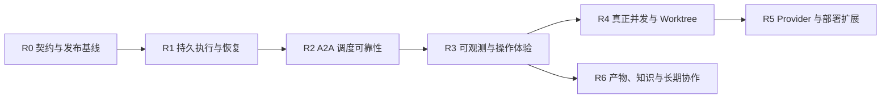

# TheTower Roadmap

> 状态：Active
> 基线日期：2026-07-13
> 产品阶段：可信单机多 Agent 运行时
> 参考实现：`/Users/xuchenyang/ai/clowder-ai` 当前代码、Roadmap、Feature Specs 与事故复盘

> 本文负责技术实施顺序、架构依赖和工程验收。产品缺口、用户结果、发布阶段与产品指标见 [产品成熟度路线图](./PRODUCT_MATURITY_ROADMAP.md)。

## 1. 路线结论

TheTower 的下一阶段目标不是快速增加 Agent、工具或页面数量，而是把当前已经可用的协作内核升级为一个**可恢复、可验证、可扩展的本地优先多 Agent 运行时**。

后续开发顺序固定为：

核心约束：

1. 在持久 Step 状态机完成前，不实现真正 `fanout` / `parallel`。
2. 在 Provider conformance suite 完成前，不增加新的“已支持 Provider”。
3. 在统一契约和 `OperationContext` 完成前，不继续为 HTTP、SDK、MCP 分别手写同一组参数。
4. 在真实使用证明需要之前，不引入 Redis、消息队列、微服务或重型向量记忆。
5. `handoffPayload` 保持兼容但不作为日常 A2A 的必填路径；普通协作优先使用 `content + targetAgents`。

## 2. 产品北极星

TheTower 面向一个清晰场景：

> 用户在可信 Workspace 中组织多个 CLI Agent 完成真实任务，并能知道谁在执行、看到了什么、做了什么、为何失败，以及重启后任务处于什么状态。

衡量项目是否进步，不看新增多少 Agent 或 MCP 工具，而看以下结果：

- 一次执行不会无声丢失、重复或永久卡在 `running`。
- A2A 消息不会串台，私密内容不会越权进入其他 Agent 上下文。
- UI 展示与服务端持久状态一致，断线和重启后可以恢复。
- Agent 失败、取消、超时和无正式输出都有明确终态。
- 新 Provider 通过统一契约接入，不需要继续扩大核心服务中的条件分支。
- 用户能从 Thread 直接找到执行结果、文件、证据和关键决策。

## 3. 当前基线

### 3.1 已完成

| 能力 | 当前状态 |
| --- | --- |
| Thread / Message / Invocation 基础模型 | 已实现并持久化到 SQLite |
| `single` / `serial` 调度 | 已实现，当前使用进程内 worklist |
| Codex / Claude / Mock Runner | 已实现统一事件接口、取消、超时与进程监督 |
| callback / MCP 正式写回 | 已实现 Bearer grant、Agent 绑定、公开/私密可见性 |
| A2A 结构化路由 | HTTP、SDK 与 MCP 支持 `targetAgents`；保留行首 mention 兼容路径 |
| 输出隔离 | `agent_stream` 与正式 `callback` 分离，默认 `play` 隐藏执行流 |
| ContextBuilder / VisibilityPolicy | 已成为 Agent 上下文和私密可见性的统一入口 |
| Workspace 文件边界 | 已有 realpath、allowed roots、symlink escape 和文件大小限制 |
| 事件重放 | SQLite event log、SSE id、heartbeat、Last-Event-ID replay 已完成第一轮 |
| Web 工作台 | 已有 Thread、Task、Workspace、Agent、Telemetry、能力目录和消息审计页面 |
| 自动化基线 | unit、API integration、lint、production build 可运行 |

### 3.2 尚未完成

| 缺口 | 影响 |
| --- | --- |
| Worklist、Step、Attempt 和 A2A edge 未持久化 | API 重启后无法恢复或准确解释执行状态 |
| Invocation 缺少持久 Step 状态机 | grant、运行态、retry 和 UI 仍缺统一最小执行单元 |
| 用户消息、Invocation、Step、Event 未通过事务 outbox 原子提交 | 崩溃点可能产生部分成功 |
| `fanout` / `parallel` 未真正并发 | 协议能力大于实际能力 |
| 浏览器 E2E 与 CI workflow 缺失 | UI 主链路没有发布级自动化门禁 |
| HTTP / SDK / MCP schema 仍可能漂移 | 已发生 `targetAgents` 在 API 存在、MCP 缺失的问题 |
| 启动 reconcile 与用户可见中断通知缺失 | 遗留 invocation 可能显示为仍在执行 |
| Provider 注册仍由核心代码控制 | 新 Provider 接入需要修改核心分支 |
| Thread 产物与长期知识没有稳定入口 | 用户需要从消息时间线手工找成果 |

## 4. 从 Clowder AI 借鉴什么

| Clowder AI 经验 | TheTower 决策 | Roadmap |
| --- | --- | --- |
| F048 Restart Recovery：先做启动收尸，再考虑完整队列恢复 | 先实现 SQLite reconcile 和用户可见中断，再实现可恢复 scheduler | R1 |
| F055 Structured Routing：结构化目标与文本路由迁移 | 保留 `targetAgents` 为主路径，行首 mention 为兼容和人类可读入口 | R0 / R2 |
| F189 Operation Context：多载体上下文单点化 | HTTP、MCP、SDK、A2A 使用同一契约与身份/权限上下文 | R0 |
| F220 A2A Reliability：可见、可靠、可恢复分层 | 分开解决 liveness、调度事实源和 force-reset，不用一个状态表示所有概念 | R1 / R2 / R3 |
| F224 Session/Message Reliability：不丢、不重、不乱 | 在 enqueue 时幂等，在消息层稳定标识，在 Provider 层显式声明 resume 能力 | R2 |
| F153 Observability：trace 必须覆盖真实执行边界 | 从 Run/Step/Tool 的真实时间和终态出发，不先堆大而全的 dashboard | R3 |
| F167 A2A Chain Quality：机械事实优于语义猜测 | 用 route event、tool activity、重复 edge 和无输出结果做防护，不构造复杂意图分类器 | R2 |
| F143 / F241 Hostable Provider：安全边界由 host 控制 | Provider 只能声明能力；token、MCP、cwd、sandbox、cancel 由 TheTower 注入和约束 | R5 |
| F236 Anchor-first Context：指针 + preview + drill | 长上下文和大工具结果采用可逃生的按需读取，不默认截断成不可恢复摘要 | R6 |
| F243 Docs Discovery：生成索引与同步门禁 | Roadmap、能力矩阵、ADR 和当前架构建立明确真相源与 CI 漂移检查 | R0 / R6 |

### 4.1 明确不照搬

- 不因 Clowder AI 使用 Redis 就提前引入 Redis；TheTower 先把 SQLite 单机事务和恢复做正确。
- 不复制媒体、金融、游戏、语音、社区运营等领域能力。
- 不把大量 prompt 规则当作调度正确性的替代品。
- 不强迫 Agent 为普通接力填写大型 `handoffPayload`。
- 不在 host 安全边界和 Provider 契约稳定前开放任意插件代码执行。
- 不先建“聊天记录向量库”；文档、Message、Event、Artifact 的事实关系先稳定。
- 不同时维护数十个活跃 Feature；每轮最多两个核心 Epic 处于开发中。

## 5. Roadmap 阶段

工期是单人主开发、正常 review 和测试条件下的相对估算，不是发布日期承诺。

### R0：契约统一与发布基线

**状态：进行中**  
**建议周期：1–2 个 Sprint**

实施进度：R0.1 callback canonical contract 与 R0.2 callback `OperationContext` 已于 2026-07-13 完成；R0.3 context/file tools canonical contract 已于 2026-07-14 完成；R0.5 stable service errors、R0.6 CI/release gate 与 R0.7 browser main journey 已于 2026-07-22 完成。API、MCP 与 SDK 共享消息、上下文、文件工具和错误响应契约；GitHub Actions 已覆盖 lint、build、unit、integration、migration，以及创建 Thread、发送、private callback reveal、Stop、SSE 重连和失败展示的浏览器主链。

目标：消除“某个载体支持、另一个载体漏字段”的协议漂移，让文档和发布门禁成为可信事实源。

主要交付：

1. [x] 为 callback 建立共享 Zod contract；API 与 MCP 从同一 schema 派生，SDK 类型从 schema 推导，不再复制字段。
2. [x] 在 `OperationContext` 边界明确后，为 context 和 file tools 收敛共享 contract。
3. [x] 定义 `OperationContext`：caller、thread、invocation、step、carrier、capabilities、trust level。
4. [x] HTTP callback 边界统一解析 MCP、A2A fallback 与直接 HTTP 载体，构造 `OperationContext`；domain service 不再信任请求体身份。
5. [x] 将服务错误改成稳定错误码，例如 `private_recipient_required`、`unknown_agent`、`unsupported_route_mode`；共享 `TowerErrorResponse`，SDK/MCP 保留 `code` 和 `details`，文案不作为客户端逻辑条件。
6. [x] 配置 GitHub Actions：lint、build、unit、integration、独立历史 fixture migration test、production browser smoke，并在失败时上传 Playwright diagnostics。
7. [x] 增加 Playwright 主链路：创建 Thread、发送、private callback、Stop、重连、失败展示。
8. [x] 完成 A2A isolation 的真实 e2e、历史 `agent_final` migration 演练与 stream 落库量观察。2026-07-22 本地实际库、自动化门禁及真实 Codex/Claude 验收全部通过；两份 Provider 报告均为 `terminalStatus=done`、11/11 checks 通过且 stream 无预算超限。
9. [ ] 校正 README、能力矩阵和旧 Phase 文档中的过期描述；旧设计文档明确标注 superseded 状态。
10. [ ] 为 roadmap 文档增加轻量 metadata/lint，生成文档入口而不是手工维护多份状态。

验收标准：

- 新增 callback 字段只需修改一个 canonical contract，API/MCP/SDK parity test 自动覆盖。
- HTTP 与 MCP 对相同输入返回相同错误码和语义。
- `pnpm test:ci` 在干净 checkout 中通过，包含真实浏览器 E2E。
- capability matrix 中每个“支持”能力都能指向自动化测试。
- A2A 输出隔离可在真实 Codex/Claude 链路复现并留存验收记录。

### R1：持久执行状态机与重启恢复

**状态：待开始**  
**建议周期：2–3 个 Sprint**  
**依赖：R0 canonical contracts**

目标：API 崩溃或重启后，不再出现无法解释的永久 `running`，每次 Agent 执行都有可审计 Step。

主要交付：

1. 新增 `invocation_steps`、`step_attempts`、`step_edges`、`callback_grants`、`outbox_events`。
2. Invocation 创建时持久化 Workspace、Agent 配置、Skill 版本与 route policy 快照。
3. 用户 Message、Invocation、初始 Step 和 outbox event 在同一事务内提交。
4. callback grant 绑定持久 `stepId`，Step 终止后立即失效。
5. callback 写入增加明确 idempotency key，重试不重复创建消息或派发 Step。
6. API 启动执行 reconciler：遗留 `queued/running/cancelling` 收敛为 `interrupted`，并向 Thread 写入一条合并后的可见系统通知。
7. 建立 retry/resume contract；第一阶段只支持安全重试，不承诺恢复真实 CLI 中间态。
8. force-reset 只清理执行状态和进程，不删除 Message、Artifact 或 Thread 历史。

验收标准：

- 在 accepted、queued、running、callback-written、terminal 五个崩溃点强杀 API，重启后均有确定状态。
- 同一 callback 重试 10 次只产生一条 Message 和一条有效 edge。
- 取消后 grant 不可继续发消息或访问文件。
- startup reconcile 对同一 Thread 的多个中断 Step 只生成一条用户可见通知。
- migration 有备份、升级、失败恢复和历史数据 fixture。

### R2：A2A 调度、会话与链路质量

**状态：待开始**  
**建议周期：2–3 个 Sprint**  
**依赖：R1 Step / Edge / Attempt**

目标：让 A2A 达到“不丢、不重、不乱”，并让 serial 的含义由服务端状态机保证。

主要交付：

1. 用持久 scheduler 替换 `WorklistRegistry` 作为历史真相源；内存结构只做执行缓存。
2. A2A 在 enqueue 时基于 invocation、source step、target、trigger message、route intent 合并，而不是执行时临时去重。
3. `serial` 下一 Step 只在前一步产生正式 callback 或结构化 `no_output` 后释放。
4. 每个 Step 必须以 `callback`、`no_output` 或 `failed` 之一结束，禁止“进程成功但协作区没有结果”的假成功。
5. 建立单一 liveness projection，由 Step/Attempt 派生 UI 状态、Agent 状态和 force-reset 判断。
6. ping-pong、虚空传球和重复 edge 使用机械事实检测：连续 edge、tool activity、输出长度、重复目标；不使用语义意图分类器。
7. 定义 Provider session policy：`stateless`、`resume`、`reborn`。只有通过 conformance 的 Provider 才可声明 resume。
8. 增加 session-chain MCP 查询，让 Agent 能查看当前 Step 的来源、剩余链路和阻断原因。

验收标准：

- serial 下一棒稳定读到上一棒正式结果，stream 不参与释放条件。
- 重复 callback、重复 mention 和网络重试不会生成重复 Step。
- 任何活跃 UI 状态都能追溯到一个持久 Step/Attempt。
- ping-pong 熔断写入明确 blocked reason，用户能从 UI 看到原因和链路。
- session resume/reborn 行为由 Provider conformance test 验证，而不是只检查 prompt。

### R3：可观测性与 Operator 控制面

**状态：待开始**  
**建议周期：2 个 Sprint**  
**依赖：R1；可与 R2 后半段交叉**

目标：用户能区分“正在启动、排队、工作、静默、卡死、失败”，并能安全恢复。

主要交付：

1. 为 Run、Step、Attempt、Tool 生成统一 trace/correlation id。
2. 记录真实 tool start/result/duration/status，不用零时长占位事件冒充执行 span。
3. 提供 Run Strip：当前 Agent、等待队列、Step 结果、Stop、Retry、Resume、Force Reset。
4. force-reset 入口只在活跃或疑似卡死时出现，必须确认，并明确“保留消息，只清运行态”。
5. 增加诊断包导出：状态快照、事件区间、route edges、脱敏后的 runner/tool 错误。
6. Prompt X-Ray 只保存版本、组成区块、token 估算与脱敏预览；默认不保存 secret 或完整隐私内容。
7. 建立 Thread read cursor 和 unread 状态的服务端真相源。
8. 对 startup latency、queue time、run time、callback latency、cancel latency、stuck count 建立轻量指标。

验收标准：

- A2A 路由后 500 ms 内出现 queued/spawning 可见状态。
- UI 刷新、SSE 重连和 API 重启后，5 秒内恢复服务端权威状态。
- Stop 无效或超时后，用户可通过 force-reset 恢复 Thread，历史消息数量不变。
- 任一失败 Run 可导出不含 token/secret 的诊断包。
- 指标用于描述事实，不在本阶段生成“Agent 质量分”。

### R4：真实 Fanout、Join 与 Worktree

**状态：规划中**  
**建议周期：3 个 Sprint**  
**依赖：R1 + R2 + R3 基础指标**

目标：提供受控、可测量、不会互相污染的并发协作。

主要交付：

1. 实现 `fanout(maxConcurrency)`，所有分支读取同一输入快照。
2. fanout 结果进入显式 join/summary Step，不依赖“最后完成的人顺便总结”。
3. 暂不单独实现 `parallel`；除非出现无法由 fanout 表达的产品语义，否则从公开契约移除或作为 alias。
4. 建立 Thread、Agent、Provider、Workspace 四级 semaphore 和 backpressure。
5. 写任务默认创建 invocation worktree；合并、冲突和清理成为显式可审计 Step。
6. 工作目录、skills、agent config 和 context snapshot 在 fanout 期间不可漂移。

验收标准：

- 两个真实 Runner 存在可测量并发重叠，且不超过配置上限。
- 分支不读取其他分支运行中的 stream 或未完成结果。
- 并发写任务不会直接污染主工作树。
- join Step 能区分成功、失败、取消和部分结果。
- 24 小时 soak test 无孤儿进程、永久 running 或重复 Step。

### R5：Provider 平台、部署与远程安全

**状态：远期规划**  
**建议周期：3–5 个 Sprint**  
**依赖：R1–R4**

目标：新 Agent runtime 能以声明式、可验证方式接入，同时保持 host-owned 安全边界。

主要交付：

1. 定义 `ProviderDescriptor`：process model、stream protocol、control channel、resume、tools、permissions、workspace、token usage。
2. 建立 `ProviderTransportRegistry`，逐步替换核心 provider switch。
3. 建立 conformance suite：probe、success、startup failure、stream parse、callback、cancel、timeout、workspace、token usage、denied capability。
4. 先迁移现有 Codex 和 Claude，再评估 Gemini CLI、ACP/A2A remote 或 API provider。
5. Provider 配置由通用字段渲染，不为每个 Provider 写独立 Settings 页面。
6. 插件只能引用 host allowlist transport；禁止插件获得 callback token、声明任意 sandbox 或执行任意安装脚本。
7. 提供 SQLite backup/restore、migration preflight、runbook 和单活部署示例。
8. 远程访问必须在 Operator auth、Thread ACL、session、CSRF/CORS、安全审计完成后单独开放。

验收标准：

- 新 Provider 无需修改核心调度分支即可注册，但必须通过完整 conformance suite。
- plugin/runtime 无法读取或制造 callback grant。
- cwd、MCP、sandbox、network 和 secret policy 全由 host 强制。
- 新机器从安装到本地 ready 小于 15 分钟。
- 完成备份恢复演练；未完成多用户 ACL 前继续明确声明 local-first、single-operator。

### R6：Artifacts、上下文效率与长期知识

**状态：探索**  
**依赖：R3 稳定事件与 R4 稳定执行关系**

目标：让 Thread 的成果比聊天过程更容易发现，并在不让 Agent“变瞎”的前提下降低上下文成本。

候选交付：

1. Thread Artifacts：聚合文件、图片、报告、commit/PR、命令证据并跳回来源 Message/Step。
2. Thread summary/distillation：摘要是派生物，原 Message 和 Event 保持真相源。
3. Anchor-and-drill 工具结果：路径、计数、preview、读取指针；永远提供一跳获取全文的逃生口。
4. 文档发现：为 ADR、Roadmap、Feature/Plan 增加 metadata、生成索引和 CI sync gate。
5. 只有当跨 Thread recall 有真实查询和评测集后，才增加 lexical/semantic/hybrid knowledge index。
6. Task–Thread 关系规范化，Artifact、Decision 和 Evidence 可挂到 Task。

验收标准：

- 用户从 Thread 在两次点击内找到主要交付物及来源。
- anchor 模式相对全文模式显著降低 token，同时漏判率不增加。
- 摘要和索引可以重建，不成为第二套不可追溯真相源。
- 记忆检索上线前有 cold-start、precision、漏判和过期知识评测。

## 6. 接下来三个 Sprint

### Sprint A：契约与验收闭环

| 优先级 | 工作项 | 完成定义 |
| --- | --- | --- |
| P0 | Shared callback contract + API/MCP parity test | ✅ 2026-07-13：`targetAgents` 等字段不再多处复制；新增字段漏接会红测 |
| P0 | Callback `OperationContext` | ✅ 2026-07-13：caller 从 Bearer grant 派生；消息、上下文和文件工具不再信任 body `agentId` |
| P0 | Context/file tools canonical contract | ✅ 2026-07-14：API、MCP、SDK 共享输入/响应 schema，并校验 callback 响应 |
| P0 | 结构化错误码 | ✅ 2026-07-22：API/MCP/SDK 共享错误 contract，并保留 private recipient、unknown agent、unsupported mode 的稳定 code/details |
| P0 | A2A isolation 真实 e2e | Codex/Claude 至少各完成一条 private/stream/play/debug 验收链 |
| P1 | Browser E2E + CI | 创建 Thread、发送、Stop、private reveal、重连主链进入 CI |
| P1 | 文档真相源校正 | README、能力矩阵、当前架构与旧 phase 状态一致 |

### Sprint B：Step 与事务边界

| 优先级 | 工作项 | 完成定义 |
| --- | --- | --- |
| P0 | `invocation_steps` / `attempts` / `edges` migration | Store、fixture、upgrade test 完成 |
| P0 | Step-scoped persisted grant | grant 跨 Step、过期和取消后调用均被拒绝 |
| P0 | Transactional outbox | Message + Invocation + Step + Event 崩溃测试无部分写入 |
| P1 | callback idempotency | 重试不重复消息、不重复路由 |
| P1 | Workspace/config/skills snapshot | Invocation 运行期间配置修改不影响当前 Step |

### Sprint C：重启恢复与操作面

| 优先级 | 工作项 | 完成定义 |
| --- | --- | --- |
| P0 | Startup reconciler | 五个 crash point 均收敛到确定状态 |
| P0 | 用户可见 interruption 通知 | 同 Thread 合并通知、重启重复执行不重复发消息 |
| P1 | Run Strip + Force Reset | 用户能 Stop、Retry 和清理卡死运行态，历史不丢 |
| P1 | 单一 liveness projection | UI、Telemetry、Agent status 不再各自推断“谁在跑” |
| P1 | Restart/soak harness | 自动强杀、重启和重复回调场景可持续运行 |

## 7. Roadmap 治理

### 7.1 状态定义

| 状态 | 含义 |
| --- | --- |
| Explore | 问题和价值尚在验证，不承诺实现 |
| Planned | 范围、依赖、验收标准已明确 |
| Ready | 前置依赖完成，可进入开发 |
| In Progress | 有明确 owner 和当前工作分支 |
| Automated Verified | 自动化验收通过，但真实运行验收未完成 |
| Released | 自动化、真实运行、migration/runbook 和文档全部完成 |

### 7.2 完成定义

任何 Roadmap 项只有同时满足以下条件才能标记 Released：

1. canonical contract / ADR 已更新；
2. 代码实现完成；
3. unit、integration、必要的 browser/runtime e2e 通过；
4. migration、回滚或兼容策略已验证；
5. capability matrix 与当前架构文档已更新；
6. 用户可观察到结果或明确错误；
7. 不以 prompt 规则代替服务端不变量。

### 7.3 变更规则

- Roadmap 只维护阶段目标、依赖和验收，不承载每日任务日志。
- 每个 Sprint 最多一个 P0 架构主轴和一个可并行 P1 产品轴。
- 新功能必须说明进入哪个阶段；无法归类时先进入 Explore，不直接写代码。
- 阶段结束后把详细实施证据移入对应 ADR/plan，Roadmap 只保留结论和链接。
- 每月或每个阶段结束时复核一次；代码事实与 Roadmap 冲突时，以代码和自动化测试为准，并立即修正文档。

## 8. 关联文档

- [当前项目架构](./architecture/current-project-architecture.md)
- [当前 A2A 整体架构](./architecture/current-a2a-architecture.md)
- [架构可靠性与交互整改开发计划](./design/architecture-reliability-remediation-plan.md)
- [能力矩阵](./design/capability-matrix.md)
- [A2A 输出隔离升级实施记录](./architecture/a2a-isolation-upgrade-implementation.md)
- [Clowder AI 产品架构调研](./architecture/cat-cafe-product-architecture-research.md)
- [Clowder AI Skill/MCP 差距分析](./architecture/clowder-skill-mcp-gap-analysis.md)
