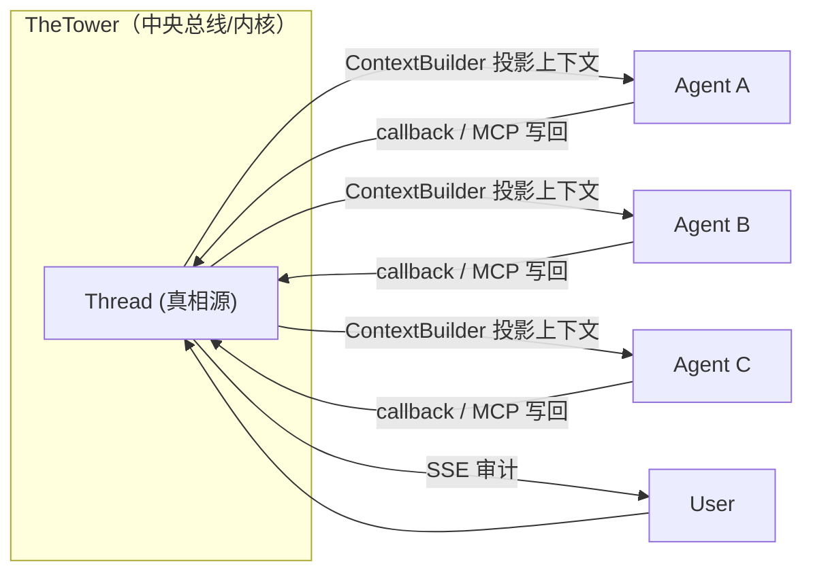
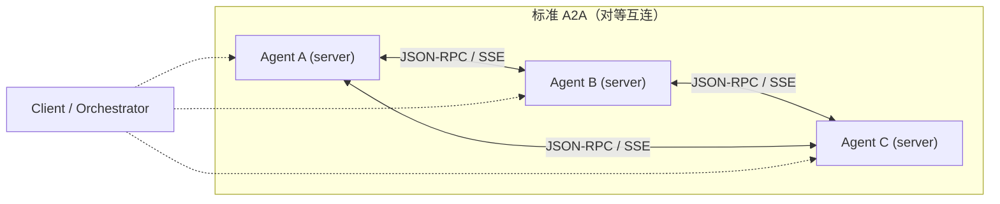

# TheTower Agent 交互协议：理论说明

生成时间：2026-07-02

本文从**理论层面**刻画 TheTower 内部的 Agent 交互协议——它的抽象、拓扑、寻址、消息语义、生命周期、可见性、写回通道、治理规则——并与业界标准 **A2A（Agent2Agent）协议**对照，说明二者的根本差异与定位分工。

本文不描述具体 API 路由或代码实现（见 [当前项目架构文档](./current-project-architecture.md) 与 [当前 A2A 整体架构说明](./current-a2a-architecture.md)），只刻画协议的"语法与语义"。

## 1. 摘要与定位

TheTower 协议是一个**协作内核协议（collaboration-kernel protocol）**，不是一个**互操作线路协议（interoperability wire protocol）**。

- 标准 A2A 协议回答的问题是："两个独立部署、各自自治的 Agent 服务，如何通过网络互相发现并调用？" 它定义的是线路层：JSON-RPC over HTTP/SSE、Agent Card 发现、Task 抽象、流式与推送。它**刻意不规定编排**——谁决定路由、谁治理可见性、如何串联多 Agent，都不在 A2A 范畴。
- TheTower 协议回答的问题是："一组 Agent 在一次用户请求里如何**被治理地协作**？" 它定义的是编排层：共享 Thread 作真相源、中央 Worklist 调度、可见性裁决、Skills 行为约束、回调写回。Agent 在这里是**被调起的工人**，不是持久自治的服务。

一句话：**A2A 是 Agent 之间的互操作契约；TheTower 是 Agent 之上的协作治理内核。** 二者不在同一层，也不互相替代——见 §15 的定位分工。

## 2. 设计目标与约束

TheTower 协议的设计由以下约束驱动：

1. **Agent 是黑箱外部进程**：Agent 是本机 CLI（`codex`/`claude`）或 mock，平台无法侵入其内部状态。所有协作必须经由"写回到共享总线"显式化。
2. **协作必须可审计**：用户要能看到 private 消息、callback 写回、worklist 推进、agent 事件流。因此协作不能是 Agent 间的私下点对点调用。
3. **协作必须可治理**：要能防止 ping-pong、循环、重复唤醒、ack 抖动。因此路由不能由 Agent 单方面决定。
4. **上下文必须可控可见**：同一 thread 里不同 Agent 看到的内容可以不同。因此上下文不能是"谁调用谁就拿到全部"。
5. **单进程 MVP**：暂不引入分布式调度，但协议本身要为后续分布式留好语义边界。

这些约束直接决定了协议形态：**中央总线 + 受控回调**，而非 A2A 的**对等直连**。

## 3. 核心抽象

| 抽象 | 含义 | A2A 对应物 |
| --- | --- | --- |
| **Thread** | 协作真相源，一条有序消息流。所有 Agent 共享同一 thread。 | A2A 无共享 thread 概念；每次 `SendMessage` 是独立调用，状态由被调 Agent 自持。 |
| **Message** | thread 中的一条记录，带 `origin` / `visibility` / `handoffPayload` / `extra`。 | A2A `Message`（`role` + `parts`）；TheTower 的 Message 字段更面向审计与可见性。 |
| **Invocation** | 一次用户请求触发的协作执行单元，含 `targetAgents` / `routeMode` / `depth`。 | A2A `Task`（有生命周期状态）。语义相近但 Invocation 强调"一轮编排"。 |
| **Worklist** | Invocation 内的 Agent 执行队列（进程内），带 `currentIndex` / `depth` / `maxDepth` / `pingPong`。 | A2A 无对应；编排不在 A2A 范畴。 |
| **Agent** | 注册表条目，含 `mentionHandles` / `provider` / `model` / `persona`。 | A2A `AgentCard`（含 skills/security_schemes/endpoint）。TheTower 的 Agent 不暴露 endpoint。 |
| **HandoffPayload** | 结构化交接五件套（what/why/tradeoff/openQuestions/nextAction）。 | A2A 无结构化 handoff；仅靠 `Message.parts` 自由承载。 |
| **Visibility** | public / private / revealed，加 `visibleToAgentIds`。 | A2A 无可见性概念——发给某 Agent 的内容该 Agent 即可见。 |
| **Skills** | 行为协议层，约束 Agent 如何交接/接球/review/收尾。 | A2A `AgentSkill` 是能力声明（描述能做什么），不是行为约束。 |

## 4. 通信拓扑





**TheTower：星型 / 总线型。** 平台是唯一中介。Agent 之间**永远不直接通信**——A 想让 B 接手，只能写一条 callback 消息到 thread，由平台裁决后把 B 推进 worklist。任何 Agent 间的"对话"都是经过 thread 的间接对话。

**A2A：对等网状。** 每个 Agent 是一个持久服务，暴露 JSON-RPC endpoint。调用方（可以是另一个 Agent，也可以是编排器）直接向被调方发起 `SendMessage`。状态由被调方自持，调用方只收到 Task 状态与产出。

这一拓扑差异是其余所有差异的根源。

## 5. 寻址与路由

### TheTower

- **寻址**：`@handle` mention。Agent 在注册表里登记 `mentionHandles`，平台解析消息文本中的行首 `@handle` 得到目标 Agent id。Agent 之间也用行首 `@handle`，但解析更严格（`parseA2AMentions`，只认行首、最长 handle 优先、支持 `@a @b` 链式），避免 stdout 里的 `@` 误触发。
- **结构化寻址**：callback / API 可显式带 `targetAgents`，绕过文本解析。
- **路由模式 `routeMode`**：`single` / `serial` / `fanout` / `parallel`。默认推断：单目标 `single`，多目标 `fanout`。
- **路由决策权**：在平台。Agent 文本里的 `@` 是"路由请求"，是否真正推进 worklist 由 `WorklistRegistry.push` 的治理规则裁定（见 §10）。`fanout`/`parallel` 下 Agent 普通文本**默认不继续路由**，避免重复唤醒已在 worklist 中等待的 Agent。

### A2A

- **寻址**：Agent URL + Agent Card（`/.well-known/agent.json` 或 `GetExtendedAgentCard`）。调用方按 URL 直连。
- **路由决策权**：完全在调用方。A2A 不规定谁调用谁、何时调用；编排逻辑外部化。

**差异本质**：TheTower 的 `@` 是"对总线的指令"，由总线裁决；A2A 的调用是"对端的直接请求"，对端即执行。前者天然可治理，后者天然不可治理（除非在外部包一层编排器，而那层编排器本质上就是 TheTower 想做的事）。

## 6. 消息模型

### TheTower Message

```text
Message {
  senderType: user | agent | system
  origin: user | agent_stream | callback | tool | system | briefing
  visibility: public | private
  visibleToAgentIds?: string[]      // private 时限定可见 Agent
  revealedAt?: number              // private 被 reveal 后全员可见
  handoffPayload?: HandoffPayload  // 结构化交接
  extra?: { isExplicitPost, chunkType, ... }  // 流式 chunk / 显式发言标记
  replyTo?: string                 // 公开回复引用（受 canQuoteInPublicReply 约束）
  deliveryStatus: queued | delivered | canceled
}
```

`origin` 是审计的关键维度：区分用户消息、Agent 流式输出、callback 写回、tool 输出、系统消息、briefing。`extra.isExplicitPost` 区分"Agent 显式发言"与"流式 chunk"。消息体是单一 `content: string`（Markdown），多模态不在 MVP 范畴。

### A2A Message

```text
Message {
  role: ROLE_USER | ROLE_AGENT      // 纯方向：client→server / server→client
  parts: [TextPart | FilePart(Raw) | DataPart | URL]  // 多模态
  taskId, messageId, contextId
}
```

A2A 的 `role` 只是方向（client/server），无 origin/visibility 之分；`parts` 原生支持多模态（文本、二进制、结构化数据、URL）。

### 对照

| 维度 | TheTower | A2A |
| --- | --- | --- |
| 正文承载 | 单一 `content` string | `parts[]` 多模态 |
| 方向/来源 | `senderType` + `origin`（六值） | `role`（二值） |
| 可见性 | public/private/revealed + `visibleToAgentIds` | 无 |
| 结构化交接 | `HandoffPayload`（五件套） | 无专用载体，靠 `DataPart` 自由承载 |
| 引用 | `replyTo`（受公开引用规则约束） | `messageId` 链 / `contextId` |
| 产出 | 消息即产出 | `Task` + `Artifacts`（结构化产出） |

TheTower 牺牲了多模态与 Artifacts，换来了可见性与审计语义；A2A 反之。

## 7. 任务 / 调用生命周期

### TheTower Invocation

```text
Invocation {
  status: queued | running | done | failed | cancelled
  targetAgents[]
  routeMode: single | serial | fanout | parallel
  depth           // 当前 A2A 深度
}
```

生命周期由 `executeWorklist` 驱动：`queued` → `running`（worklist 推进）→ `done`/`failed`/`cancelled`。`depth` 与 `maxDepth=10` 是协议级的循环防护。无 `input_required`/`auth_required` 状态——因为 Agent 是被调起的进程，不存在"等待用户补充输入"的中断态（用户输入会开启新的 Invocation）。

### A2A Task

```text
TaskState: SUBMITTED | WORKING | COMPLETED | FAILED | CANCELED | INPUT_REQUIRED | REJECTED | AUTH_REQUIRED
```

A2A 有 `INPUT_REQUIRED`（Agent 暂停等用户补充）、`REJECTED`（Agent 拒绝）、`AUTH_REQUIRED`（需鉴权）——这些状态反映 A2A 的 Agent 是**持久自治服务**，可以主动暂停、拒绝、要求鉴权。TheTower 的 Agent 是**无状态被调进程**，没有这些自主性，故无需对应状态。

## 8. 上下文与可见性（TheTower 独有）

这是 TheTower 与 A2A 最大的语义分歧。

**A2A 模型**：每个 Agent 自持上下文。调用方 `SendMessage` 时把想给的内容放进 `parts`，被调 Agent 自己管理历史。协议不保证两个 Agent 看到一致的世界。

**TheTower 模型**：Thread 是唯一真相源，但每个 Agent 看到的是**经 `ContextBuilder` + `VisibilityPolicy` 投影后的视图**：

- `public` 消息对所有 Agent 可见。
- `private` 消息仅 `visibleToAgentIds` 可见。
- `revealedAt` 后 private 对全员可见。
- `briefing` 默认不进普通上下文。
- `thinking` stream chunk **永不跨 Agent**（即使 debug 模式）。
- `play` 模式下 `agent_stream` 仅 sender 可见；`debug` 模式共享。
- `handoffPayload` 只注入给目标 Agent。

关键性质：**Runner 初始 prompt 与 callback `get_thread_context` 走同一入口**，所以 Agent 无论何时读取上下文，都拿到一致的、按身份过滤的视图。private 消息无法被非 recipient Agent 通过 callback 偷读。

A2A 没有等价物。这在 TheTower 是必需的——因为多个 Agent 共享同一 thread，若没有可见性裁决，就无法做"私密交接""部分公开 review"这类协作。

## 9. 写回通道

### TheTower

Agent 写回平台有两条等价通道，语义完全一致：

1. **MCP 工具**（首选）：`mcp__thetower__post_message` / `get_thread_context` / `read_file` / `write_file` / `shell_exec`。MCP server 作为 Agent 子进程的工具挂载，每轮注入 per-invocation env。
2. **HTTP callback**（fallback）：`POST /api/callbacks/post-message` / `GET /api/callbacks/thread-context` / `POST /api/callbacks/tools/*`。

两条通道都经 callback token 鉴权、都过相同的 A2A 治理规则、都写同一 thread。callback 不是"调另一个 Agent"，而是"向总线写一条消息（并可能请求路由）"。

### A2A

写回即调用对端 Agent 的 JSON-RPC 方法：`SendMessage`（同步）/ `SendStreamingMessage`（流式）/ `SubscribeToTask`。被调方是另一个自治 Agent 服务，不是总线。

### 对照

| 维度 | TheTower | A2A |
| --- | --- | --- |
| 写回目标 | 中央 thread（总线） | 对端 Agent 服务 |
| 写回方法 | `post_message`（callback/MCP） | `SendMessage` / `SendStreamingMessage` |
| 读上下文 | `get_thread_context`（受可见性投影） | 无——调用方自带上下文进 `parts` |
| 同步语义 | 写回即追加消息，路由异步推进 | `SendMessage` 同步返回 Task 状态/产出 |
| 流式 | Agent 事件流仅推 UI 审计 | `SendStreamingMessage` 把 Task 产出流回调用方 |

注意：TheTower 用 MCP 做 Agent↔平台回调，这恰好落在 **MCP 的设计意图（Agent↔工具）** 上，而非 A2A 的意图（Agent↔Agent）上。TheTower 把"平台"建模为 Agent 的工具集，而不是把别的 Agent 建模为对端服务。这是有意的架构选择（见 §14）。

## 10. 协作治理（TheTower 独有）

A2A 不规定治理——它信任调用方自己组织。TheTower 把治理做进协议：

1. **深度限制**：`depth < maxDepth(=10)`，超限中止，防无限接力。
2. **ping-pong 阻断**：跟踪最近 `(from,to)` 对，警告阈值 2、阻断阈值 4，防两 Agent 互相点名死循环。
3. **pending 去重**：同一目标已在 worklist 等待则不再重复入队。
4. **caller 校验**：`WorklistRegistry.push` 要求 caller 是 `currentIndex` 处的 Agent，防伪造他人发起路由。
5. **ack 短路**：`shouldRouteAgentText` 命中 ack-only 词（收到/ok/done/thanks…）则不路由，防 ack 抖动扩散。
6. **fanout/parallel 不重复路由**：这些模式下 Agent 普通文本默认不解析 A2A，避免唤醒已在队列里的 Agent。
7. **callback 去重**：同 invocation+agent+内容+visibility+mentions+replyTo 命中既有消息则不重复写入、不重复路由。
8. **公开引用约束**：`canQuoteInPublicReply` 禁止在 public 回复里引用未 reveal 的 private / briefing。

这些规则共同把"协作"从"可能失控的自由交互"约束成"可预测的有界编排"。

## 11. 流式与事件

### TheTower

- **Agent 事件流**（`AgentEvent`：thinking/stream_text/text/tool_call/token_usage/error/done）由 Runner 产生，`handleAgentEvent` 落库为 `agent_stream` 消息并经 `EventBus` 发 `agent.event`/`agent.status` 等 SSE 事件。
- **SSE 的消费者是用户/UI**，用于审计，不是其他 Agent。Agent 之间不通过 SSE 互传。
- 当前 `CodexCliRunner` 只读 final message，未做 token 级流式（边界见架构文档）。

### A2A

- `SendStreamingMessage` 把 Task 的中间状态与产出**流回调用方**（通常是另一个 Agent 或编排器）。流式是协作通道的一部分。

差异：TheTower 的 SSE 是"旁路审计"，A2A 的流式是"协作数据通道"。两者用途不同——TheTower 不让 Agent 实时消费彼此的流，正是为了维持可见性边界（stream chunk 默认不跨 Agent）。

## 12. 鉴权

### TheTower

- **per-invocation callback token**：每次 Invocation 签发一个随机 token（sha256 入库，1h TTL）。Runner 经 `AgentRunInput.callbackToken` 拿到，注入给 Agent 子进程与 MCP server 的环境变量。
- Token 不进用户可见消息，只作进程环境变量存在。
- Agent 之间不互相鉴权——因为它们不互调，只调平台。

### A2A

- **per-agent security schemes**：Agent Card 声明 `security_schemes`（OAuth2/API key/HTTP 等）与 `security_requirements`。调用方按对端 Agent 的 scheme 鉴权。
- Agent Card 可带 `signatures`（JWS）做卡片完整性签名。

差异反映拓扑：TheTower 鉴权的是"这次 invocation 能否写回"，A2A 鉴权的是"你能否调用我这个 Agent 服务"。前者是会话级、中央签发；后者是服务级、对端自管。

## 13. 与标准 A2A 的对照表

| 维度 | TheTower 协议 | 标准 A2A 协议 |
| --- | --- | --- |
| 定位 | 协作治理内核 | 互操作线路协议 |
| 拓扑 | 星型/总线（平台中介） | 网状 P2P（Agent 直连） |
| Agent 形态 | 被调起的无状态进程 | 持久自治服务 |
| 发现 | 注册表 + `@handle` | Agent Card (`/.well-known/agent.json`) |
| 路由决策 | 平台（Worklist + routeMode） | 调用方自行决定 |
| 真相源 | 共享 Thread | 各 Agent 自持 |
| 上下文投影 | ContextBuilder + VisibilityPolicy | 无（调用方带 parts） |
| 可见性 | public/private/revealed | 无 |
| 消息体 | 单 content (Markdown) | parts[] 多模态 |
| 结构化交接 | HandoffPayload | 无专用载体 |
| 任务状态 | queued/running/done/failed/cancelled | submitted/working/completed/failed/canceled/input_required/rejected/auth_required |
| 写回方法 | post_message (callback/MCP) | SendMessage / SendStreamingMessage |
| 鉴权 | per-invocation callback token | per-agent security schemes + JWS |
| 流式 | SSE 旁路审计（给 UI） | SendStreamingMessage 协作通道（给调用方） |
| 治理规则 | depth/ping-pong/dedup/ack-short-circuit/routeMode-gating | 无（外部化） |
| 行为约束 | Skills（协议级行为层） | AgentSkill（能力声明，非约束） |

## 14. 与 MCP 的关系

TheTower 同时使用了 MCP，但用的是 MCP 的**本义**——Agent ↔ 工具。平台对 Agent 暴露的工具集（`post_message`/`get_thread_context`/文件/shell）就是把"平台能力"建模为工具。文件/shell 工具是**薄代理**，真权限边界在平台（发 `workspace.file_tool` 审计）；`shell_exec` 在 Agent 进程本地跑但有独立沙箱。

因此 TheTower 的协议栈是：

```text
Agent ──(MCP, agent↔tools)── 平台总线 ──(内部编排)── 多 Agent 协作
```

而**不是**：

```text
Agent ──(A2A, agent↔agent)── Agent
```

TheTower 刻意不在 Agent 间用 A2A，因为：可见性、治理、审计都要求"经过总线"。若未来要让 TheTower 接入外部自治 Agent 服务，正确做法是在**总线层**为那个外部 Agent 包一个 A2A 适配器（让平台用 A2A 调它，把它产出的消息写回 thread），而不是把内部协议改成 A2A。

## 15. 理论定位

把两个协议放进同一张坐标图：

- **横轴：协议层**。A2A 是线路/互操作层（wire/interop）；TheTower 是编排/治理层（orchestration/governance）。
- **纵轴：自治性**。A2A 假设 Agent 自治、持久、可寻址；TheTower 假设 Agent 无状态、被调起、不可寻址。

二者关系是**正交且可叠加**，而非竞争：

- 一个系统可以同时用 A2A（连外部自治 Agent）和 TheTower（治理内部协作）。
- TheTower 可以**成为** A2A 调用方：当某个内部 Agent 实际上是外部 A2A 服务时，Runner 实现成 A2A client 即可，对内仍是 worklist 的一棒。
- 反过来，A2A **不试图**解决 TheTower 解决的问题（可见性、worklist、ping-pong、handoffPayload）。如果一个 A2A 编排器要解决这些，它就是在重新发明 TheTower。

所以理论结论：**TheTower 不是 A2A 的替代或竞争者，而是 A2A 之上一层的协作治理语义，二者在不同层解决不同问题。** TheTower 选择"总线 + 受控回调"而非"对等直连"，是为了换取可见性、治理与审计——这三者是对等协议天然给不了的。

## 16. 局限与未来演进

当前协议的已知局限（理论层面）：

1. **Agent 间无实时通道**：Agent 不能流式地把中间产出给另一个 Agent，只能写 final/callback。这是可见性边界带来的代价。
2. **单进程 worklist**：`WorklistEntry` 带进程内 `AbortController`，非 wire 类型，无法跨进程。分布式化时需把 worklist 提升为可序列化状态 + 分布式锁。
3. **无多模态**：`content` 为 string。需要时可把 `Message` 升级为 `parts[]`（向 A2A 看齐）而不破坏可见性语义。
4. **无 INPUT_REQUIRED 语义**：Agent 不能在协作中途请求用户补输入。若需要，可加 `input_required` 作为 Invocation 状态或一种 callback origin。
5. **无跨 thread 协作**：worklist 绑定单 thread。跨 thread 任务编排（Task 已有 threadIds 字段）尚未在协议层贯通。
6. **SSE 无 catch-up**：`EventBus` 是内存 ring buffer，重启即失、重连无 `lastEventId` 续传。

未来若要接入外部自治 Agent，建议在 Runner 层引入 **A2A adapter**（platform 作为 A2A client 调用外部 Agent Card），把外部 Agent 的产出翻译成 `callback` origin 消息写回 thread——这样可见性与治理规则自动适用，无需改动内核协议。

## 附：协议要素速查

- **寻址**：`@handle`（行首）、`targetAgents`（结构化）。
- **路由**：`routeMode` = single | serial | fanout | parallel。
- **可见性**：public | private | revealed；`visibleToAgentIds`。
- **来源**：origin = user | agent_stream | callback | tool | system | briefing。
- **交接**：HandoffPayload（what/why/tradeoff/openQuestions/nextAction/evidenceRefs/riskLevel）。
- **调用**：Invocation（queued/running/done/failed/cancelled）+ Worklist（depth/maxDepth/pingPong）。
- **写回**：`post_message`（callback/MCP，支持 targetAgents/routeMode/visibility/handoffPayload/replyTo）+ `get_thread_context`。
- **鉴权**：per-invocation callback token（sha256，1h TTL）。
- **治理**：depth limit / ping-pong block / pending dedup / caller validation / ack short-circuit / fanout no-re-route / callback dedup / public-quote guard。
- **事件**：`ServerEvent` = message.created/updated · invocation.updated · worklist.updated · callback.write · agent.event/status/token_usage/liveness · workspace.resolved/file_tool。
