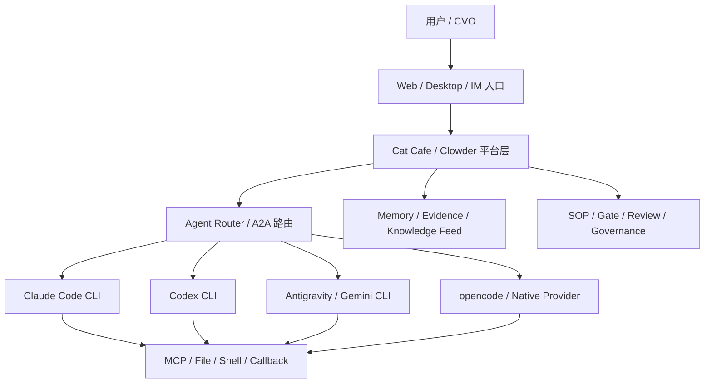

# Cat Cafe / Clowder AI 产品架构与技术方案调研报告

调研对象：

- 教程仓库：[zts212653/cat-cafe-tutorials](https://github.com/zts212653/cat-cafe-tutorials)
- 开源源码仓库：[zts212653/clowder-ai](https://github.com/zts212653/clowder-ai)

调研时间：2026-06-24

## 1. 调研结论

`cat-cafe-tutorials` 是 Cat Cafe / Clowder AI 的官方教程与项目复盘仓库。`clowder-ai` README 将 Tutorials 指向该仓库，教程 README 也明确声明 Cat Cafe 已开源，源码位于 `zts212653/clowder-ai`。

Cat Cafe 原本是一个真实使用中的多 AI Agent 协作工作台，后续抽取并开源为 Clowder AI。它不是简单的聊天 UI，也不是传统 Agent SDK 封装，而是一个 AI 团队协作平台层。

核心判断：

- 产品定位：多模型 AI Agent 团队协作平台。
- 技术路线：CLI 子进程 + 流式解析 + MCP 回传，而不是纯 API 或 SDK 编排。
- 架构思想：没有 Boss Agent，采用对等判断层 + 结构化执行层。
- 工程方法：Feature 双环、跨模型 review、TDD、Evidence Gate、Merge Gate、文档真相源。
- 教程价值：`cat-cafe-tutorials` 不是普通使用手册，而是从真实事故、架构演进和工程复盘中提炼出来的官方教程。

## 2. 项目定位

Cat Cafe / Clowder AI 的目标是把 Claude、Codex/GPT、Gemini、opencode 等不同 Agent CLI 放到同一个协作空间，让它们像一个团队一样工作。

它解决的问题不是“如何调用一个大模型”，而是：

- 多个模型如何在同一任务中分工协作。
- 不同 Agent 如何保持身份、角色、记忆和上下文边界。
- 如何避免人类变成复制粘贴上下文的路由器。
- 如何让 AI 交付流程可审计、可 review、可复盘。
- 如何把一次次踩坑沉淀成系统能力。

项目中的人类角色被定义为 CVO，即 Chief Vision Officer。CVO 负责愿景、决策和反馈，系统负责组织 Agent 进行调研、讨论、实现、review、验证和沉淀。

## 3. 产品架构

产品整体可以拆成六层：



主要产品模块：

| 模块 | 作用 |
| --- | --- |
| Chat | 多线程、多 Agent 聊天主界面，支持 `@mention` 路由 |
| Hub | 系统控制台，包含账号、能力、Quota、Skills、Routing Policy、Governance 等 |
| Mission / Backlog | Feature 生命周期、需求审计、任务状态、SOP 流程追踪 |
| Agent Sessions | 每只 Agent 的会话、上下文和运行状态管理 |
| Memory / Evidence | 长期记忆、证据索引、知识晋升 |
| Skills | 按需加载的行为协议，如 review、TDD、debugging、handoff |
| Voice | ASR/TTS、每猫声线、自动播放 |
| Signals | AI/技术信息流、研究、播客生成 |
| Games | 狼人杀、Pixel Cat Brawl，用于验证 A2A、身份、回合协调 |
| Connectors | 飞书、Telegram、企业微信、钉钉等多平台入口 |
| Governance | Quality Gate、Merge Gate、证物 Gate、愿景守护 |

## 4. 核心架构理念：没有 Boss Agent

项目最关键的架构选择是没有中央 Boss Agent。

教程第 12 课将其描述为两层架构：

1. 对等判断层：不同 Agent 可以相互 `@`、质疑、review、否决，没有中心 Agent 垄断内容判断。
2. 结构化执行层：底层仍有 InvocationQueue、Session Strategy、Hooks、worktree、Redis、共享文档等基础设施约束。

这和主流 Boss + Sub-agent、状态图编排、角色 Pipeline 不同。Cat Cafe 更强调“多模型独立判断，再交叉校准”，用不同模型的盲区差异做质量保障。

其背后的判断是：

- 中央编排会把中心 Agent 的偏见放大全局。
- 多模型并行调研可以降低锚定效应。
- 跨模型 review 可以发现单模型自审难以发现的问题。
- 摩擦和争论是系统判断力在运作，不是需要完全消除的噪声。

## 5. 技术栈

源码仓库是 TypeScript monorepo。

| 包 | 技术 | 作用 |
| --- | --- | --- |
| `packages/web` | Next.js 14、React 18、Tailwind、Zustand、Socket.IO client | 前端工作台 |
| `packages/api` | Fastify、Socket.IO、Redis、SQLite、OpenTelemetry | 后端 API、Agent 调用、路由、数据服务 |
| `packages/mcp-server` | MCP SDK、Zod | Agent 可调用的 MCP 工具服务 |
| `packages/shared` | TypeScript schema/types | 前后端共享类型、协议和 schema |
| `packages/finance` | TypeScript | 金融相关扩展包 |
| `desktop` | Electron | 桌面端封装 |
| `cat-cafe-skills` | Markdown/YAML | Skills 行为协议库 |

重要依赖：

- Fastify、WebSocket、Socket.IO
- Redis / ioredis
- better-sqlite3、sqlite-vec
- MCP SDK
- node-pty
- OpenTelemetry
- Next.js、React、Zustand
- CodeMirror、Mermaid、Phaser
- Lark、Telegram、WeCom、DingTalk 相关 SDK

## 6. Agent 调用方案

这是该项目最核心的技术方案。

项目最初考虑过 SDK，但最终选择：

```text
CLI 子进程模式 + 流式解析 + MCP 回传
```

选择 CLI 而不是 SDK 的原因：

1. CLI 能复用用户已有 Claude Max / ChatGPT Plus / Gemini 等订阅额度。
2. CLI 保留完整 Agent 能力，包括文件操作、命令执行、MCP 工具。
3. 子进程天然隔离，CLI 崩溃不会直接拖垮主服务。
4. 各厂商 CLI 可以独立升级，平台只适配输出协议。

对应 ADR：

- [ADR-001 Agent 调用方式选择](https://github.com/zts212653/clowder-ai/blob/main/docs/decisions/001-agent-invocation-approach.md)

典型适配方式：

| Agent | 调用方式 | 输出 |
| --- | --- | --- |
| Claude | `claude -p --output-format stream-json` | stream-json / NDJSON |
| Codex | `codex exec --json` | JSON event stream |
| Gemini | `gemini --acp` 或 fallback | NDJSON / ACP |
| Antigravity | `agy --print` | plain text |
| opencode | opencode adapter | ndjson |
| Native Provider | opt-in API provider | 轻量任务路径 |

后端通过统一的 `AgentService.invoke()` 抽象屏蔽差异，并把原始事件转换为统一 `AgentMessage`。

关键基础设施包括：

- `spawnCli()`：统一子进程管理。
- `parseNDJSON()`：统一流式 JSON 解析。
- `CliTransformer`：不同 CLI 原始事件到统一消息格式的转换层。
- `AbortSignal`：支持取消。
- stderr 活跃检测：避免 Claude 等 CLI 把 thinking 输出到 stderr 时被误判为超时。

## 7. A2A 协作与路由

A2A 的核心是 `@mention` 路由。

用户或 Agent 可以在消息中 `@` 某只猫，系统解析 mention 后进入 AgentRouter，再调用对应 AgentService。

早期系统存在两条路径：

- Worklist 链。
- Callback 触发。

后来由于无限 ping-pong、不可取消、多 mention 丢失等问题，统一为共享 worklist 路径。

参考教程：

- [第 4 课：多猫路由](https://github.com/zts212653/cat-cafe-tutorials/blob/main/docs/lessons/04-a2a-routing.md)

关键机制：

- `@mention` 解析。
- thread 隔离。
- worklist 调度。
- 深度限制，防止递归。
- AbortSignal / Stop 支持。
- 多 mention 支持。
- callback 统一进入协作管道。

## 8. MCP 回传方案

项目不是只让 Agent 被动响应，而是通过 MCP 工具让 Agent 主动回传。

MCP Server 位于 `packages/mcp-server`，工具包括：

- callback tools
- memory tools
- evidence tools
- session chain tools
- signal study tools
- schedule tools
- shell/file tools
- game action tools
- hub action tools

Agent 可通过 MCP：

- 发送消息。
- 查询上下文。
- 写入记忆。
- 发布 evidence。
- 发起 A2A。
- 操作任务、日程、游戏、Signal、音频等能力。

参考教程：

- [第 5 课：MCP 回传](https://github.com/zts212653/cat-cafe-tutorials/blob/main/docs/lessons/05-mcp-callback.md)

## 9. 记忆与知识架构

项目没有把“记忆”简单做成聊天记录向量库，而是三层。

### 9.1 文档是真相源

长期知识保存在人和 Agent 都能读、都能改、都能追溯的文件中：

| 目录 | 作用 |
| --- | --- |
| `docs/features/` | 每个 Feature 的目标、边界、AC、演化 |
| `docs/decisions/` | 重大架构决策和取舍 |
| `docs/discussions/` | 讨论收敛上下文 |
| lessons / lessons-learned | 事故、教训和可复用方法 |

### 9.2 索引是编译产物

文档是真相源，SQLite 是索引产物。

- `evidence.sqlite`：项目层证据索引。
- `global_knowledge.sqlite`：全局知识索引。
- 检索模式：lexical、semantic、hybrid。
- 排序策略：RRF rank fusion。
- 过期知识：通过 `superseded_by`、`invalidates` 等关系处理。

### 9.3 Lesson 是可执行经验

Lesson 不是一句“以后注意”，而是结构化知识：

- 坑。
- 根因。
- 触发条件。
- 修复。
- 防护。
- 来源锚点。
- 原理。

知识晋升管道：

```text
对话候选
→ Knowledge Feed
→ captured / normalized / approved / materialized / indexed
→ 写回 Markdown 真相源
→ 重建索引
```

参考教程：

- [第 14 课：越犯错越聪明](https://github.com/zts212653/cat-cafe-tutorials/blob/main/docs/lessons/14-learning-from-mistakes.md)

## 10. Feature 交付流程

产品研发流程是双环。

### 10.1 Discovery Loop

```text
CVO 采访
→ Research Pipeline
→ 多猫讨论收敛
→ 图稿 / 架构外化
→ Feature Spec / ADR
```

价值：

- 不把用户第一句话当完整需求。
- 先追问隐藏需求。
- 先调研外部方案和已有实现。
- 让多模型独立判断后再交叉校准。
- 把模糊共识变成可验证结构。

### 10.2 Delivery Loop

```text
Design Gate
→ Worktree
→ TDD
→ Quality Gate
→ 跨家族 Review
→ Merge Gate
→ 愿景守护
```

价值：

- 防止 AI 直接跳到写代码。
- 用独立 worktree 隔离功能开发。
- 通过 TDD 约束高速生成代码。
- Review 不只看代码能不能跑，还看是否贴合愿景。
- 合入前要求证据和门禁。

参考教程：

- [第 13 课：一句话到交付](https://github.com/zts212653/cat-cafe-tutorials/blob/main/docs/lessons/13-from-sentence-to-ship.md)

## 11. 工程治理方案

该项目非常重视工程纪律。

| 治理点 | 方案 |
| --- | --- |
| Worktree 隔离 | 每个 Feature 独立 worktree，避免互相污染 |
| Redis 隔离 | 避免开发动作误伤生产数据 |
| TDD | 每个 Feature 以测试驱动 |
| Quality Gate | 不只看 AC，还要回看 Feature 愿景 |
| Evidence Gate | 不接受“我做了”，必须提交命令、输出、SHA 等证物 |
| Review Gate | 写代码和 review 尽量跨模型 |
| Merge Gate | lint、test、build、gate 全绿后合入 |
| 文件/目录卫生 | 文件行数和目录文件数有上限检查 |
| Signed Commit | commit 带 Agent 签名，便于追溯 |

参考教程：

- [第 15 课：跑了 54 天为什么没崩](https://github.com/zts212653/cat-cafe-tutorials/blob/main/docs/lessons/15-why-still-running.md)

## 12. 产品技术亮点

1. 不是 Agent SDK，而是 Agent CLI 协作平台。
2. 不是 Boss Agent，而是对等判断 + 结构化执行。
3. 不是单纯 RAG，而是文档真相源 + SQLite 索引 + 知识晋升。
4. 不是聊天机器人，而是覆盖研发、review、任务、记忆、语音、IM、游戏的工作台。
5. 工程治理比多数 demo 型 multi-agent 项目成熟，特别是 evidence gate、worktree 隔离、Redis 保护、跨模型 review。
6. 教程内容不是理想化路径，而是围绕事故复盘展开，可信度较高。

## 13. 风险与挑战

### 13.1 系统复杂度高

Agent CLI、MCP、Redis、worktree、skills、provider profile 都会增加理解和部署成本。

### 13.2 CLI 适配脆弱

各厂商 CLI 输出格式或参数变化会影响解析，需要持续维护 adapter。

### 13.3 本地环境依赖重

Node、pnpm、Redis、各类 CLI、账号登录、权限、端口都可能成为部署门槛。

### 13.4 多 Agent 协作成本高

对等架构能减少单点偏见，但也需要强 SOP 和门禁，否则容易变成聊天噪声。

### 13.5 文档驱动有维护成本

文档是真相源是优点，但如果文档漂移，系统判断会被污染。

## 14. 适合借鉴的设计

如果要从 Cat Cafe / Clowder AI 中抽取可复用方案，优先级如下：

1. CLI 子进程适配层：适合需要复用用户订阅额度和 CLI agent 能力的产品。
2. 统一 AgentMessage 协议：适合多模型、多 CLI 接入。
3. MCP callback：适合让 Agent 主动把信息写回系统。
4. 文档真相源 + SQLite 索引：适合长期演进项目的记忆体系。
5. Feature 双环：适合 AI 参与产品研发的工程流程。
6. 跨模型 review：适合降低单模型盲区。
7. Evidence Gate：适合约束 Agent 的“自证完成”问题。

## 15. 总体评价

Cat Cafe / Clowder AI 是一个高度工程化的 multi-agent 协作平台。它的核心价值不在“接了多个模型”，而在于把多个模型组织成一个可审计、可 review、可记忆、可持续交付的团队。

`cat-cafe-tutorials` 的价值在于完整解释了这套系统为什么这样设计，包括 SDK 到 CLI 的转向、A2A 路由事故、MCP 回传、上下文工程、知识管理、语音链路、无 Boss Agent 架构、Feature 双环和工程门禁。它适合作为 Cat Cafe / Clowder AI 的官方教程和架构复盘材料。

## 16. 主要参考链接

- [cat-cafe-tutorials README](https://github.com/zts212653/cat-cafe-tutorials/blob/main/README.md)
- [clowder-ai README](https://github.com/zts212653/clowder-ai/blob/main/README.md)
- [教程目录](https://github.com/zts212653/cat-cafe-tutorials/blob/main/docs/lessons/README.md)
- [ADR-001 Agent 调用方式选择](https://github.com/zts212653/clowder-ai/blob/main/docs/decisions/001-agent-invocation-approach.md)
- [CLI 集成架构](https://github.com/zts212653/clowder-ai/blob/main/docs/architecture/cli-integration.md)
- [第 4 课：多猫路由](https://github.com/zts212653/cat-cafe-tutorials/blob/main/docs/lessons/04-a2a-routing.md)
- [第 5 课：MCP 回传](https://github.com/zts212653/cat-cafe-tutorials/blob/main/docs/lessons/05-mcp-callback.md)
- [第 12 课：没有 Boss Agent](https://github.com/zts212653/cat-cafe-tutorials/blob/main/docs/lessons/12-no-boss-agent.md)
- [第 13 课：一句话到交付](https://github.com/zts212653/cat-cafe-tutorials/blob/main/docs/lessons/13-from-sentence-to-ship.md)
- [第 14 课：越犯错越聪明](https://github.com/zts212653/cat-cafe-tutorials/blob/main/docs/lessons/14-learning-from-mistakes.md)
- [第 15 课：跑了 54 天为什么没崩](https://github.com/zts212653/cat-cafe-tutorials/blob/main/docs/lessons/15-why-still-running.md)
