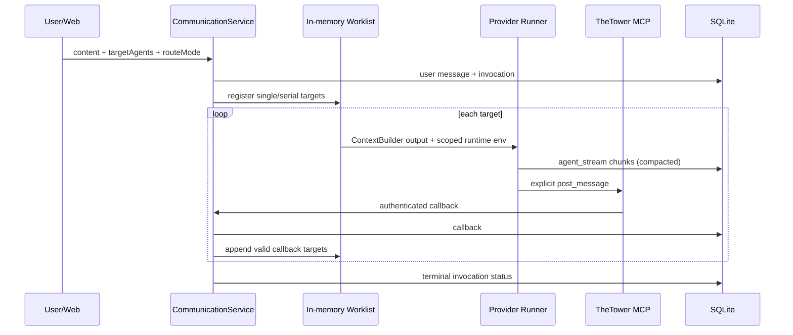

# TheTower 当前 A2A 架构

> 文档状态：Current
> 最后核验：2026-07-22
> 发布能力口径：[能力矩阵](../design/capability-matrix.md)
> 关键决策：[ADR-0002 消息通道与回调边界](./adr/0002-message-channel-boundaries.md)、[ADR-0003 Provider 与路由能力门禁](./adr/0003-provider-and-route-capability-gate.md)

本文只描述当前代码和已验收能力。早期 callback/final/stream 方案与 Phase 1–6 实施步骤保留在 `docs/phases/`，但不再作为当前事实源。

## 1. 当前发布边界

- 运行形态：单机、单操作员、可信 Workspace、单活跃 API 进程。
- 可用 Provider：Mock、Codex CLI、Claude CLI。
- 可用 route mode：`single`、`serial`。
- `fanout`、`parallel` 仅为历史协议兼容值；新请求返回 `422 unsupported_route_mode`。
- Gemini、OpenAI API、Custom 尚无 Runner；调度返回 `unsupported_agent_provider`，不会回退 Mock。
- Worklist 仍在内存中；API 重启后不能恢复正在执行的 invocation。

## 2. 两条消息通道

TheTower 把执行输出与协作发言明确分开：

| 通道 | `origin` | 生产者 | 用途 | 是否触发 A2A 路由 |
| --- | --- | --- | --- | --- |
| 执行流 | `agent_stream` | Runner stdout/thinking/tool event/final text | CLI 过程、结果和诊断 | 否 |
| 正式协作 | `callback` | Agent 显式调用 `post_message` | public/private 发言与结构化 handoff | 是 |

Runner 的普通 stdout 和 final text 不会隐式生成公开 callback。Agent 要对 Thread 或其他 Agent 发言，必须显式调用 callback/MCP 工具。

当前 `MessageOrigin` 为：

```text
user | agent_stream | callback | tool | system | briefing
```

历史 `agent_final` 已由 migration v1 转换为 `callback`，并以 `extra.isExplicitPost=false` 标识历史隐式来源。

## 3. 可见性与上下文

`ContextBuilder` 是 Agent 上下文的唯一构造入口，`VisibilityPolicy` 是消息可见性的唯一判断入口。

| 消息 | `play` | `debug` |
| --- | --- | --- |
| public callback | 所有参与者可见 | 所有参与者可见 |
| private callback | 发送者和 `visibleToAgentIds` 可见 | 发送者和 `visibleToAgentIds` 可见 |
| `agent_stream` 普通内容 | 仅操作者审计可见，不进入任何 Agent 上下文 | 可进入 Agent 上下文 |
| stream thinking | 不跨 Agent | 不跨 Agent；投影时剥离 `thinking` |

private callback 的发送者会自动加入接收列表。公开用户提示词中的文本不作为 callback 或 stream 证据；验收按 `origin + marker` 联合判断。

## 4. 调度流程



初始目标来自结构化 `targetAgents` 与用户文本中的有效 `@mention`，合并后去重。无目标时选择第一个 enabled Agent。单目标默认 `single`，多目标默认 `serial`。

callback 可以向当前 worklist 追加新目标，但深度、重复 edge 和 ping-pong 防护会限制无限接力。`agent_stream` 永远不参与目标解析或 worklist 扩展。

## 5. Runner 与 callback grant

每次真实 Provider invocation 会获得本轮 runtime 环境，包括 API 地址、Thread/Invocation/Agent 标识、Workspace 和 callback token，并动态挂载 TheTower MCP Server。

callback token 在数据库中只保存哈希，并绑定：

- `invocationId`；
- `agentId`；
- 过期时间；
- 可选 `stepId`。

服务端从已认证 grant 构造 `OperationContext`，不信任请求体自报身份。Invocation 终止后 grant 失效。持久 Step/Attempt 状态机尚未实现，因此完整 Step-scoped 生命周期属于 R1。

## 6. Stream 持久化

同一 `(threadId, invocationId, senderId)` 的 stdout、thinking 和 tool event 合并为一条 `agent_stream` 记录：

- `content` 保存普通输出；
- `thinking` 单独保存；
- `extra.stream.chunks` 保留 chunk 类型与时间；
- `toolEvents` 保存工具调用摘要。

默认发布预算为每组最多 1 行、序列化 payload 最大 1 MiB。可使用：

```bash
pnpm observe:streams -- --db /path/to/app.db
```

## 7. 已验收证据

R0.8 于 2026-07-22 完成 Codex/Claude 真实 Provider 验收：

- 两个 Provider 均为 `terminalStatus=done`；
- 各自 11/11 isolation checks 通过；
- private callback 只进入来源 Agent 与指定 observer 上下文；
- `play` 隐藏 stream，`debug` 共享普通 stream 且不泄露 thinking；
- stream 均保持单行并低于 payload 预算。

详见 [R0.8 验收记录](../acceptance/r0.8-a2a-isolation-acceptance-2026-07-22.md) 和 [验收手册](../runbooks/r0.8-a2a-isolation-acceptance.md)。

## 8. 尚未完成

- 持久 `InvocationStep`、Attempt、edge、outbox 和启动 reconcile；
- callback grant 的完整持久 Step 生命周期；
- 真正并发的 `fanout` / `parallel`；
- 跨重启的 worklist 恢复和幂等调度；
- 多用户、RBAC、租户隔离和远程生产部署。

这些缺口与实施顺序由 [TheTower Roadmap](../ROADMAP.md) 维护，不在历史 Phase 文档中继续更新。
