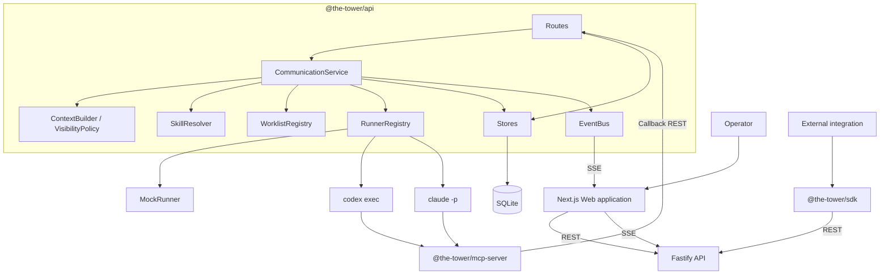
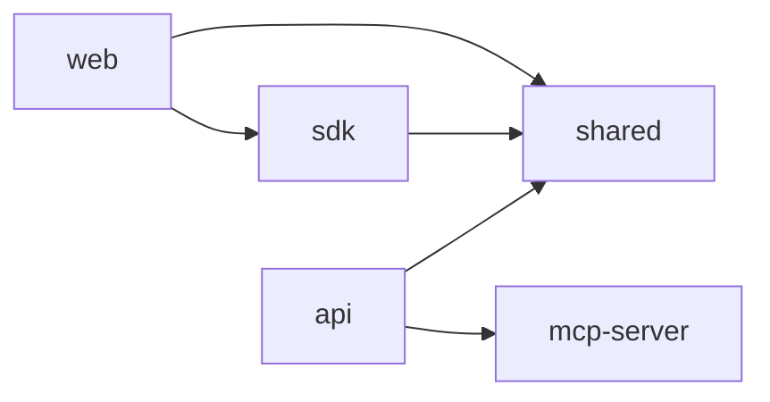
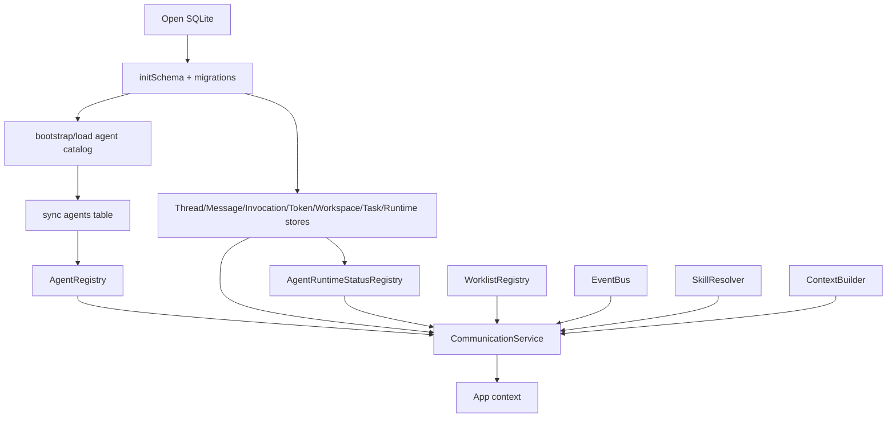
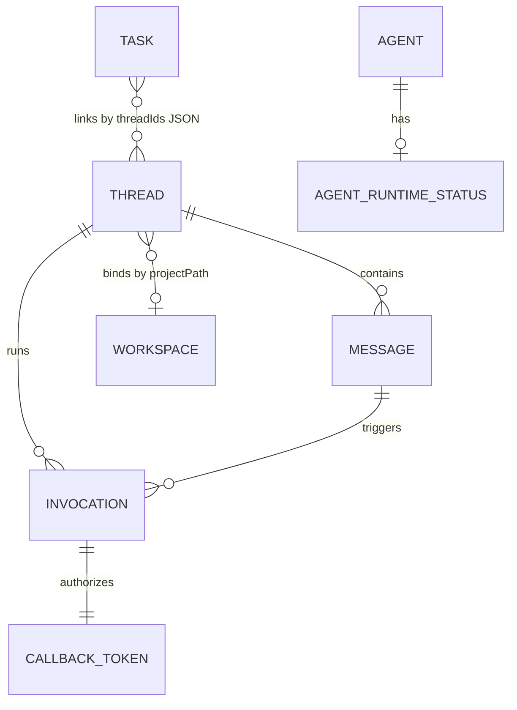
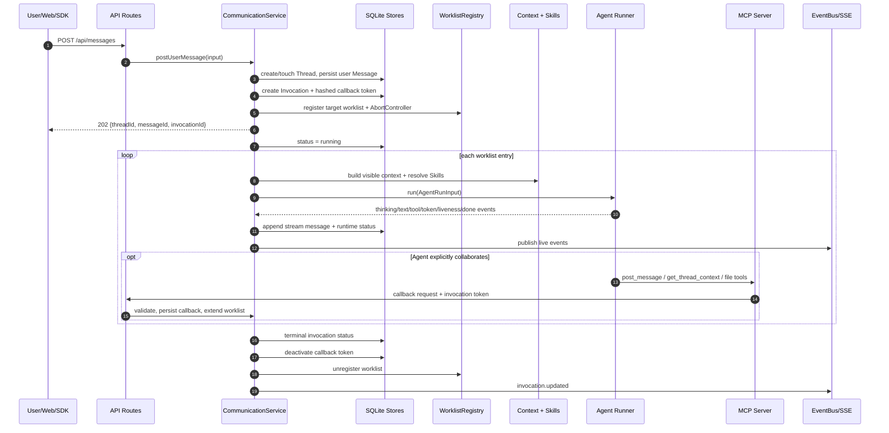

# TheTower 当前项目架构

> 文档状态：Current
> 文档基线：2026-07-22，描述当前工作区代码的实现状态，而非远期设计。发布能力口径以 [能力矩阵](../design/capability-matrix.md) 为准。

本文覆盖 TheTower 的系统边界、包结构、领域模型、核心调用链、上下文隔离、Runner/MCP、持久化、前端、部署配置和已知限制。A2A 的协议推导与更细的协作语义另见 [当前 A2A 整体架构](./current-a2a-architecture.md)。

## 1. 定位与架构原则

TheTower 是本地优先的多 Agent 协作与审计平台。它不是一个直接把多个模型 API 拼在一起的聊天界面，而是给 CLI Agent 提供统一的协作运行时。

当前实现遵循以下原则：

1. **Thread 是协作事实源**：用户输入、Agent 发言、私密交接、工具事件和系统错误都映射为 Thread 中的消息或事件。
2. **Invocation 是一次执行边界**：一条用户消息创建一次 invocation，callback grant、worklist、取消信号和运行状态都以 invocation 为单位。
3. **上下文不是消息全集**：`ContextBuilder` 与 `VisibilityPolicy` 为每个 Agent 生成身份相关的消息投影。
4. **CLI 原始流与协作发言分离**：`agent_stream` 用于操作员观察；Agent 必须通过 callback/MCP 主动发表可进入协作上下文的消息。
5. **Agent 是外部进程**：API 通过 Runner 启动 Mock、Codex CLI 或 Claude CLI；Agent 通过 MCP/HTTP 回写。
6. **Workspace 是执行边界**：真实 CLI Agent 必须绑定可信目录，平台文件工具和命令工具继续执行路径检查。
7. **持久状态与实时状态分层**：业务实体与 event log 写入 SQLite；worklist 仍是单进程运行态，SSE 可从持久事件日志重放。

## 2. 系统上下文



系统默认部署为一个本地 API 进程、一个 Next.js Web 进程，以及按 invocation 临时启动的 CLI/MCP 子进程。当前没有消息队列、独立 worker 或 Redis。

## 3. 仓库与包依赖

项目是 `pnpm` workspace，根配置包含 `packages/*` 五个包。

| 包 | 职责 | 主要技术 |
| --- | --- | --- |
| `@the-tower/shared` | 领域实体、API DTO、事件和 Runner 类型 | TypeScript |
| `@the-tower/api` | HTTP/SSE、编排、上下文、Workspace、持久化、Runner | Fastify、Zod、better-sqlite3 |
| `@the-tower/sdk` | 平台 Client 与 Agent Callback Client | Fetch API、shared types |
| `@the-tower/mcp-server` | invocation 级 MCP 工具和 HTTP callback 适配 | MCP SDK、Zod、stdio transport |
| `@the-tower/web` | 操作、配置、任务与审计界面 | Next.js 16、React 19、Zustand、Tailwind 4、Radix UI |



`api` 对 `mcp-server` 有两种关系：

- 编译期读取静态工具目录，为 `/api/mcp-tools` 提供能力说明。
- 运行时由 Codex/Claude Runner 把 MCP Server 作为 stdio 子进程动态挂载，并注入本轮 callback 环境变量。

仓库根目录的其他关键内容：

| 路径 | 作用 |
| --- | --- |
| `agent-template.json` | Agent catalog 首次初始化模板 |
| `.the-tower/agent-catalog.json` | API 运行时 Agent 配置真相源 |
| `skills/manifest.yaml` | Skill 元数据、优先级和触发条件 |
| `skills/*/SKILL.md` | 注入 Agent prompt 的协作规范 |
| `scripts/dev.mjs` | MCP、API、Web 的联合开发进程管理 |

## 4. API 启动与依赖装配

入口是 `packages/api/src/server.ts`：

1. 创建 Fastify 实例并启用 CORS。
2. 调用 `createAppContext()` 构造应用依赖。
3. 调用 `registerRoutes()` 注册 REST 与 SSE 路由。
4. 监听 `HOST` / `PORT`，默认 `127.0.0.1:3001`。

`createAppContext()` 的装配顺序反映了核心依赖关系：



依赖以构造函数显式注入为主，便于在单元测试中替换数据库、Runner 和事件设施。

## 5. 核心领域模型

### 5.1 主要实体

| 实体 | 含义 | 关键字段 |
| --- | --- | --- |
| `Agent` | 可调度的协作者 | provider、model、persona、mentionHandles、enabled |
| `Thread` | 长期协作容器 | title、mode、projectPath |
| `Message` | Thread 中的通信或运行记录 | sender、content、origin、visibility、handoffPayload、invocationId |
| `Invocation` | 一条用户请求触发的执行轮次 | rootMessageId、targetAgents、routeMode、status、depth |
| `Workspace` | 已信任的本地项目目录 | projectPath、trustedAt、lastOpenedAt |
| `Task` | 可关联多个 Thread 的任务元数据 | status、priority、owner、threadIds |
| `AgentRuntimeStatus` | Agent 最新运行快照 | status、tokenUsage、liveness、invocationId |

### 5.2 关系



其中 Workspace 与 Thread、Task 与 Thread 目前不是数据库外键关系：Thread 保存 `project_path`，Task 用 JSON 数组保存 `threadIds`。

### 5.3 消息来源与可见性

`Message.origin` 是理解系统的关键：

| Origin | 产生者 | 用途 |
| --- | --- | --- |
| `user` | 用户/API | 用户意图与初始路由 |
| `callback` | Agent 的 MCP/HTTP callback | 正式协作发言、A2A 路由与 handoff |
| `agent_stream` | Runner stdout/事件流 | 思考、文本流、工具调用，主要供操作员观察 |
| `tool` | 工具通道 | 工具相关消息类型预留 |
| `system` | API | 错误、跳过等系统信息 |
| `briefing` | 平台 | 特殊 briefing，默认不进入 Agent 上下文 |

消息可见性为 `public` 或 `private`。私密消息通过 `visibleToAgentIds` 指定可见 Agent，操作员始终可以查看，也可以将私密消息 reveal 为全员可见。

## 6. 用户消息到 Agent 执行

### 6.1 主时序



`POST /api/messages` 返回 `202` 后，worklist 在 API 进程中异步继续执行。

### 6.2 初始目标解析

用户目标由两部分合并并去重：

- 请求中的结构化 `targetAgents`。
- 用户文本中的 `@mention`；解析器会忽略 fenced/inline code，并按边界匹配 Agent handle。

若两者均为空，系统选择第一个 enabled Agent。未显式提供 `routeMode` 时，单目标为 `single`，多目标为 `serial`。

### 6.3 Route mode 的当前语义

共享类型保留 `single`、`serial`、`fanout`、`parallel` 以读取历史数据，但新请求只接受 `single` 和 `serial`。`fanout`、`parallel` 在 API 边界返回 `422 unsupported_route_mode`，不会伪装成顺序执行。

这意味着：

- `serial` 是当前唯一支持的多目标模式。
- `fanout` / `parallel` 是保留的历史协议值，不属于当前发布能力。
- Agent callback 可继续向 worklist 末尾追加目标。

### 6.4 取消

`POST /api/threads/:threadId/invocations/:invocationId/cancel` 会：

1. 校验 invocation 属于 Thread 且尚未终止。
2. 触发 worklist 中的 `AbortController`。
3. 将 invocation 设为 `cancelled`。
4. 停用 callback token、清理 worklist、更新 Agent 状态并发布事件。

Runner 在收到 abort 后终止 CLI 子进程；终态写入做了幂等保护。

## 7. A2A 路由与治理

### 7.1 Callback 目标来源

Agent callback 的下一跳由三类输入合并：

1. 结构化 `targetAgents`。
2. `handoffPayload.toAgentIds`。
3. callback 文本中行首的 `@handle`。

Agent 文本解析比用户 mention 更严格：只有每行开头（可带 Markdown quote/list 前缀）的连续 handle 才是路由指令，代码块和 inline code 会被忽略。短确认文本如 `ok`、`done`、`收到` 会被 `A2ARoutingPolicy` 阻止继续解析 mention。

### 7.2 Worklist 防护

`WorklistRegistry.push()` 实现以下保护：

- 只有当前 worklist Agent 发出的 callback 才能成功追加路由目标。
- 忽略 self target 和仍在 pending 区域中的重复目标。
- 每成功追加一个目标增加 depth，默认最大深度为 10。
- 对连续往返的 Agent pair 计数：第 2 次开始告警，第 4 次阻断。

Callback 消息本身还会按 invocation、Agent、规范化内容、可见性、mentions、可见 Agent 列表和 `replyTo` 做精确去重。

当前 callback grant 绑定 invocation 与正在执行的 Agent。服务端从 token hash 验证结果取得 `agentId`；请求体若自报不同身份会被拒绝。grant 可携带内部 `stepId`，但持久 Step 状态机尚未落地。

### 7.3 结构化 handoff

`handoffPayload` 为下游 Agent 提供稳定的交接字段：

- `fromAgentId`、`toAgentIds`
- `what`、`why`、`tradeoff`
- `openQuestions`、`nextAction`
- 可选 `evidenceRefs`、`riskLevel`、`triggerMessageId`

服务端强制 `fromAgentId` 等于 callback 调用者，并验证目标 Agent 已启用。私密 handoff 会自动把发送者和目标 Agent 加入 `visibleToAgentIds`。

## 8. 上下文与输出隔离

`ContextBuilder` 读取最近消息后，通过 `VisibilityPolicy` 过滤。Runner 首次 prompt、callback `get_thread_context` 和调试用 Agent context API 共用这套规则。

### 8.1 通用规则

- 只包含 `delivered` 消息。
- 排除 `briefing`。
- public 消息对所有 Agent 可见。
- 未 reveal 的 private 消息只对 `visibleToAgentIds` 中的 Agent 可见。
- public callback 不得 `replyTo` 未 reveal 的 private、briefing 或未 delivered 消息。

### 8.2 `play` 与 `debug`

| 模式 | `agent_stream` | callback | thinking |
| --- | --- | --- | --- |
| `play` | 不进入任何 Agent 上下文 | 按可见性进入 | 属于 stream，因此不进入 |
| `debug` | 可进入上下文 | 按可见性进入 | 仅产生该 thinking 的 Agent 自己可见 |

因此在默认 `play` 模式下，CLI stdout 即使展示在 Web 中，也不会自动成为其他 Agent 的协作输入。Agent 想“说给团队听”必须调用 `post_message`。这避免日志、工具参数和中间思考意外触发路由或污染上下文。

## 9. Skills 与 Prompt 构建

### 9.1 Skill Registry

`SkillRegistry` 从项目根目录读取：

```text
skills/manifest.yaml
skills/<skill-id>/SKILL.md
```

manifest 定义 enabled、priority、触发器、输出和后继 Skill。Registry 启动时加载并按 priority 排序。

### 9.2 Skill 解析

`SkillResolver` 根据以下条件选择 Skill：

- `always`
- 当前 Agent 是否处于 handoff 前的位置
- 当前 Agent 是否接收到其他 Agent 的 handoff
- 是否为 worklist 最后一棒
- 最近消息是否命中关键词

解析结果连同 Agent persona、同伴名册、worklist 状态、可见消息和定向 handoff 一起由 `CliPromptBuilder` 注入 prompt。

Skills 约束 Agent 行为，但不替代服务端的可见性、token 校验和 worklist 防护。

## 10. Runner 架构

所有 Runner 实现统一的异步事件接口：

```ts
interface AgentRunner {
  run(input: AgentRunInput): AsyncIterable<AgentEvent>;
}
```

事件包括 `thinking`、`stream_text`、`text`、`tool_call`、`token_usage`、`liveness`、`error` 和 `done`。

### 10.1 Mock Runner

`MockRunner` 用于默认启动、自动化测试和无模型环境。它产生确定性事件，不访问网络或外部模型。

### 10.2 Codex CLI Runner

`CodexCliRunner`：

- 调用 `codex exec --json`，通过 stdin 传入 prompt。
- 解析 JSONL 事件为统一 `AgentEvent`。
- 使用 Thread Workspace 作为 cwd。
- 动态注入 TheTower MCP 配置与 callback 环境变量。
- 默认 5 分钟超时；abort 时向子进程发送 `SIGTERM`。
- 当前默认 sandbox 为 `read-only`，approval policy 为 `untrusted`；workspace-write/network 需要显式配置。

当 sandbox 配置为 `workspace-write` 且 callback network 开启时，Runner 会为 localhost callback 增加 network proxy 配置。

### 10.3 Claude CLI Runner

`ClaudeCliRunner`：

- 调用 `claude -p --output-format stream-json --verbose`。
- 用 system prompt、stdin user prompt 和动态 MCP config 启动本轮进程。
- 解析文本、thinking、tool、usage 和错误事件。
- 默认 10 分钟超时，默认 permission mode 为 `default`；绕过权限必须显式配置。
- 用 `ProcessLivenessProbe` 采样进程树 CPU，区分 active、busy-silent、idle-silent 和 dead。
- busy-silent 可在有界范围内延长 timeout；持续 idle-silent 可触发 stall auto-kill。

### 10.4 Provider 映射

| Provider | Runner |
| --- | --- |
| `mock` | Mock |
| `codex` | Codex CLI |
| `claude` | Claude CLI |
| `gemini` | 未实现；抛出 `unsupported_agent_provider` |
| `openai-api` | 未实现；抛出 `unsupported_agent_provider` |
| `custom` | 未实现；抛出 `unsupported_agent_provider` |

`gemini`、`openai-api` 和 `custom` 当前只是领域枚举与配置兼容入口，并非已完成的真实执行器，也不会静默回退 Mock。

## 11. MCP 与工具安全

### 11.1 动态挂载

每轮真实 CLI invocation 会注入：

```text
THE_TOWER_API_URL
THE_TOWER_AGENT_ID
THE_TOWER_THREAD_ID
THE_TOWER_INVOCATION_ID
THE_TOWER_CALLBACK_TOKEN
ALLOWED_WORKSPACE_DIRS
```

MCP Server 通过 stdio 与 CLI 通信，再通过 HTTP callback 回到 API。callback token 只在数据库中保存 SHA-256 hash，grant 绑定 invocation、Agent、可选 stepId 与过期时间，invocation 结束后停用。

### 11.2 工具集

| 工具 | 作用 | 主要边界 |
| --- | --- | --- |
| `post_message` | 正式发布 Agent 消息并可扩展 worklist | invocation/token、可见性和路由校验 |
| `get_thread_context` | 读取当前 Agent 可见上下文 | 复用 ContextBuilder |
| `read_file` | 读取 UTF-8 文件 | Workspace 内、最大 512 KB |
| `read_file_slice` | 按行读取 | 最多 400 行 |
| `list_files` | 有界文件列表 | 跳过 `.git`、`node_modules`，最多 1000 项 |
| `write_file` | 覆盖写入 UTF-8 文件 | Workspace 内、最大 2 MB、禁止 `.git` |
| `shell_exec` | 执行受限本地命令 | 白名单、30 秒、256 KB 输出、路径边界 |

`shell_exec` 直接 `spawn(command, args, {shell:false})`，拒绝 shell 控制符、重定向、替换、变量、glob 和反斜线转义。允许的命令包括基础只读检查、只读 Git 子命令，以及 Workspace 内的 Node/Python 脚本。

MCP profile：

| Profile | 工具面 |
| --- | --- |
| `full` | 全部协作、文件和命令工具 |
| `collab-only` | 仅 `post_message`、`get_thread_context` |
| `read-only` | `get_thread_context` 与只读文件工具 |

## 12. Workspace 模型

Thread 通过 `projectPath` 绑定 Workspace。执行真实 CLI provider 前，`WorkspaceResolver` 会重新 realpath 并验证目录。

注册目录时执行：

1. 展开 `~` 并解析绝对路径与 symlink。
2. 确认路径存在且为目录。
3. 拒绝系统目录、敏感目录、`.git` 和 `node_modules`。
4. 确认目录位于 allowed roots 下。

默认 denied roots 包括 `/`、`/System`、`/Library`、`/Applications`、`~/.ssh`、`~/.gnupg`、`~/.codex` 和 `~/.claude`。allowed roots 可用环境变量配置；当前源码默认值为 `/Users/xuchenyang`，这是现阶段的可移植性限制。

API 文件工具在每次调用时再次校验 invocation、token、Thread Workspace、目标路径与 symlink，不依赖 Runner cwd 作为唯一安全边界。

## 13. 数据与状态

### 13.1 SQLite

`better-sqlite3` 以 WAL 模式运行，并开启 foreign keys。当前表：

```text
agents
threads
workspaces
messages
invocations
callback_tokens
tasks
agent_runtime_statuses
schema_migrations
```

持久化内容包括 Agent 配置镜像、Thread、消息、invocation、callback token hash、Workspace、Task 和 Agent 最新 runtime status。

### 13.2 进程内状态

| 状态 | 位置 | 重启结果 |
| --- | --- | --- |
| 动态 worklist、currentIndex、depth、AbortController | `WorklistRegistry` Map | 丢失 |
| SSE listeners | `EventBus` | 丢失 |
| 最近事件/工具审计 | SQLite `event_log` + 500 条内存热缓存 | 可 replay（保留最近 20,000 条） |
| AgentRegistry | 内存，从 catalog/SQLite 启动重建 | 重建 |
| RuntimeStatusRegistry | 内存，从 SQLite 启动恢复 | 恢复最后快照 |

Invocation 虽然会持久化，但没有在 API 重启后恢复 queued/running worklist 的机制。因此数据库中的非终态 invocation 不等于仍有 worker 在执行。

## 14. 事件与可观测性

`EventBus` 先把事件追加到 SQLite `event_log`，再以单调递增 seq 通知 SSE listener，并保留最近 500 条内存热缓存。主要事件包括：

- `message.created` / `message.updated`
- `invocation.updated`
- `worklist.updated`
- `agent.event` / `agent.status` / `agent.token_usage` / `agent.liveness`
- `callback.write`
- `workspace.resolved` / `workspace.file_tool`

`GET /api/events` 是 SSE：每条事件带 `id:`，浏览器重连可通过 `Last-Event-ID` replay，回放结束会收到 `sync`，并每 15 秒发送 heartbeat。`/api/telemetry/events`、工具审计和 invocation inspect 仍从内存热缓存聚合；事务 outbox 与跨重启执行恢复属于 Phase 2。

## 15. HTTP API 分区

路由集中在 `packages/api/src/routes.ts`，按能力可分为：

| 分区 | 主要用途 |
| --- | --- |
| Health | 服务探活 |
| Agents | Agent 列表、配置、runtime status、占位的 tools/runtime/audit 配置 |
| Threads / Messages | Thread CRUD、消息、上下文投影、private reveal、invocation 与取消 |
| Workspaces | 路径验证、可信目录、活动视图、占位文件树/搜索 |
| Tasks | Task CRUD、创建/关联 Thread |
| Skills / MCP catalog | 能力目录和详情 |
| Callbacks | Agent 发消息、读上下文、文件工具代理 |
| Telemetry | Thread 汇总、事件、invocation、工具审计 |
| Events | SSE 实时流 |

输入校验主要使用 Zod。`@the-tower/sdk` 对常用接口提供类型化封装，Web 通过 SDK 走 Next.js 同源 rewrite；SSE 在开发环境默认直连 API，以避免代理破坏 EventSource 分块。

## 16. Web 架构

Web 使用 Next.js App Router，页面路由包括：

```text
/
/threads
/threads/[threadId]
/agents
/agents/[agentId]
/capabilities
/capabilities/skills/[skillId]
/capabilities/tools/[toolName]
/telemetry
/telemetry/[threadId]
/telemetry/invocations/[invocationId]
/workspaces
/workspaces/[workspaceId]
/tasks
/tasks/[taskId]
/settings
```

分层方式：

- `app/`：路由与页面入口。
- `components/`：按 command、tasks、telemetry、workspace、capabilities、settings 等业务域组织。
- `hooks/`：SDK 查询、SSE 订阅和页面组合逻辑。
- `stores/`：Zustand 客户端状态，包括 Thread、Task、Workspace、创建对话框和 SSE 连接状态。
- `lib/`：消息投影、事件格式化、SSE URL、Agent 状态等纯逻辑。

REST 默认请求同源 `/api/*`，Next rewrite 到 `THE_TOWER_API_TARGET`。SSE 默认使用 `NEXT_PUBLIC_SSE_ORIGIN=http://127.0.0.1:3001` 直连。

## 17. 配置边界

### 17.1 Agent catalog

启动时若 `.the-tower/agent-catalog.json` 不存在，API 从 `agent-template.json` 创建。之后 catalog 是运行配置真相源，启动时同步覆盖 SQLite agents 表并重建 AgentRegistry。

API 修改 Agent 时执行：

1. Zod 校验并规范化 provider/model。
2. 用临时 AgentRegistry 验证 ID/handle 唯一性。
3. 原子写入 catalog。
4. upsert SQLite。
5. 重建内存 AgentRegistry。

### 17.2 安全默认值

当前项目针对可信本地开发优化，而非直接暴露到公网：

- Fastify CORS 默认只允许本地 Web origin；非 loopback bind 没有 Operator Token 时拒绝启动。
- Operator Token 不是用户登录、RBAC 或租户边界。
- Codex 默认 `read-only + untrusted`，callback network 默认关闭。
- Claude 默认 permission mode 为 `default`。
- MCP 默认 profile 仅开放协作工具；文件写入与命令执行需要显式危险 profile。

生产化之前必须显式收紧这些设置，并增加认证、授权、secret 管理和进程隔离。

## 18. 已知限制与演进方向

1. **单进程调度**：worklist 不持久化，API 重启不能恢复执行。
2. **没有真正并行**：`fanout` / `parallel` 对新请求明确拒绝，尚未映射到并发 Runner。
3. **执行事实未原子提交**：SSE event log 已持久化并支持 replay，但尚无事务 outbox 与持久 Step/Attempt。
4. **Provider 未全部实现**：Gemini、OpenAI API 和 Custom 明确返回不支持，不回退 Mock。
5. **部分 API 为占位**：Workspace 文件树/搜索、Agent tools/runtime 写配置、完整 audit 尚未实现。
6. **Callback 尚未完整 Step 化**：grant 已绑定 invocation 与 Agent，但持久 Step 状态机尚未落地。
7. **Task 关联未规范化**：Task 使用 JSON 保存 Thread ID，数据库不维护引用完整性。
8. **部署安全未完成**：无认证，默认 CLI 权限较宽，当前只适合可信本地网络。
9. **平台路径默认值不可移植**：allowed root 仍包含开发机绝对路径。

建议演进优先级：先持久化调度状态并提供恢复策略，再实现真正的并行执行与事件持久化；随后细化 per-Agent capability/token、补齐 provider 和多用户安全边界。

## 19. 扩展指南

### 新增 Provider

1. 在 shared 的 `AgentProvider` 中注册类型。
2. 实现 `AgentRunner.run()` 并映射为统一事件。
3. 在 `RunnerRegistry` 选择真实 Runner。
4. 明确 Workspace policy、timeout、权限和 callback/MCP 注入方式。
5. 为事件解析、取消、失败和 token usage 增加测试。

### 新增 MCP 工具

1. 在 `packages/mcp-server/src/tools/` 定义 Zod input schema、handler 和工具描述。
2. 在 server toolset 注册，并为工具添加显式 read-only/destructive annotation。
3. 若需要 API 权限边界，在 callback routes/service 中实现校验与审计。
4. 更新 MCP catalog 测试与本文档。

### 新增持久实体

1. 在 shared 定义领域类型和 API DTO。
2. 在 `db/schema.ts` 添加幂等 schema/migration。
3. 创建 Store，避免让 route 直接散落 SQL。
4. 在 bootstrap 装配，通过 service 暴露业务行为。
5. SDK/Web 只依赖共享协议，不复制领域类型。

## 20. 相关文档

- [文档总索引](../README.md)
- [当前 A2A 整体架构](./current-a2a-architecture.md)
- [Agent 交互协议](./agent-interaction-protocol.md)
- [多 Agent 通信内核架构设计](./multi-agent-communication-architecture.md)
- [A2A 输出隔离对比](./a2a-routing-output-isolation-comparison.md)
