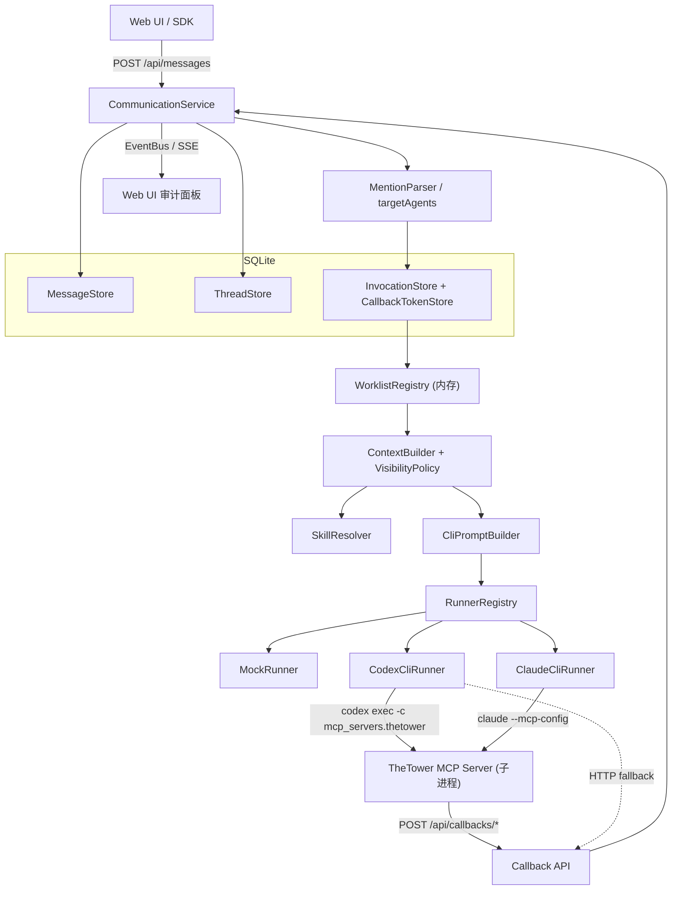
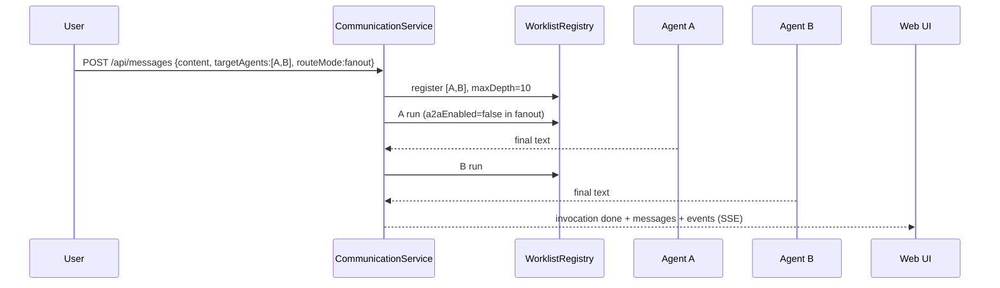
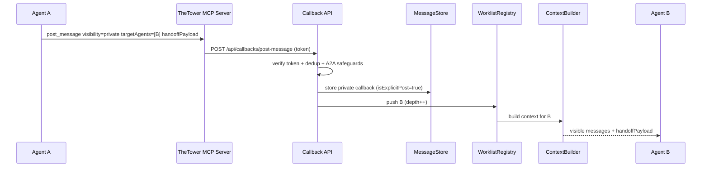
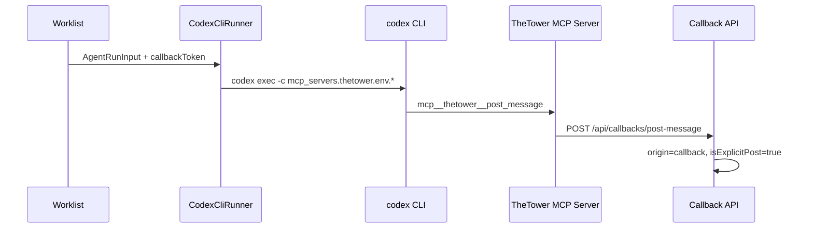

# TheTower 当前项目架构文档

生成时间：2026-07-02

本文是对 TheTower 仓库**当前实现态**的系统级架构说明，覆盖 monorepo 全部五个包（`shared` / `api` / `sdk` / `mcp-server` / `web`）的结构、数据模型、后端编排、Callback/MCP 链路、前端架构、关键流程与当前边界。

A2A 协作语义的细粒度说明另见 [当前 A2A 整体架构说明](./current-a2a-architecture.md)，本文不重复其全部内容，而是在更宏观的层面把它们串起来。

## 1. 项目定位

TheTower 是一个**多 Agent 通信内核平台**。核心理念是：

- **Thread 是协作真相源**：所有 Agent 协作都先落到 thread，不允许黑箱点对点通信。
- **Agent 是外部进程**：Agent 是本机 CLI（`codex` / `claude`）或 mock，通过 HTTP Callback / MCP 工具写回平台。
- **可控可见、可治理、可审计**：可见性由 `VisibilityPolicy` 统一裁决，协作顺序由 `WorklistRegistry` 治理，全过程通过 SSE 推给前端审计。

当前处于 MVP 阶段：先跑通多 Agent 通信内核，单进程内存调度，暂不引入 Redis；前端定位为**调试 / 审计 UI**。

## 2. 仓库与包结构

pnpm monorepo（`pnpm-workspace.yaml` → `packages/*`），`packageManager: pnpm@9.15.4`，Node ≥ 20。

```text
packages/
  shared/      共享领域类型与 API 协议类型（单一 barrel: src/index.ts, ~750 行）
  api/         后端服务：Fastify + SQLite + Agent 调度 + Callback + SSE
  sdk/         HTTP Client：TheTowerClient + AgentCallbackClient
  mcp-server/  TheTower MCP Server：暴露 post_message / get_thread_context / 文件 / shell 工具
  web/         调试前端：Next.js 16 + React 19 + Zustand
```

依赖关系：`api`、`sdk`、`web`、`mcp-server` 都依赖 `shared`，避免前后端重复定义协议类型。`web` 依赖 `sdk`；`api` 在运行时通过子进程方式拉起 `mcp-server`（不直接 import，而是用 `codex exec -c mcp_servers...` / `claude --mcp-config` 动态挂载）。

仓库根目录还有：

- `agent-template.json` — Agent 默认模板，首次初始化来源。
- `.the-tower/agent-catalog.json` — 运行时真实 Agent 配置，前端保存时同步写入。
- `skills/` — 协作 Skills 定义（`manifest.yaml` + 每个 skill 的 `skill.yaml` + `SKILL.md`）。
- `docs/` — 架构 / 设计 / 前端 / 分阶段文档。
- `tsconfig.base.json` — 共享 TS 基线。

## 3. 技术栈

| 层 | 技术 |
| --- | --- |
| 后端 | Fastify、`@fastify/cors`、`better-sqlite3`（WAL + foreign_keys）、原生 TypeScript |
| 前端 | Next.js 16.2.9（App Router）、React 19、Zustand 5、TailwindCSS 4、Radix UI、`react-markdown` + `remark-gfm`、`lucide-react`、`animejs` |
| MCP | `@modelcontextprotocol/sdk`（StdioServerTransport） |
| Agent 运行时 | 本机 `codex exec` CLI、本机 `claude` CLI（stream-json）、Mock |
| 校验 | 手写 zod schema（Fastify route schema） |
| 测试 | node `--test` + tsx；前端有 Playwright smoke 脚本 |

## 4. 整体架构与请求流



一条用户消息的完整流：

1. `POST /api/messages` → `CommunicationService.postUserMessage`
2. 解析路由目标（`@mention` 或结构化 `targetAgents`），创建 `Invocation` + 一次性 `CallbackToken`，`WorklistRegistry.register`（带 `AbortController`，`maxDepth=10`）。
3. `executeWorklist` 循环：对每个 Agent → `ContextBuilder.buildForAgent`（按可见性过滤）→ 解析 workspace → `SkillResolver.resolve` → `CliPromptBuilder` → `runner.run(input)` 异步迭代。
4. Runner 调用本机 CLI / mock，把 `AgentEvent`（thinking / stream_text / text / tool_call / token_usage / error / done）流回 `handleAgentEvent`，写回 thread 并发 SSE。
5. Agent 运行中通过 MCP 工具或 HTTP callback 调 `POST /api/callbacks/post-message` / `GET /api/callbacks/thread-context`，经 token 校验 + A2A 防护后更新 worklist。
6. 全程事件经 `EventBus` 推给 `GET /api/events` SSE 客户端。

## 5. 后端 `@the-tower/api`

### 5.1 启动与装配

- `server.ts`（15 行）：Fastify 实例，挂 `@fastify/cors`（origin:true），`createAppContext()` → `registerRoutes(app, ctx)`，监听 `PORT`（默认 3001）/ `HOST`（默认 127.0.0.1）。
- `bootstrap.ts` `createAppContext`（`:21`）：顺序为 `initSchema(db)` → `AgentStore` + `bootstrapAgentCatalog` + `syncAgentStoreFromCatalog` → `AgentRegistry.replaceAll` → 各 Store → `WorklistRegistry` → `EventBus` → `RunnerRegistry` → `createDefaultSkillResolver` → `ContextBuilder` → `CommunicationService`（注入全部依赖）→ `WorkspaceFileService`。

### 5.2 HTTP 路由（`routes.ts`，`registerRoutes` 在 `:424`）

按域分组：

| 域 | 路由 |
| --- | --- |
| Health | `GET /health` |
| Agents | `GET /api/agents`、`GET /api/agents/runtime-status`、`PATCH /api/agents/:id`、`GET|PATCH /api/agents/:id/config`、`GET|PATCH /api/agents/:id/tools`（stub 501）、`GET|PATCH /api/agents/:id/runtime`（stub 501）、`GET /api/agents/:id/audit`（stub） |
| Threads | `GET|POST /api/threads`、`PATCH|DELETE /api/threads/:id`、`GET /api/threads/:id/messages`、`/invocations`、`/agent-status`、`/agent-context`、`/context`（telemetry）、`POST .../messages/:msgId/reveal` |
| Messages | `POST /api/messages`（202，委托 `communication.postUserMessage`） |
| Events | `GET /api/events`（SSE） |
| Workspaces | `GET|POST /api/workspaces`、`POST /api/workspaces/validate`、`GET /api/workspaces/:id`、`/activity`、`/files`、`/search`（后两者 stub）、`GET /api/dirs` |
| Tasks | `GET|POST /api/tasks`、`GET|PATCH /api/tasks/:id`、`POST /api/tasks/:id/create-thread`、`GET /api/tasks/:id/threads` |
| Skills | `GET /api/skills`、`GET /api/skills/:id` |
| MCP | `GET /api/mcp-tools`、`GET /api/mcp-tools/:name`（来自 `@the-tower/mcp-server` 静态 catalog） |
| Callbacks | `POST /api/callbacks/post-message`、`GET /api/callbacks/thread-context`、`POST /api/callbacks/tools/read-file` / `read-file-slice` / `list-files` / `write-file` |
| Telemetry | `GET /api/telemetry/threads`、`/events`、`/tool-audit`、`GET /api/invocations`、`GET /api/invocations/:id/inspect` |

### 5.3 核心编排 `services/CommunicationService.ts`（756 行）

A2A 主编排服务。关键方法：

- `postUserMessage`（`:51`）：解析/创建 thread → `resolveUserTargets`（`:620`，合并结构化 `targetAgents` 与 `parseMentions`，无目标则回退首个 enabled agent）→ `assertEnabledAgents` → `normalizeRouteMode`（多目标默认 `fanout`，单目标 `single`）→ 持久化用户 message → `startInvocation`。
- `startInvocation`（`:251`）：建 `Invocation`（queued）→ 建回调 token（24 字节随机，sha256 入库）→ `worklists.register` → fire-and-forget `executeWorklist`。
- `executeWorklist`（`:294`）：置 running，循环 `currentIndex < list.length`：跳过 disabled agent（写系统消息）→ `contextBuilder.buildForAgent` → `resolveThreadWorkspace` + `getProviderWorkspacePolicy`（codex/claude/gemini/custom **必须**有 workspace，mock/openai-api 不需要）→ `skillResolver.resolve` → 发 `workspace.resolved` / `agent.event(skills_loaded)` → `runner.run` 异步迭代 → `handleAgentEvent`。
- `handleAgentEvent`（`:405`）：`text`/`stream_text` → `postStreamChunk`（origin `agent_stream`）；`tool_call` → status `tool_calling`；`thinking` → 私有 chunk；`token_usage` → 累计；`error` → 系统消息；`done` → status done。全部发 `agent.event` / `agent.status` / `message.created`。
- `postAgentMessage`（`:105`，callback 入口）：校验 invocation running + token → A2A 短路（仅 `single`/`serial` 且非 ack-only 文本才解析 `@mention`）→ `normalizeCallbackMessageFields`（private 才能有 `visibleToAgentIds`，自动加入 caller + targets，`handoffPayload.fromAgentId` 强制为 caller）→ `assertCanPubliclyReplyTo` → 去重（`findExactCallbackDuplicate` `:518`，同 invocation+agent+内容+visibility+mentions+replyTo 命中返回既有 id）→ 持久化（origin `callback`，`extra.isExplicitPost=true`）→ `worklists.push` → 发 `worklist.updated` + `callback.write`。
- `a2aEnabled = depth < maxDepth && canRouteFromAgentText(routeMode)`（`:386`）：只有 `single`/`serial` 才从 Agent 文本继续路由（`canRouteFromAgentText` `:749`）。
- 其他：`getThreadContext` / `revealMessage`（发 `message.updated`）/ `getThreadContextForCallback`（`:227`，解析当前 worklist agent 的上下文）/ `finishInvocation`（`:562`，停 token、注销 worklist、收尾状态）/ `publishAgentStatus`。

常量：`DEFAULT_MAX_A2A_DEPTH = 10`（`:30`）、`CALLBACK_TOKEN_TTL_MS = 1h`（`:31`）。

### 5.4 路由 `routing/*`

- `MentionParser.ts`：`stripCode`（`:9`，去掉代码块再解析）→ `parseMentions`（`:13`，用户消息解析，按 `mentionHandles` 整词匹配，CJK 边界感知）→ `parseA2AMentions`（`:35`，**Agent 间**解析，只认行首 `@handle`，最长 handle 优先，支持 `@a @b` 链式；比用户 mention 严格，避免 stdout 里的 `@` 误触发）。
- `WorklistRegistry.ts`：内存 `Map<invocationId, WorklistEntry>`。`push`（`:46`）是 A2A 防护核心：`caller_mismatch`（caller 必须是 `currentIndex` 处的 agent）→ 跳过 self / 已 pending → `depth_limit`（`depth >= maxDepth` 中止）→ `updatePingPong`（`:103`，跟踪最近 `(from,to)`，`PINGPONG_WARN_THRESHOLD=2` 警告，`PINGPONG_BLOCK_THRESHOLD=4` 阻断）→ 成功则 `list.push` / `depth++` / 记录 `a2aFrom`/`triggerMessageId`/`triggerOrigin`，返回 `duplicate` 表示无新增。
- `A2ARoutingPolicy.ts`：`shouldRouteAgentText`（`:4`）——内容命中 `ACK_ONLY_RE`（收到/好的/ok/done/thanks/明白…）则不路由，短路 ack 抖动。

### 5.5 上下文 `context/*`

- `ContextBuilder.ts` `buildForAgent`（`:21`）：`messageStore.listByThread`（默认 100 条）→ `canIncludeMessage` → `VisibilityPolicy.canIncludeInAgentContext`，返回 `{threadId, agentId, mode, messages}`。Runner 初始 prompt 与 callback `get_thread_context` 共用同一入口。
- `VisibilityPolicy.ts`：
  - `canViewMessage`（`:7`）：用户可见全部；public 全员可见；private 仅 `visibleToAgentIds`，`revealedAt` 后全员可见。
  - `canIncludeInAgentContext`（`:20`）：必须 `delivered`；`origin=briefing` 排除；**`thinking` chunk 永不跨 agent**（即使 debug 模式也只有产生者可见，`:32-34`）；`play` 模式下 `agent_stream` 仅 sender 可见，`debug` 模式共享（`:36-38`）。
  - `canQuoteInPublicReply`（`:43`）：public reply 不能引用未 reveal 的 private / briefing / 未 delivered 消息。

### 5.6 Agent 注册表与运行时状态 `agents/*`

- `AgentRegistry.ts`：内存 `Map<id,Agent>` + `handleToAgentId`。`register`（`:7`）拒重 id/handle；`replaceAll`（`:24`）bootstrap / 更新时整体重建；`normalizeHandle`（`:46`）小写 + 补 `@`。
- `RunnerRegistry.ts` `getRunner(agent)`（`:11`）：`mock`→MockRunner、`codex`→CodexCliRunner、`claude`→ClaudeCliRunner、`gemini`/`openai-api`/`custom`→MockRunner（fallback）。三个 runner 单例。
- `AgentRuntimeStatusRegistry.ts`：每 agent 一份 `AgentRuntimeStatus` 快照。`markSessionStarted` / `setStatus`（跟踪 `lastToolAt`/`lastTextAt`）/ `setTokenUsage`（`mergeAgentTokenUsage` 累加）/ `setLiveness`（liveness state → work status）/ `markSessionCompleted` / `clearInvocation` / `get` / `list` / `listByThread`。`normalizeUsage`（`:177`）从 budget 推 `totalTokens` / `remainingTokens`。

### 5.7 Runner 抽象 `agents/runners/*`

统一接口 `AgentRunner.run(input): AsyncIterable<AgentEvent>`。`AgentRunInput` 携带 agent、availableAgents、worklist 快照、routeMode、`a2aEnabled`、thread/invocation id、workspace、messages、activeSkills、`callbackToken`、`AbortSignal`。

- `MockRunner.ts`（`:3`）：确定性测试 runner，yield `thinking` → `stream_text` → `text`（persona 签名，引用最近消息 + 直接 sender）→ `token_usage`（合成）→ `done`。
- `CodexCliRunner.ts`（`:40`）：spawn `codex` CLI。`buildArgs`（`:134`）：`--ask-for-approval`、`--sandbox`、`--cd`、`--output-last-message`、`--color never`；sandbox=workspace-write 时追加 network proxy；`buildMcpConfigArgs`（`:165`）把 TheTower MCP server 以 TOML `-c` flags 注入（含 callback env + `ALLOWED_WORKSPACE_DIRS`）。stdin 喂 prompt，stdout 流为 `stream_text`，末尾从 output 文件读 final message，yield `text`+`done`。超时/abort 发 SIGTERM。默认超时 5 分钟。
- `ClaudeCliRunner.ts`（`:30`）：spawn `claude` CLI，`-p --output-format stream-json --verbose --model --append-system-prompt --permission-mode`，MCP 启用时 `--strict-mcp-config` + `--allowedTools mcp__thetower__*` + `--mcp-config`（JSON）。stdout 逐行经 `parseClaudeStreamLine`（`:245`）解析为 thinking/stream_text/tool_call/token_usage/text/error。默认超时 10 分钟。
- `CliPromptBuilder.ts`：`buildAgentPromptParts`（`:15`）分 system + user。`buildSystemPrompt`（`:25`）含：身份、strengths/restrictions、平台规则（不冒充、第一人称、🐾 签名、stdout 私有、A2A 只走 callback、`@` = 路由指令）、peer agent directory、provider 工具文档。`buildUserPrompt`（`:87`）：invocation 状态、skills、messages、`handoffPayload`（仅注入目标 agent）。
- `CallbackRuntimeEnv.ts`：`resolveCallbackBaseUrl`（`:12`）、`buildCallbackRuntimeEnv`（`:22`，5 个 env var）、`defaultMcpServerLauncher`（`:32`，定位 MCP server dist）、`toTomlString`（`:51`）。
- `WorkingDirectory.ts`：`resolveInvocationWorkingDirectory`（`:3`）。

### 5.8 持久化 `stores/*` + `db/*`

全部 SQLite（`better-sqlite3`，WAL + `foreign_keys=ON`）。`db/database.ts` `openDatabase`（`:7`）从 `APP_DB` 或 `data/app.db` 打开，导出 singleton `db`。`db/schema.ts` `initSchema`（`:3`）建表：`agents`、`threads`、`workspaces`（`project_path` 唯一）、`messages`（FK→threads，索引 `idx_messages_thread_created`）、`invocations`（FK→threads+messages）、`callback_tokens`（PK=invocation_id，FK→invocations）、`tasks`。`ensureColumn`（`:149`）幂等补列；`runMigrations`（`:113`）含 migration v1：legacy `agent_final` origin → `callback`（`isExplicitPost=false`），强制 thread mode 为 `play`。

| Store | 表 | 关键方法 |
| --- | --- | --- |
| `AgentStore` | `agents` | `replaceAll`（事务删+upsert）、`upsert`（INSERT…ON CONFLICT DO UPDATE）、`toAgent`（legacy `role_prompt` → persona） |
| `ThreadStore` | `threads` | `create/get/list/touch/updateMode/update/updateProjectPath`、`delete`（`:79`，手动级联：callback_tokens→invocations→messages→thread） |
| `MessageStore` | `messages` | `create`、`reveal`（`:105`，设 `revealed_at`）、`listByThread`（DESC+limit 再反转）、`listByInvocation`、`inferOrigin` |
| `InvocationStore` | `invocations` | `create/get/listByThread/list`（`:69`，跨线程过滤，agentId 在 JS 层过滤）/`updateStatus`（COALESCE finished_at） |
| `CallbackTokenStore` | `callback_tokens` | `hashToken`（sha256）、`create`、`verify`（timingSafeEqual + active + expiry）、`deactivate` |
| `TaskStore` | `tasks` | `create/get/list/update`（保留 threadIds）、`linkThread`（去重 append） |
| `WorkspaceStore` | `workspaces` | `upsert`（ON CONFLICT(project_path) DO UPDATE name+last_opened_at）、`get/getByProjectPath/list` |

### 5.9 Skills `skills/*`

协作行为协议层（不决定可见性、不直接执行路由）。

- `SkillRegistry.ts`（`:5`）：从 `<projectRoot>/skills/` 加载——全局 `manifest.yaml` + 每skill `skill.yaml` + `SKILL.md`（frontmatter 感知 `parseFrontmatter` `:173`）。手写 YAML 解析 `parseSkillManifest`（`:78`，支持 `triggers:`/`not_for:`/`next:` 与 folded `>`）。`list()` 按 priority desc 排序。
- `SkillResolver.ts` `resolve`（`:11`）：按 worklist 位置触发——`always`、`handoff`（末棒前）、`receiveHandoff`（agent 有 `a2aFrom`）、`finalAgent`（末棒）、`keywords`（最近消息命中）。返回按 priority 排序的 prompt。
- `zodToParams.ts`：序列化 zod schema 为 `McpToolParam[]`，供 `/api/mcp-tools` catalog UI。

### 5.10 Workspace `workspaces/*` + `services/WorkspaceFileService.ts`

- `WorkspaceResolver.ts`：`resolveThreadWorkspace`（`:10`）校验 thread `projectPath`；`getProviderWorkspacePolicy`（`:30`）codex/claude/gemini/custom 必须有 workspace。
- `projectPath.ts` `validateProjectPathDetailed`（`:19`）：展开 `~`、realpath、校验目录、拒绝（`isDeniedProjectPath` `:74`：node_modules、.git、`~/.ssh`、`~/.claude 等敏感根）、强制在 allowed roots（`getAllowedRoots` `:55`，默认用户家目录，env `THE_TOWER_PROJECT_ALLOWED_ROOTS` / `_APPEND`）。
- `WorkspaceFileService.ts`：`readFile`/`readFileSlice`/`listFiles`/`writeFile`，`resolveContext`（`:152`，校验 invocation+token+thread workspace）+ `resolveWorkspacePath`（`:224`，强制 workspace 内、无 `.git` 段、realpath 跟随 symlink）。限额：读 512KB、写 2MB、slice 400 行、list 1000 条。`publishAudit`（`:170`）发 `workspace.file_tool` + `agent.status(tool_calling)`。

### 5.11 事件 `events/EventBus.ts`

内存 pub/sub + 500 条 ring buffer（`:14`）。`publish`（`:16`）分配 seq、push（驱逐最旧）、通知 listener。`subscribe`（`:23`）返回 unsubscribe。`recent`（`:31`）返回 buffer 副本——所有 `live_only` telemetry 端点的基础，**不持久化，重启清空**。

### 5.12 Agent 配置 `config/AgentConfigLoader.ts`

- 路径：`resolveProjectRoot`（`:110`，env 或 cwd 的 `../..`）、`resolveAgentTemplatePath`（`:114`，`agent-template.json`）、`resolveAgentCatalogPath`（`:118`，`<root>/.the-tower/agent-catalog.json`，经 `safePath` `:235` 防逃逸）。
- schema：`agentProviderSchema`（`:14`，codex/claude/gemini/openai-api/custom/mock）、`personaSchema`、`agentSchema`（`:38`，接受 `persona` 或 legacy `rolePrompt`）、`catalogSchema`（version=1）。
- `migrateLegacyRolePrompt`（`:76`）启发式拆分旧 prompt；`bootstrapAgentCatalog`（`:122`）模板→catalog（原子写）；`loadAgentCatalog`（`:135`）解析+规整（含 legacy `rolePrompt` 时回写为 persona-only）；`saveAgentCatalog`（`:150`）校验唯一性 + 原子写；`updateAgentInCatalog`（`:159`）单 agent upsert；`normalizeAgentModel`（`:166`）把 `mock-*` 映射到 env 默认（`CODEX_AGENT_MODEL`/`CLAUDE_AGENT_MODEL`）。

## 6. 共享层 `@the-tower/shared`

单一 barrel `src/index.ts`（~750 行），全部 string-union 类型（非 `enum`）。按域：

- **Agent**：`AgentProvider`（codex|claude|gemini|openai-api|custom|mock）、`AgentPersona`、`Agent`、`AgentWorkStatus`（idle|thinking|tool_calling|replying|alive_but_silent|suspected_stall|done|error）、`AgentTokenUsage`、`AgentLivenessSnapshot`、`AgentRuntimeStatus`、`AgentEvent`（thinking|stream_text|text|tool_call|token_usage|error|done 判别联合）、`AgentRunInput`、`AgentRunner` 接口、各类 admin/config 响应与 `AgentAuditEntry`。
- **Thread**：`ThreadMode`（debug|play）、`A2ARouteMode`（single|serial|fanout|parallel）、`Thread`、`Workspace`。
- **Message**：`SenderType`、`MessageVisibility`、`MessageOrigin`（user|agent_stream|callback|tool|system|briefing）、`MessageDeliveryStatus`、`MessageExtra`（`isExplicitPost` + streaming chunk 字段）、`HandoffPayload`、`Message`。
- **Invocation/Worklist**：`InvocationStatus`、`Invocation`、`CallbackToken`、`WorklistEntry`（**进程内类型**，带 `AbortController`，非 wire 类型）、`InvocationInspectResponse`。
- **Skill**：`ResolvedSkill`、`SkillManifest`（triggers: always/handoff/receiveHandoff/finalAgent/keywords）、`SkillDefinition`。
- **MCP**：`McpToolParam`、`McpToolCatalogEntry`、`McpToolDetail`。
- **Task**：`TaskStatus`、`TaskPriority`、`Task` + 请求/响应。
- **Workspace**：`Workspace` + `WorkspaceFileEntry`/`WorkspaceSearchMatch`/`ValidateWorkspaceResponse` 等。
- **Telemetry/Events**：`ServerEvent`（SSE 判别联合，含 `message.created/updated`、`invocation.updated`、`agent.status/token_usage/liveness`、`workspace.resolved/file_tool`、`worklist.updated`、`agent.event`、`callback.write`）、`TelemetryEventEntry`（`{seq, event}`）、`TelemetryEventsResponse`（含 `capability: "live_only"|"persistent"` 前向兼容占位）。
- **API 请求/响应**：`PostUserMessageRequest/Response`、`PostAgentMessageRequest/Response`、`ThreadContextRequest/Response`、`HealthResponse` 等。

设计要点：`capability` 字段是前向兼容占位（持久化推迟到后续阶段）；`WorklistEntry` 是进程内类型不进 wire。

## 7. SDK `@the-tower/sdk`

`src/index.ts`（413 行）。三个导出 + helper。

- `TheTowerClient`（`:95`）：构造 `{baseUrl, fetch?}`，所有方法走 `request<T>`（`:335`），非 2xx 抛 `TheTowerApiError`（`:385`，带 status+body）。方法覆盖 health / agents / telemetry / tasks / threads / workspaces / dirs / skills / mcp-tools / invocations / messaging（`postUserMessage` `:261`、`revealMessage` `:316`）。工厂 `createAgentCallbackClient`（`:323`）返回绑定同 baseUrl 的 `AgentCallbackClient`。
- `AgentCallbackClient`（`:348`）：构造需 `{invocationId, callbackToken, agentId, ...}`。`postMessage`（`:361`）→ `POST /api/callbacks/post-message`（自动合并三字段）；`getThreadContext(threadId, limit?)`（`:374`）→ `GET /api/callbacks/thread-context`（三字段作 query）。
- 鉴权：纯 callback-token，无 API key/bearer。Token 按 invocation 签发，runner 经 `AgentRunInput.callbackToken` 拿到，wire 上是 JSON body 字段或 query 参数，服务端按 hash 校验。

## 8. MCP Server `@the-tower/mcp-server`

`src/index.ts` `main`（`:203`）：`readCallbackEnv`（`:225`）读 5 个 env（`THE_TOWER_API_URL` + AGENT_ID/THREAD_ID/INVOCATION_ID/CALLBACK_TOKEN，缺一抛错）→ 构造 `AgentCallbackHttpClient` → `createTheTowerMcpServer`（`:187`，`McpServer({name:"the-tower", version:"0.1.0"})` + `registerFullToolset`）→ `StdioServerTransport`。`import.meta.url` 守卫使其可作 CLI 二进制。`listMcpToolDefs` 静态导出供 `/api/mcp-tools`。

连接 API：`AgentCallbackHttpClient`（`:82`）实现本地 `CallbackClient` 接口，POST/GET tower API。

工具集（`server-toolsets.ts`）：

- `ToolProfile`（`:6`）：full | collab-only | read-only，由 `THE_TOWER_MCP_PROFILE` 选，默认 full。`read-only` 仅保留 `get_thread_context`/`read_file`/`read_file_slice`/`list_files`。
- **强制 annotation**（`EXPLICIT_TOOL_ANNOTATIONS` `:49`，readOnlyHint/destructiveHint/openWorldHint），无 annotation 拒绝注册。

| 工具 | 文件:行 | 说明 |
| --- | --- | --- |
| `post_message` | `callback-tools.ts:43` | 写 thread 消息，支持 targetAgents/routeMode/visibility/visibleToAgentIds/handoffPayload/replyTo，转发 `/api/callbacks/post-message` |
| `get_thread_context` | `callback-tools.ts:55` | 读当前 thread 可见消息（limit 1–200） |
| `read_file` / `read_file_slice` / `list_files` / `write_file` | `file-tools.ts:27/39/53/68` | **代理**到 `/api/callbacks/tools/*`，服务端是真权限边界 |
| `shell_exec` | `shell-tools.ts:101` | **本地**执行，白名单（pwd/ls/cat/只读 git/python3/node），拒绝控制字符/反引号/`$`/glob 等，30s 超时，256KB 截断 |

架构要点：callback + file 工具是**薄代理**（API 才是权限/审计边界，发 `workspace.file_tool` 事件）；只有 `shell_exec` 在 agent 进程本地跑，有独立沙箱（`ALLOWED_WORKSPACE_DIRS`）。

## 9. 前端 `@the-tower/web`

Next.js 16.2.9 App Router + React 19 + Zustand 5 + Tailwind 4 + Radix（`dev` 监听 127.0.0.1:5173）。Next 版本显式锁定（`_nextVersionLocked`）。`lint` = `tsc --noEmit` + `check-no-hex-colors.mjs`（强制走 design token，禁裸 hex）。样式 token 在 `src/styles/tower-tokens.css` / `tower-components.css`，入口 `app/globals.css`。Markdown 经 `react-markdown` + `remark-gfm` + `remark-breaks`；首页动画 `animejs`。测试为 node `--test` + 一组 Playwright smoke 脚本（home/agents/telemetry/workspaces/tasks/confirm/functional）。

### 9.1 路由与页面（`src/app/`）

`layout.tsx`（`:13-23`）套 `AppShell` + `ConfirmDialogProvider` + `CreateThreadDialogProvider`，`<html lang="zh-CN">`，shell 跨路由持久。Next 16 动态参数页 `await params`；用 `useSearchParams` 的页包 `<Suspense>` 保静态预渲染。

| 路由 | 渲染 | 用途 |
| --- | --- | --- |
| `/` | `HomePage` | 仪表盘：hero emblem、agent/thread/running/SSE 状态徽章、最近 6 条 thread、enabled agents、快捷入口、workspace 计数 |
| `/threads` | `ThreadsPageClient` | thread 列表（搜索 / mode 过滤 all|play|debug / 排序 / 删除） |
| `/threads/[threadId]` | `CommandShell` | 主命令面：三栏 navigator / mission feed / agent roster，`threadId` 为 URL 真源同步进 `threadStore` |
| `/agents` + `/agents/[agentId]` | `AgentDetailPanel` | Agent 配置治理，Radix Tabs：Overview/Persona/Model/Tools/Runtime/Audit |
| `/tasks` + `/tasks/[taskId]` | `TasksPageClient` / `TaskDetailPanel` | 任务板与详情，task→thread 映射，可从 task 派生 thread |
| `/capabilities` + `/capabilities/skills/[id]` + `/capabilities/tools/[name]` | `CapabilitiesPageClient` 等 | Skills + MCP 工具双栏 catalog 与详情 |
| `/workspaces` + `/workspaces/[id]` | `WorkspaceListPageClient` / `WorkspaceDetailPageClient` | workspace 列表与详情（路径/trusted、thread 绑定、tool 活动） |
| `/telemetry` + `/telemetry/[threadId]` + `/telemetry/invocations/[id]` | `TelemetryPageClient` / `InvocationDetailPageClient` | 跨 thread 可观测性：timeline / invocation feed / event feed / tool audit / raw messages / context；invocation 详情展示每 agent 加载的 skills 与 MCP 工具 |
| `/settings` | `SettingsPageClient` | health、API 连接、provider/model、MCP/workspaces/runner/diagnostics |

### 9.2 状态管理 `stores/`（8 个 Zustand store，均 `"use client"`）

- `sseStore` — 仅全局 SSE 连接状态（connecting/connected/error），供 `TopCommandBar` 与 `HomePage` 共享。
- `threadStore` — 按 thread id 分片的 UI 状态（draft、`MessageAuditFilter`、unread），用哨兵 `__new__` 承载未保存新 thread 草稿；`currentThreadId` 由 URL 驱动。
- `agentConfigStore` — 每 agent `DraftEntry {original, working}` + 保存状态（idle/saving/saved/error），`init` 刷新 original 不覆盖在写 working，`isDraftDirty` 做 JSON 相等检查。
- `taskStore` — tasks + selected + selectedThreads（task→thread 绑定），各 feed 独立 `FeedStatus`。
- `telemetryStore` — 四路并行 feed（threads/invocations/events/toolAudit），filter 由 URL 驱动，store 只缓存查询结果。
- `workspaceStore` — 选中 workspace 的 thread 绑定 + tool-activity 缓存。
- `createThreadStore` — 全局新建 thread dialog 开关，HomePage CTA 与 `ThreadNavigator` 共用。
- `confirmStore` — Promise 化全局确认对话框，`openConfirm(options): Promise<boolean>`，由 `ConfirmDialogProvider`（Radix AlertDialog）渲染、`useConfirm` 调用。

### 9.3 SSE 事件流（关键设计）

SSE 管线刻意拆成 `lib/sseUrl.ts` / `lib/eventStream.ts` / `hooks/useEventStream.ts` / `lib/eventFlow.ts`：

1. **URL**（`lib/sseUrl.ts:4-8` `getSseUrl`）：`${NEXT_PUBLIC_SSE_ORIGIN ?? "http://127.0.0.1:3001"}/api/events`。注释明说 SSE **绕过 Next dev proxy**（dev proxy 会破坏实时分块），REST 仍走 `/api/*` rewrite（`next.config.ts`）。生产可设 `NEXT_PUBLIC_SSE_ORIGIN=""` 走同源。
2. **传输**（`lib/eventStream.ts:20-42` `createEventStream`）：浏览器 `EventSource`，`onopen`→connected、`onerror`→error+onDisconnect、`onmessage`→JSON.parse→onEvent。`EventSourceImpl` 可注入便于单测。浏览器原生自动重连，**无丢事件 catch-up**（无 `lastEventId`/seq 持久化，Phase 4 标注）。
3. **React 绑定**（`hooks/useEventStream.ts:23-50`）：`onEvent`/`onDisconnect` 存 ref（避免重连），仅 `url` 变化时订阅，状态推入 `sseStore`。
4. **事件分发**：唯一订阅者是 `components/command/CommandShell.tsx:47-57`，在每个 thread 页挂载流。`onEvent`：
   - `runtime.applyEvent(event)` → `useThreadRuntime` 用 `applyRuntimeStatusSnapshot`（`runtimeStatus.ts:11-19`）更新 `AgentRuntimeStatusMap`（仅 `agent.status`/`agent.token_usage`/`agent.liveness`，由 `lib/eventFlow.ts:10-17` `isAgentRuntimeEvent` 分类）。
   - `refreshThreads()`（全量重拉 thread 列表，粗粒度失效）。
   - 若 `shouldRefreshThreadData(event, threadId)`（即 `event.threadId === 选中 thread`，`eventFlow.ts:23-26`）→ `messages.refresh()` 仅重拉当前 thread 的 messages + invocations（避免跨 thread 数据串）。
   - `onDisconnect` → `runtime.refresh()` 从 REST 重水合状态作 fallback。

**关键：SSE 不直接把领域事件写进 store，而是触发 REST 重新拉取**（threads、messages、runtime status）。它唯一写的是 `sseStore`（连接状态）。这是有意为之的"事件通知 + REST 兜底"模式。

### 9.4 Hooks `hooks/`（23 个，均 `"use client"`）

统一模式：`useTowerClient()` → 局部 `useState` → `useEffect` `refresh()` on mount，返回 `{data, loading, error, refresh, ...mutators}`。分组：

- 基础：`useTowerClient`（`:7-12`，单例 `TheTowerClient`，`baseUrl = NEXT_PUBLIC_API_BASE_URL ?? ""` 同源）、`useHealth`（每 15s 轮询 `/health`，不走 SDK）、`useConfirm`、`useCreateThread`、`useEventStream`。
- Threads：`useThreads`、`useThreadMessages`（并行拉 200 msgs / 50 invocations；`send` 无 threadId 时创建并返回新 id 供路由；`reveal`；`updateThread`）、`useThreadContext`、`useThreadAgentContext`、`useThreadRuntime`。
- Agents：`useAgents`、`useAgentConfig`（并行 config/tools/runtime/audit，接 `agentConfigStore`，暴露 `save`）。
- Tasks：`useTaskBoard`、`useTaskDetail`。
- Capabilities：`useSkillsCatalog`/`useSkillDetail`、`useMcpToolsCatalog`/`useMcpToolDetail`、`useInvocationInspect`。
- Workspaces：`useWorkspaces`、`useWorkspace`、`useWorkspaceActivity`、`useDirListing`（供 `PathPicker`）。
- Telemetry：`useTelemetry`（`Promise.allSettled` 并行四 feed，按 feed 独立写 `telemetryStore`）。

### 9.5 Components `components/`

- `ui/` — Radix 包裹的设计系统基元（button 用 cva 变体、dialog/input/select/tabs/textarea/alert-dialog + `cn`）。
- `hud/` — 可复用 shell 控件：`HudPanel`/`PanelHeader`/`IconButton`/`SegmentedControl`/`StatusBadge`（语义色调：thinking/tool-calling/replying/done/error/stall/idle/info/void）。
- `shell/` — `AppShell`（`TopCommandBar` + `ActivityNav` + 内容区）、`TopCommandBar`（brand、API target、health pill、sse pill）、`ActivityNav`（左 icon 导航：Command/Threads/Agents/Capabilities/Telemetry/Workspaces/Tasks/Settings）。
- `command/` — thread 工作区（`/threads/[threadId]` 挂载）：`CommandShell`（编排：navigator + mission feed + roster，持有 SSE 订阅、send/reveal/delete、thread store 同步）、`ThreadNavigator`/`ThreadListItem`、`MissionFeed`（audit filter `SegmentedControl` + `MessageBubble` 列表 + `CommandComposer`，自动滚底 + 跳到最新）、`MessageBubble`（多态气泡：user/agent/system/private/callback/handoff/stream，`agentAccentClasses` 上身份色，`MarkdownContent` 渲染正文，private reveal 按钮）、`CommandComposer`（textarea + Send + `@mention` 自动补全，IME 组合 guard）、`AgentRoster`/`AgentStatusCard`、`CreateThreadDialog`/`PathPicker`。
- 其余 feature 目录：`tasks`、`capabilities`、`agents`、`workspace`、`telemetry`（最大功能区：filters/timeline/invocation feed/event feed/tool audit/raw messages/context panels）、`threads`、`settings`、`markdown`、`confirm`、`home`（`DestinyEmblem` + anime.js 入场）。

### 9.6 Lib `lib/`

- `sseUrl.ts` — SSE URL（见 §9.3）。
- `eventStream.ts` — `createEventStream`（EventSource 包装）+ 类型。
- `eventFlow.ts` — 纯事件助手：`isAgentRuntimeEvent`、`shouldRefreshThreadData`、`appendEventLog`、`EVENT_LOG_CAP=40`。
- `eventFormat.ts` — `formatEventLabel(ServerEvent)` → 每变体一行人类可读标签，供 `EventFeed`。
- `mention.ts` — `detectMentionQuery` `@` 补全光标检测，**刻意镜像后端 `MentionParser` 边界语义**，使补全触发与服务端解析一致。
- `agentIdentity.ts` — `agentAccent(agentId)` 确定性映射到 `arc/solar/void/strand`（id 哈希），返回 text/border/bg/solid Tailwind token 类。
- `messageAudit.ts` — `getMessageVisibility`/`getMessageOrigin`、`buildMessageAuditCounts`、`matchesMessageAuditFilter`；`MessageAuditFilter` 联合 = `all|private|callback|privateCallback|stream|revealed|handoff`。
- `messageProjection.ts` — **核心展示投影** `projectMessagesToBubbles`：拆出 `agent_stream` chunk → 按 (threadId, invocationId, senderId, 归一化 content, mentions, replyTo) 对显式 `callback` 去重（`isExplicitPost` 优先 incoming）→ `groupStreamChunks` 把同 (invocationId, senderId) 的 stream chunk 聚成一条合成 "CLI Output" 消息 → 合并按 `createdAt` 排序。供 `MissionFeed`。
- `agentStatus.ts` — `AgentWorkStatus` → `StatusBadge` tone / 状态点类 / 中文标签 / 工具名中文 / token usage 格式化（含 context window 解析）。
- `telemetry.ts`/`tasks.ts`/`format.ts` — 过滤常量、tone 映射、`shortId`/`senderLabel`(user→"Guardian")/`workspaceLabel` 等。

### 9.7 与后端通信

- **REST**：经 `@the-tower/sdk` `TheTowerClient`（`useTowerClient` 单例，同源 baseUrl）。`next.config.ts` rewrite 把 `/api/:path*` 与 `/health` 反向代理到 `${THE_TOWER_API_TARGET ?? "http://127.0.0.1:3001"}`，故同源 REST 实际打到 API dev server。错误非 2xx 抛 `TheTowerApiError`，由各 hook 捕获写入局部 state 或 store。
- **SSE**：浏览器 `EventSource` 直连 `/api/events`（绕过 dev proxy，见 §9.3）。唯一订阅在 `CommandShell`（thread 页）。事件为 `ServerEvent`（shared 契约）。连接状态经 `sseStore` 显示在 `TopCommandBar`/`HomePage`。SSE 不承载数据进 store，只触发 REST 重拉。
- **Health 轮询**：`useHealth` 独立于 SDK 每 15s 轮询 `/health`。

## 10. 数据模型摘要

核心实体：`Agent`（id/displayName/mentionHandles/provider/model/persona/enabled）、`Thread`（id/title/mode=debug|play/projectPath）、`Message`（senderType/visibility/visibleToAgentIds/revealedAt/origin/deliveryStatus/handoffPayload/extra/invocationId/replyTo）、`Invocation`（status/targetAgents/routeMode/depth）、`CallbackToken`（invocationId/tokenHash/expiresAt/active）、`WorklistEntry`（进程内，list/currentIndex/depth/maxDepth/a2aFrom/pingPong/abortController）、`Task`（title/priority/status/ownerAgentId/projectPath/threadIds）、`Workspace`（projectPath/trustedAt）、`HandoffPayload`（what/why/tradeoff/openQuestions/nextAction/evidenceRefs/riskLevel）。

`MessageOrigin` 是审计关键：`user` / `agent_stream` / `callback` / `tool` / `system` / `briefing`。`MessageExtra.isExplicitPost` 区分显式 callback 发言与流式 chunk。

## 11. 关键流程

### 11.1 用户消息触发 fanout



### 11.2 Agent 经 MCP private callback handoff



### 11.3 Codex MCP callback 写回



callback token 不进用户可见消息，只作为 MCP server 进程环境变量存在。

## 12. 配置与环境变量

运行时默认：API `http://127.0.0.1:3001`，Web `http://127.0.0.1:5173`，SQLite `packages/api/data/app.db`（可 `APP_DB` 覆盖）。

Agent 配置：`agent-template.json`（模板/首次初始化）→ `.the-tower/agent-catalog.json`（运行时真实配置，前端保存同步写入）。`mock` 切 `codex` 但 model 仍 `mock-*` 时后端自动修正为 `CODEX_AGENT_MODEL`（默认 `gpt-5`）。

关键 env：`PORT`/`HOST`、`APP_DB`、`THE_TOWER_API_URL`、`THE_TOWER_PROJECT_ALLOWED_ROOTS`(/`_APPEND`)、`CODEX_CLI_BIN`/`CODEX_RUNNER_CWD`/`CODEX_RUNNER_SANDBOX`(默认 danger-full-access)/`CODEX_RUNNER_APPROVAL`(默认 on-request)/`CODEX_RUNNER_MCP_ENABLED`/`CODEX_RUNNER_CALLBACK_NETWORK`/`CODEX_RUNNER_TIMEOUT_MS`(默认 300000)、`CLAUDE_CLI_BIN`/`CLAUDE_RUNNER_CWD`/`CLAUDE_RUNNER_TIMEOUT_MS`、`DEFAULT_AGENT_PROVIDER`(默认 mock)/`CODEX_AGENT_MODEL`(默认 gpt-5)/`CLAUDE_AGENT_MODEL`、`THE_TOWER_MCP_SERVER_COMMAND`/`ARGS`、`THE_TOWER_MCP_PROFILE`。

Workspace 安全：默认 allowed root 为用户家目录；拒绝 node_modules/.git/`~/.ssh`/`~/.claude 等敏感路径；codex/claude/gemini/custom provider 必须有 workspace。

## 13. 当前边界与未实现

- `CodexCliRunner` 只读 `codex exec` 最终消息写回 thread，**未解析 JSONL 做 token 级流式**。
- Worklist 与 running invocation 在**单进程内存**，第一阶段不引入 Redis，重启即失（`live_only`）。
- `sqlite-vec` **暂未使用**，等长期记忆 / 语义检索阶段。
- `GET /api/workspaces/:id/files`、`/search`、`/api/agents/:id/tools`、`/runtime` 等**为 stub**（501 或 `capability: "unavailable"`）。
- telemetry 事件 ring buffer 不持久化（`capability: live_only`），重启清空。
- 前端定位为调试 / 审计 UI，非最终产品形态。
- `gemini`/`openai-api`/`custom` provider 当前 fallback 到 MockRunner，尚未接入真实 runner。

## 14. 测试

```bash
pnpm lint
pnpm test
pnpm build
```

单包：`pnpm --filter @the-tower/api test` / `--filter @the-tower/sdk test`。前端另有 Playwright smoke 脚本（`pnpm --filter @the-tower/web smoke:*`）。测试覆盖：MessageStore round-trip、legacy 迁移、VisibilityPolicy、ContextBuilder debug/play 差异、callback private 写回与 context 过滤、handoffPayload 规整与路由、`replyTo` 防泄漏、MentionParser、WorklistRegistry 防护、routeMode prompt 注入、fanout 不重复路由、SDK/MCP routeMode 透传、callback 去重与 final 折叠、Codex runner 默认 sandbox 与动态 MCP 挂载、mock fanout/serial 集成。
