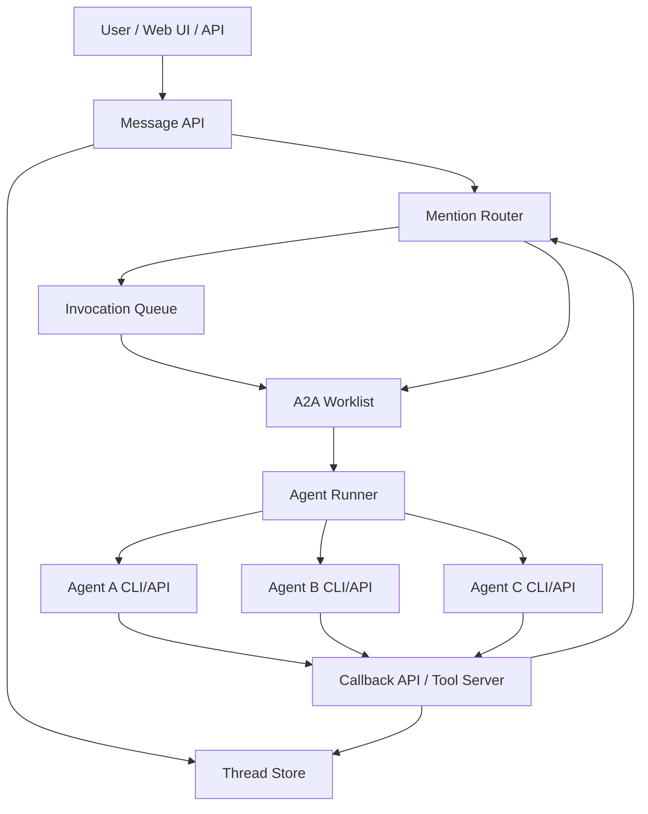
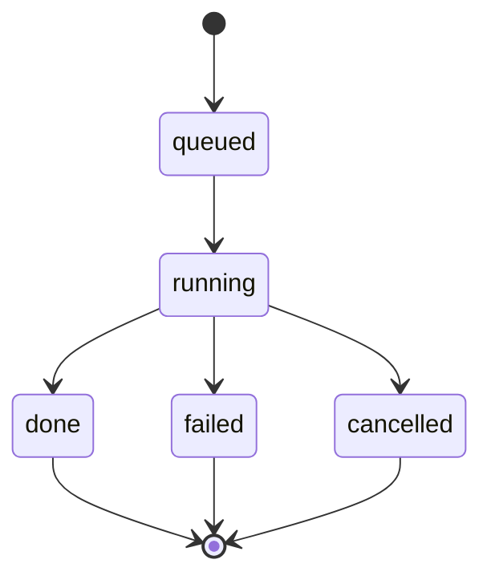
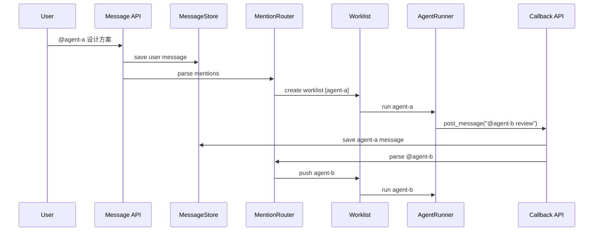

# 多 Agent 平台通信内核架构设计

> 文档状态：Superseded（早期架构方案）
> 当前来源：[当前 A2A 架构](./current-a2a-architecture.md)、[能力矩阵](../design/capability-matrix.md)
> 保留目的：记录第一阶段通信内核的设计背景，不代表当前 route mode、消息通道或 Provider 能力。

参考项目：[Cat Cafe / Clowder AI](https://github.com/zts212653/clowder-ai)

生成时间：2026-06-24

## 1. 目标

本架构文档用于设计一个自研多 Agent 平台的第一阶段能力：**多 Agent 之间的通信与接力调用**。

第一阶段不追求完整复刻 Cat Cafe，而是先实现一个稳定的 Multi-Agent Communication Kernel。

核心目标：

1. 多个 Agent 有独立身份：`agentId`、名称、模型、角色、mention handle。
2. 所有交流落到同一个 `thread` 里，而不是 Agent 点对点黑箱通信。
3. Agent A 可以通过 `@agentB` 触发 Agent B。
4. A → B → C 的接力必须可追踪、可取消、有限深。
5. Agent 输出、工具调用、路由决策都能审计。

## 2. 核心原则

### 2.1 不做 Agent 点对点私聊

Agent A 不应该直接调用 Agent B。

推荐模式：

```text
Agent A 想找 Agent B
→ A 发一条 message 到 thread，内容包含 @agentB
→ 系统保存 message
→ MentionRouter 解析 @agentB
→ 把 B 加入当前 invocation 的 worklist
→ A 完成后，调度器调用 B
→ B 的 prompt 中包含：A 刚才对你说了什么
```

这样所有通信都具备：

- 可见性：用户能看到 Agent 之间说了什么。
- 可审计性：所有消息和路由决策都有记录。
- 可取消性：用户可以取消整条调用链。
- 可防护性：可以限制深度、防止无限互相喊。
- 可回放性：可以复盘一次多 Agent 协作的完整过程。

### 2.2 Thread 是通信真相源

`thread` 是所有通信的中心。

所有用户消息、Agent 消息、系统消息、工具消息都应该写入同一个 thread 时间线。

不要让 Agent 之间的通信只存在于内存、临时 prompt 或外部 callback 中。

### 2.3 Worklist 是 A2A 接力核心

一次 invocation 不应该只表示“调用一个 Agent”，而应该表示“一条可延展的 Agent 接力链”。

例如：

```text
用户：@agent-a 设计方案，然后让 @agent-b review

worklist = [agent-a, agent-b]
```

如果 `agent-a` 运行期间又发消息：

```text
@agent-c 你也看一下数据库设计
```

则当前 worklist 变成：

```text
worklist = [agent-a, agent-b, agent-c]
```

## 3. 技术栈确认

第一阶段目标是通信内核，不是完整复刻 Cat Cafe。因此技术栈选择以简单、可调试、可快速验证为主。

### 3.1 第一阶段采用

| 层 | 技术 | 用途 |
| --- | --- | --- |
| 语言 | TypeScript | 前后端统一类型，便于抽象 AgentRunner、路由协议和数据模型 |
| 包管理 | pnpm monorepo | 管理 `api`、`web`、共享类型包 |
| 后端框架 | Fastify | 提供 Message API、Callback API、Agent 调度 API |
| 前端框架 | Next.js + React | 构建 thread UI、Agent 面板和运行状态视图 |
| 前端状态 | Zustand | 管理当前 thread、消息流、running invocation 状态 |
| 数据库 | SQLite + `better-sqlite3` | MVP 主存储，保存 agents、threads、messages、invocations、callback_tokens |
| 实时推送 | SSE | 推送 Agent 输出、消息新增、invocation 状态变化；第一阶段比 WebSocket 简单 |
| 入参校验 | Zod | 校验 Agent 配置、callback payload、API 请求 |
| 日志 | pino | 记录路由、调用、错误、callback、取消事件 |
| 测试 | Vitest 或 Node test runner | 覆盖 MentionParser、Worklist、Callback auth、循环阻断 |
| Agent 调用 | `MockRunner` + `CodexCliRunner` | 先用 Mock 验证通信内核，再接 Codex CLI |

第一阶段运行态先放内存：

```ts
const worklists = new Map<string, WorklistEntry>();
const runningInvocations = new Map<string, AbortController>();
```

SQLite 负责持久化：

```text
agents
threads
messages
invocations
callback_tokens
```

### 3.2 第一阶段暂不采用

| 技术 | 暂不采用原因 |
| --- | --- |
| Redis | 单进程 MVP 不需要；worklist、running invocation、AbortController 可先放内存 |
| `sqlite-vec` | 这是长期记忆/语义检索使用，不是多 Agent 通信内核必需 |
| PostgreSQL | 如果先做本地/单机 MVP，SQLite 更轻；SaaS 化后再切 PostgreSQL |
| MCP | 第一版用 HTTP Callback 即可；通信内核稳定后再升级 MCP tool server |
| 多 Provider 同时接入 | 第一版先 Mock，再 Codex；不要同时接 Claude/Gemini/opencode |
| 向量库 | 第二阶段做长期记忆和 Evidence Search 时再引入 |

### 3.3 第一阶段整体形态

```text
Next.js Web
  ↓ HTTP / SSE
Fastify API
  ↓
better-sqlite3
  ↓
AgentRunner
  ├─ MockRunner
  └─ CodexCliRunner
```

### 3.4 后续升级路径

| 触发条件 | 升级方向 |
| --- | --- |
| 需要多进程 / 多实例部署 | 引入 Redis 管理队列、running state、callback token TTL、分布式锁 |
| 需要 SaaS 多用户 | 从 SQLite 迁移到 PostgreSQL |
| 需要长期记忆 / 语义搜索 | 引入 `sqlite-vec` 或 `pgvector` |
| 需要让 Agent 用标准工具协议写回平台 | 引入 MCP Server |
| 需要跨设备实时协作 | 从 SSE 升级到 WebSocket 或 SSE + Redis pub/sub |

## 4. 总体架构



## 5. 模块划分

| 模块 | 职责 |
| --- | --- |
| `AgentRegistry` | 注册 Agent 身份、模型、能力、mention handle |
| `ThreadStore` | 存 thread、message、参与者、上下文 |
| `MessageStore` | 存用户消息、Agent 消息、系统消息、工具消息 |
| `MentionParser` | 从文本中解析 `@agentB` |
| `MentionRouter` | 根据 mention 结果决定目标 Agent |
| `InvocationQueue` | 控制每个 thread 内的执行顺序、并发和取消 |
| `WorklistRegistry` | 管理当前 invocation 的 A2A 接力链 |
| `AgentRunner` | 真正调用 Agent CLI/API |
| `Callback API` | Agent 运行中主动发消息、读取上下文、触发其他 Agent |
| `AuditLog` | 记录路由、调用、错误、取消、深度限制 |

## 6. 推荐目录结构

```text
multi-agent-platform/
  packages/
    api/
      src/
        agents/
          AgentRegistry.ts
          AgentRunner.ts
          AgentTypes.ts
          runners/
            MockRunner.ts
            CodexCliRunner.ts
            OpenAIAPIRunner.ts
        routing/
          MentionParser.ts
          MentionRouter.ts
          WorklistRegistry.ts
          InvocationQueue.ts
          RoutingTypes.ts
        threads/
          ThreadStore.ts
          MessageStore.ts
          ThreadTypes.ts
        callbacks/
          callbackRoutes.ts
          callbackAuth.ts
          callbackTypes.ts
        audit/
          AuditLog.ts
        server.ts
    web/
      src/
        components/
          ThreadView.tsx
          MessageList.tsx
          AgentPanel.tsx
  docs/
    architecture.md
    a2a-protocol.md
```

## 7. 核心数据模型

### 7.1 Agent

```ts
export type Agent = {
  id: string;
  displayName: string;
  mentionHandles: string[];
  provider: "codex" | "claude" | "gemini" | "openai-api" | "custom";
  model: string;
  rolePrompt: string;
  enabled: boolean;
};
```

示例：

```ts
const agents: Agent[] = [
  {
    id: "agent-a",
    displayName: "架构师",
    mentionHandles: ["@arch", "@agent-a"],
    provider: "codex",
    model: "gpt-5.4",
    rolePrompt: "你负责系统架构设计。",
    enabled: true,
  },
  {
    id: "agent-b",
    displayName: "Reviewer",
    mentionHandles: ["@reviewer", "@agent-b"],
    provider: "codex",
    model: "gpt-5.4",
    rolePrompt: "你负责代码审查、安全和测试。",
    enabled: true,
  },
];
```

### 7.2 Thread

```ts
export type Thread = {
  id: string;
  title: string;
  createdAt: number;
  updatedAt: number;
};
```

### 7.3 Message

```ts
export type Message = {
  id: string;
  threadId: string;
  senderType: "user" | "agent" | "system";
  senderId?: string;
  content: string;
  mentions: string[];
  replyTo?: string;
  invocationId?: string;
  createdAt: number;
};
```

### 7.4 Invocation

```ts
export type Invocation = {
  id: string;
  threadId: string;
  rootMessageId: string;
  status: "queued" | "running" | "done" | "failed" | "cancelled";
  targetAgents: string[];
  depth: number;
  createdAt: number;
  finishedAt?: number;
};
```

### 7.5 Worklist

```ts
export type WorklistEntry = {
  invocationId: string;
  threadId: string;
  list: string[];
  currentIndex: number;
  depth: number;
  maxDepth: number;
  a2aFrom: Record<string, string>;
  triggerMessageId: Record<string, string>;
  abortController: AbortController;
};
```

## 8. 核心执行流程

### 8.1 用户触发 Agent

用户发：

```text
@agent-a 帮我设计登录模块，然后让 @agent-b review
```

流程：

```text
Message API 接收用户消息
→ MessageStore 写入 thread
→ MentionParser 解析出 agent-a、agent-b
→ MentionRouter 创建 invocation
→ WorklistRegistry 注册 worklist = [agent-a, agent-b]
→ InvocationQueue 开始执行
```

### 8.2 Worklist 串行执行

伪代码：

```ts
async function executeWorklist(entry: WorklistEntry) {
  while (entry.currentIndex < entry.list.length) {
    const agentId = entry.list[entry.currentIndex];

    await runAgent({
      agentId,
      threadId: entry.threadId,
      invocationId: entry.invocationId,
      signal: entry.abortController.signal,
    });

    entry.currentIndex++;
  }
}
```

### 8.3 Agent A 运行中触发 Agent B

Agent A 输出：

```text
@agent-b 请重点 review token 存储和 session 过期策略。
```

或调用 callback：

```json
{
  "content": "@agent-b 请重点 review token 存储和 session 过期策略。",
  "targetAgents": ["agent-b"]
}
```

系统处理：

```text
Callback API 接收消息
→ 校验 invocation token
→ MessageStore 写入 thread
→ MentionParser 解析 agent-b
→ WorklistRegistry.push(invocationId, agent-b, from=agent-a)
→ 当前 Agent A 完成后，worklist 继续调度 Agent B
```

### 8.4 Agent B 获得上下文

Agent B 被调用时，prompt 应包含：

- 当前 thread 最近消息。
- 用户原始请求。
- Agent A 的输出。
- Agent A 对 B 的直接请求。
- B 自己的角色定义。

示例 prompt 结构：

```text
你是 agent-b，负责代码审查、安全和测试。

当前 thread:
User: @agent-a 帮我设计登录模块，然后让 @agent-b review
Agent A: 这是登录模块方案...
Agent A: @agent-b 请重点 review token 存储和 session 过期策略。

本轮任务:
Agent A 刚刚直接提到了你。请基于上面的上下文回应。
```

## 9. Callback API 设计

Agent 运行中需要主动和平台通信。MVP 先做 3 个接口。

### 9.1 发送消息

```http
POST /callbacks/post-message
```

请求：

```json
{
  "invocationId": "inv_123",
  "callbackToken": "token_xxx",
  "agentId": "agent-a",
  "content": "@agent-b 帮我 review 这个方案",
  "targetAgents": ["agent-b"],
  "replyTo": "msg_123"
}
```

响应：

```json
{
  "ok": true,
  "messageId": "msg_456",
  "routed": ["agent-b"]
}
```

处理逻辑：

1. 校验 `invocationId + callbackToken`。
2. 确认 invocation 仍 active。
3. 写入 `MessageStore`。
4. 解析 mentions。
5. 合并显式 `targetAgents`。
6. 追加目标到当前 worklist。
7. 推送 WebSocket/SSE 事件。

### 9.2 获取 thread 上下文

```http
GET /callbacks/thread-context?invocationId=inv_123&callbackToken=token_xxx&limit=50
```

响应：

```json
{
  "threadId": "thread_123",
  "messages": [
    {
      "senderType": "user",
      "content": "@agent-a 帮我设计登录模块"
    },
    {
      "senderType": "agent",
      "senderId": "agent-a",
      "content": "这是我的方案..."
    }
  ]
}
```

### 9.3 确认处理 mention

```http
POST /callbacks/ack
```

用于后续 pending mention 机制。MVP 可先不做复杂实现。

## 10. AgentRunner 抽象

所有 Agent 调用统一为一个接口。

```ts
export interface AgentRunner {
  run(input: AgentRunInput): AsyncIterable<AgentEvent>;
}

export type AgentRunInput = {
  agent: Agent;
  threadId: string;
  invocationId: string;
  messages: Message[];
  callbackToken: string;
  signal: AbortSignal;
};

export type AgentEvent =
  | { type: "text"; content: string }
  | { type: "tool_call"; name: string; input: unknown }
  | { type: "error"; error: string }
  | { type: "done" };
```

第一阶段建议先实现：

```ts
class MockRunner implements AgentRunner {}
class CodexCliRunner implements AgentRunner {}
```

不要一开始就同时接 Claude、Gemini、OpenAI API。通信内核跑通后再扩展 provider。

## 11. Mention 解析规则

MVP 规则：

1. 只解析已注册 Agent 的 `mentionHandles`。
2. mention handle 必须唯一。
3. 行首 mention 优先作为路由目标。
4. 正文中的 mention 可以作为弱触发，建议先简单处理为目标。
5. 代码块中的 mention 不触发。

示例：

```text
@agent-b 请 review
```

解析为：

```json
["agent-b"]
```

建议实现：

```ts
export function parseMentions(content: string, agents: Agent[]): string[] {
  const stripped = stripCodeBlocks(content);
  const result = new Set<string>();

  for (const agent of agents) {
    for (const handle of agent.mentionHandles) {
      if (stripped.includes(handle)) {
        result.add(agent.id);
      }
    }
  }

  return [...result];
}
```

后续再增强：

- 支持中文别名。
- 支持 `@all`。
- 支持 `@thread`。
- 支持只识别行首 mention。
- 支持 quoted/code exclusion。

## 12. 防死循环与安全机制

这些机制第一阶段就应该做。

| 风险 | 方案 |
| --- | --- |
| A 反复 @ B，B 反复 @ A | ping-pong 计数，超过阈值警告或阻断 |
| Agent 无限接力 | `maxDepth` |
| 旧 invocation 的 callback 污染新 invocation | callback 必须带 `invocationId + token` |
| 重复 @ 同一个 Agent | pending worklist 去重 |
| 用户取消后 Agent 继续写消息 | callback 校验 invocation 是否仍 active |
| 多 Agent 并发写混乱 | 所有消息统一写 thread 时间线 |

### 12.1 maxDepth

```ts
const MAX_A2A_DEPTH = 10;
```

每次 Agent 触发另一个 Agent，`depth + 1`。

超过阈值时：

```text
系统消息：A2A depth limit reached. Further routing blocked.
```

### 12.2 Ping-pong breaker

记录最近 A2A pair：

```ts
type PingPongState = {
  from: string;
  to: string;
  count: number;
};
```

规则：

- A → B → A → B 连续出现时累加。
- 超过 2 次，向 Agent 注入警告。
- 超过 4 次，阻断继续路由。

### 12.3 Callback token

每次 invocation 创建一个 token：

```ts
type CallbackAuth = {
  invocationId: string;
  tokenHash: string;
  expiresAt: number;
  active: boolean;
};
```

Agent 只能用当前 invocation 的 token 写回系统。

## 13. 状态流转

### 13.1 Invocation 状态



### 13.2 Message 写入与路由



## 14. MVP 实施顺序

建议按以下顺序开发。

### Step 1: AgentRegistry

目标：

- 注册 `agent-a`、`agent-b`。
- 支持 mention handle。
- 校验 handle 唯一。

验收：

```text
输入 @agent-a 能解析到 agent-a。
输入 @reviewer 能解析到 agent-b。
重复 handle 启动失败。
```

### Step 2: ThreadStore + MessageStore

目标：

- 创建 thread。
- 写入用户消息。
- 写入 Agent 消息。
- 按时间读取 thread 上下文。

验收：

```text
用户消息和 Agent 消息都能在同一个 thread 中按顺序读取。
```

### Step 3: MentionParser + MentionRouter

目标：

- 从消息中解析目标 Agent。
- 无 mention 时路由到默认 Agent。
- 多 mention 时生成多个目标。

验收：

```text
"@agent-a hi" → ["agent-a"]
"@agent-a @agent-b discuss" → ["agent-a", "agent-b"]
```

### Step 4: InvocationQueue + Worklist

目标：

- 创建 invocation。
- 创建 worklist。
- 串行执行多个 Agent。
- 支持运行中追加 Agent。

验收：

```text
初始 worklist = [agent-a]
agent-a callback @agent-b
最终 worklist = [agent-a, agent-b]
```

### Step 5: MockRunner

目标：

- 不接真实大模型。
- 用假 Agent 模拟输出。
- 快速验证 A2A 链路。

验收：

```text
Mock agent-a 输出 "@agent-b review"
系统自动调度 mock agent-b
```

### Step 6: Callback API

目标：

- Agent 可通过 `/callbacks/post-message` 写回消息。
- 写回消息可触发 A2A。
- callback token 校验生效。

验收：

```text
无 token 写入失败。
过期 invocation 写入失败。
有效 token 写入成功并触发目标 Agent。
```

### Step 7: 接入第一个真实 Agent CLI

建议先接 Codex CLI 或一个 OpenAI API Runner。

目标：

- 把 thread context 组装成 prompt。
- 调用真实 Agent。
- 流式接收输出。
- 输出写回 MessageStore。

### Step 8: 前端实时显示

目标：

- WebSocket/SSE 推送 message。
- 展示 thread 时间线。
- 展示当前 running agents。
- 支持 cancel invocation。

### Step 9: 防护机制

目标：

- maxDepth。
- ping-pong breaker。
- pending 去重。
- stale callback 拒绝。
- cancellation。

## 15. 最小闭环示例

用户发：

```text
@agent-a 帮我设计登录模块，然后让 @agent-b review
```

系统执行：

```text
worklist = [agent-a, agent-b]

run agent-a
  agent-a 输出方案
  agent-a 可通过 callback 补充：@agent-b 请重点看安全性

run agent-b
  agent-b 读取 thread 上下文
  agent-b 知道 agent-a 的方案和请求
  agent-b 输出 review
```

最终 thread：

```text
User:
@agent-a 帮我设计登录模块，然后让 @agent-b review

Agent A:
这是登录模块方案...

Agent A:
@agent-b 请重点看 token 存储和 session 过期

Agent B:
我 review 了，主要风险有三点...
```

## 16. 与 Cat Cafe 的对应关系

| 本项目设计 | Cat Cafe 对应设计 |
| --- | --- |
| `AgentRegistry` | CatRegistry / runtime cat catalog |
| `MentionRouter` | AgentRouter |
| `WorklistRegistry` | WorklistRegistry |
| `Callback API` | MCP callback / `/api/callbacks/post-message` |
| `AgentRunner` | ClaudeAgentService / CodexAgentService / GeminiAgentService |
| `ThreadStore` | thread/message stores |
| `maxDepth` | A2A depth limit |
| `ping-pong breaker` | F167 ping-pong streak breaker |

## 17. 不建议第一阶段做的事情

第一阶段不要急着做：

- 长期记忆系统。
- Skills 框架。
- 多平台 IM 接入。
- 复杂权限系统。
- 多租户。
- Agent 自我进化。
- Mission Hub。
- 语音和游戏。
- 完整 MCP 工具生态。

这些能力都应该建立在稳定通信内核之上。

## 18. 第一阶段完成标准

当下面场景稳定通过时，第一阶段才算完成：

1. 用户可以在 thread 中 `@agent-a`。
2. `agent-a` 能读取 thread 上下文并回复。
3. `agent-a` 可以通过 `@agent-b` 触发 `agent-b`。
4. `agent-b` 能看到用户原始需求和 `agent-a` 的消息。
5. 所有消息都在 thread 时间线中可见。
6. 用户可以取消整条调用链。
7. A/B 互相无限 `@` 会被阻断。
8. 旧 invocation 的 callback 不能污染新 invocation。

## 19. 总结

第一阶段架构的重点不是“让 Agent 更聪明”，而是让 Agent 之间的通信变成一个可靠、可审计、可取消、可限深的系统能力。

最小可行核心是：

```text
Thread 事件流
+ Mention 路由
+ Worklist 调度
+ Callback 写回
+ AgentRunner 抽象
+ 防循环机制
```

通信内核稳定后，再扩展记忆、review、任务系统、Skills、多平台入口和复杂治理。
