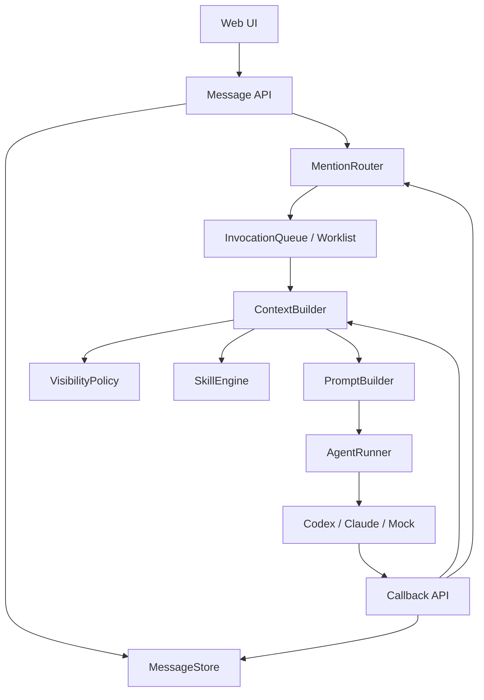

# TheTower 协作上下文与 Skills 升级方案

参考项目：Cat Cafe / Clowder AI

生成时间：2026-06-25

## 1. 背景

TheTower 当前已经具备基础多 Agent 通信能力：

- 用户消息写入 thread。
- 后端解析 `@mention`。
- Worklist 按顺序调用 Agent。
- Agent 可通过最终回复继续触发下一个 Agent。
- Codex CLI 已接入 HTTP callback prompt fallback。

但当前上下文模型仍然是公开 thread 模型：调用任意 Agent 前，后端会把同一个 thread 的最近消息直接传入 runner。这个模式适合早期调试和简单协作，但不利于后续扩展：

- 无法区分公开消息、私密消息、系统 briefing、工具结果、运行过程输出。
- 无法实现按 Agent 过滤上下文。
- 无法稳定支持复杂 A2A 交接、角色扮演、隐藏信息任务。
- 缺少统一的协作行为规范，Agent 交接质量依赖 prompt 临场发挥。

Cat Cafe 的协作上下文值得参考。它的普通多 Agent 协作并不是复杂游戏上下文，而是以 thread message 为主，同时增加了 message visibility、viewer 过滤、origin 分类、callback 工具和 skills 行为协议。

本方案只讨论协作上下文，不纳入狼人杀等 GameRuntime / GameView 机制。

## 2. Cat Cafe 协作上下文总结

### 2.1 Thread 是协作上下文真相源

Cat Cafe 普通协作围绕 thread 展开。用户消息、Agent 消息、callback 写回、A2A handoff 都落到同一个 thread。

核心 callback 工具：

```text
POST /api/callbacks/post-message
GET  /api/callbacks/thread-context
GET  /api/callbacks/pending-mentions
```

Agent 运行中可以主动写回消息，也可以读取当前 thread 上下文，而不是只能依赖最终回复。

### 2.2 默认公开，但支持可见性过滤

Cat Cafe message 模型支持：

```ts
visibility?: "public" | "whisper";
whisperTo?: readonly CatId[];
revealedAt?: number;
origin?: "stream" | "callback" | "briefing";
deliveryStatus?: "queued" | "delivered" | "canceled";
```

可见性规则：

- 用户视角可以看到全部消息。
- `public` 消息所有 Agent 可见。
- `whisper` 消息只对 `whisperTo` 中的 Agent 可见。
- `revealedAt` 后，原本 whisper 的消息变为所有人可见。
- `briefing` 不进入普通路由上下文。
- play 模式下，其他 Agent 的 `stream` 过程输出会被隐藏。

### 2.3 debug / play 两种读取模式

Cat Cafe thread 有 `thinkingMode`：

```ts
thinkingMode: "debug" | "play"
```

含义：

- `debug`：开发调试模式，Agent 更接近用户视角，可以看到更多上下文。
- `play`：协作隔离模式，Agent 使用自己的 viewer，只能看到自己有权限看到的消息。

这给平台提供了两个运行档位：

- 早期开发、排障、复盘时使用 `debug`。
- 角色扮演、隐藏信息、多方协作边界清晰时使用 `play`。

### 2.4 Skills 是协作行为协议层

Cat Cafe 的 `cat-cafe-skills` 不是工具层，也不是数据库层，而是 Agent 协作 SOP 层。

它解决的问题是：Agent 看到上下文后应该如何行动。

典型技能：

- `cross-cat-handoff`：规范跨 Agent 交接格式。
- `receive-handoff-grounding`：接收方先校验交接内容和证据。
- `request-review`：发起 review。
- `receive-review`：处理 review 意见。
- `quality-gate`：交付前检查。
- `context-self-management`：上下文过长时主动压缩和沉淀。

因此，协作上下文可以拆成两层：

```text
底层：thread message + visibility + callback routes + ContextBuilder
上层：skills + trigger rules + prompt injection + output contract
```

TheTower 应该从一开始引入 Skills 基础设施。否则后续每次新增协作模式都会变成改 rolePrompt，难以治理。

## 3. TheTower 目标架构

### 3.1 升级目标

本次升级目标不是实现游戏上下文，而是升级普通多 Agent 协作能力：

1. 增加 message visibility，支持公开消息和定向消息。
2. 增加 message origin，区分正式发言、运行过程、系统 briefing、工具结果。
3. 增加 ContextBuilder，按 Agent 和 thread mode 生成上下文。
4. 增加 thread mode：`debug | play`。
5. 增加 Skills 基础设施，作为 Agent 协作规范入口。
6. 让 callback 和 runner 都使用同一套上下文构建逻辑。

### 3.2 总体结构



### 3.3 核心原则

1. Thread 仍然是协作真相源。
2. Agent 之间默认通过公开消息和 line-start mention 交接。
3. 不做隐式点对点 RPC。
4. 私密消息可以存在，但必须可审计、可 reveal。
5. 所有 Agent 上下文都必须经过 ContextBuilder。
6. Skills 不直接执行业务逻辑，只改变 prompt、约束输出和触发流程。

## 4. 数据模型升级

### 4.1 Message

建议扩展当前 message 模型：

```ts
export type MessageVisibility = "public" | "private";

export type MessageOrigin =
  | "user"
  | "agent_final"
  | "agent_stream"
  | "callback"
  | "tool"
  | "system"
  | "briefing";

export type Message = {
  id: string;
  threadId: string;
  authorType: "user" | "agent" | "system";
  authorId: string | null;
  content: string;
  mentions: string[];
  timestamp: number;

  visibility?: MessageVisibility;
  visibleToAgentIds?: string[];
  revealedAt?: number;

  origin?: MessageOrigin;
  replyTo?: string;
  invocationId?: string;
  deliveryStatus?: "queued" | "delivered" | "canceled";
};
```

说明：

- `visibility` 默认值为 `public`。
- `private` 对应 Cat Cafe 的 `whisper`。
- `visibleToAgentIds` 只在 `private` 时生效。
- `revealedAt` 用于调试、复盘或用户手动公开。
- `origin=briefing` 的消息默认不进入 Agent 普通上下文。
- `origin=agent_stream` 表示运行过程输出，在 play 模式下不应暴露给其他 Agent。

### 4.2 Thread

建议扩展 thread：

```ts
export type ThreadMode = "debug" | "play";

export type Thread = {
  id: string;
  title: string;
  createdAt: number;
  updatedAt: number;
  mode: ThreadMode;
};
```

默认值建议：

```text
mode = "debug"
```

原因：

- 开发阶段透明度更高。
- 方便排查 callback、routing、prompt 问题。
- 后续用户可在 UI 上切换为 `play`。

## 5. ContextBuilder

### 5.1 职责

当前 TheTower 不应该继续由 `CommunicationService` 直接：

```ts
messageStore.listByThread(threadId, 100)
```

然后把结果传给 runner。

应该改成：

```ts
contextBuilder.buildForAgent({
  threadId,
  agentId,
  mode,
  limit,
  invocationId,
});
```

### 5.2 输入输出

```ts
export type BuildAgentContextInput = {
  threadId: string;
  agentId: string;
  mode: "debug" | "play";
  limit?: number;
  invocationId?: string;
};

export type AgentContext = {
  threadId: string;
  agentId: string;
  mode: "debug" | "play";
  messages: Message[];
  activeSkills: ResolvedSkill[];
  availableAgents: Agent[];
};
```

### 5.3 过滤规则

debug 模式：

- 用户可见消息全部保留。
- 可包含其他 Agent 的过程输出。
- 可包含 revealed private 消息。
- 可选：仍然排除 `deliveryStatus=canceled` 和 `origin=briefing`。

play 模式：

- `public` 可见。
- `private` 仅当 `visibleToAgentIds` 包含当前 Agent 时可见。
- `revealedAt` 后可见。
- 隐藏其他 Agent 的 `agent_stream`。
- 隐藏 `briefing`，除非 briefing 明确发给当前 Agent。
- 隐藏未 delivered / canceled 消息。

### 5.4 VisibilityPolicy

建议单独抽出纯函数：

```ts
export type ContextViewer =
  | { type: "user" }
  | { type: "agent"; agentId: string };

export function canViewMessage(message: Message, viewer: ContextViewer): boolean {
  if (viewer.type === "user") return true;

  if (!message.visibility || message.visibility === "public") return true;

  if (message.visibility === "private") {
    if (message.revealedAt) return true;
    return message.visibleToAgentIds?.includes(viewer.agentId) ?? false;
  }

  return false;
}
```

## 6. Skills 基础设施

### 6.1 为什么第一阶段就做

Skills 必须从一开始加入，原因是：

1. A2A 的质量不是路由器能单独解决的，必须约束 Agent 如何交接。
2. 如果只靠 rolePrompt，后续会出现重复 prompt、冲突 prompt、难以审计的问题。
3. Skills 可以作为后续 review、planning、debug、handoff、memory 的统一扩展点。
4. Cat Cafe 的经验说明，skills 是协作规范层，不是锦上添花。

### 6.2 第一阶段不做复杂插件系统

第一阶段只做文件型 skills，不做市场、不做安装器、不做 UI 编辑器。

推荐目录：

```text
packages/api/src/skills/
  SkillTypes.ts
  SkillRegistry.ts
  SkillResolver.ts
  PromptSkillInjector.ts

skills/
  cross-agent-handoff/
    skill.yaml
    SKILL.md
  receive-handoff-grounding/
    skill.yaml
    SKILL.md
  quality-gate/
    skill.yaml
    SKILL.md
```

### 6.3 Skill Manifest

```yaml
id: cross-agent-handoff
name: Cross Agent Handoff
description: 规范 Agent 将任务交接给另一个 Agent 的格式
enabled: true
triggers:
  mention_line_start: true
  keywords:
    - 交给
    - 继续
    - review
    - 检查
appliesTo:
  providers:
    - codex
    - claude
    - mock
outputContract:
  requiredSections:
    - What
    - Why
    - Next Action
priority: 100
```

### 6.4 Skill 内容

`SKILL.md` 示例：

```md
# Cross Agent Handoff

当你需要把任务交给另一个 Agent 时，必须使用行首 mention。

交接消息应包含：

- What：当前已经完成什么。
- Why：为什么需要对方继续。
- Context：对方需要知道的关键上下文。
- Open Questions：仍未解决的问题。
- Next Action：希望对方具体做什么。

不要在确认、致谢、总结完成时继续 mention。
```

### 6.5 SkillResolver

第一阶段可以用规则触发：

```ts
export type SkillTriggerInput = {
  agent: Agent;
  thread: Thread;
  messages: Message[];
  currentUserMessage?: Message;
  invocationState: InvocationState;
};

export type ResolvedSkill = {
  id: string;
  priority: number;
  prompt: string;
};
```

触发规则：

- 当前回复可能包含 line-start mention：注入 `cross-agent-handoff`。
- 当前 Agent 是被其他 Agent mention 唤醒：注入 `receive-handoff-grounding`。
- 当前 Agent 是 worklist 最后一个：注入 `quality-gate`。
- 用户要求 review：注入 `request-review` 或 `receive-review`。

### 6.6 Prompt 注入顺序

推荐顺序：

```text
1. 平台系统规则
2. Agent 身份与 rolePrompt
3. 当前 invocation / worklist 状态
4. 可用 Agent 列表
5. 可用 callback 工具说明
6. Resolved Skills
7. Thread Context
8. 当前任务
```

Skills 应该靠后注入，贴近当前任务，但仍在 thread context 前，这样 Agent 会先知道行为规范，再阅读上下文。

## 7. Callback API 升级

### 7.1 保留现有接口

```text
POST /api/callbacks/post-message
GET  /api/callbacks/thread-context
```

### 7.2 post-message 增加可见性字段

```ts
type PostMessageBody = {
  invocationId: string;
  callbackToken: string;
  content: string;
  visibility?: "public" | "private";
  visibleToAgentIds?: string[];
  replyTo?: string;
};
```

规则：

- 默认 `visibility=public`。
- Agent 只能给自己和明确指定的 Agent 发 private。
- private 消息仍然写入 thread，只是普通 Agent context 不可见。
- 用户 UI 可以有开关显示或 reveal private 消息。

### 7.3 thread-context 必须走 ContextBuilder

当前 callback 获取上下文时，也必须使用：

```ts
contextBuilder.buildForAgent({
  threadId,
  agentId: principal.agentId,
  mode: thread.mode,
  limit,
});
```

这样 runner 初始 prompt 和 Agent 运行中主动读取上下文使用同一套可见性逻辑。

## 8. UI 升级

第一阶段 UI 只需要暴露最少能力：

1. Thread mode 切换：`debug / play`。
2. Message badge：
   - `public`
   - `private`
   - `callback`
   - `stream`
   - `system`
3. private 消息默认折叠，显示“仅 zavala / ikora 可见”。
4. 用户可以 reveal private 消息。
5. Agent 面板显示当前启用 skills。

不要一开始做复杂 skill 编辑器。Skills 先通过文件配置，UI 只读展示。

## 9. 开发阶段

### Phase 1：Skills 基础设施

目标：先把协作规范层搭好。

任务：

1. 新增 `skills/` 根目录。
2. 新增三个内置 skill：
   - `cross-agent-handoff`
   - `receive-handoff-grounding`
   - `quality-gate`
3. 实现 `SkillRegistry`，从文件读取 manifest 和 `SKILL.md`。
4. 实现 `SkillResolver`，基于 invocation/worklist/message 触发 skill。
5. 在 `CliPromptBuilder` 中注入 resolved skills。
6. 为 SkillResolver 增加单元测试。

验收：

- Agent A 交接给 Agent B 时，prompt 中包含 handoff skill。
- Agent B 被 A 唤醒时，prompt 中包含 receive-handoff skill。
- worklist 最后一个 Agent 的 prompt 中包含 quality-gate skill。

### Phase 2：Message 可见性模型

目标：message 支持公开和私密。

任务：

1. 扩展 Message 类型。
2. 扩展 MessageStore append/list。
3. 新增 `VisibilityPolicy`。
4. 增加 private message 测试。
5. UI 显示 visibility badge。

验收：

- public 消息所有 Agent 可见。
- private 消息只对指定 Agent 可见。
- 用户视角仍可审计全部消息。

### Phase 3：ContextBuilder

目标：所有 Agent 上下文都通过统一入口构建。

任务：

1. 新增 `ContextBuilder`。
2. `CommunicationService` 改用 `ContextBuilder`。
3. callback `thread-context` 改用 `ContextBuilder`。
4. 支持 `debug / play` 模式。
5. 增加上下文过滤测试。

验收：

- debug 模式下保持当前调试体验。
- play 模式下隐藏其他 Agent private 和 stream 消息。
- runner 初始上下文与 callback 读取上下文一致。

### Phase 4：Callback 可见性升级

目标：Agent 可以通过 callback 发 private message。

任务：

1. `POST /api/callbacks/post-message` 支持 `visibility`。
2. prompt callback 说明补充 private 用法。
3. 增加权限校验。
4. 增加 reveal API。

验收：

- Agent 能写 public message。
- Agent 能写给指定 Agent 的 private message。
- private message 不会触发非 recipient Agent。

### Phase 5：协作行为治理

目标：减少无效 ping-pong，提高交接质量。

任务：

1. line-start mention 继续作为唯一 A2A 路由触发。
2. inline mention 只显示，不路由。
3. handoff skill 要求 `Next Action`。
4. receive skill 要求先复述接收到的任务边界。
5. quality-gate skill 要求最后一个 Agent 总结完成状态。

验收：

- “收到”“已完成”不会继续 @ 下一个 Agent。
- 多 Agent 接力时，每次交接都有明确任务。
- 用户可以从 thread 中复盘完整协作链。

## 10. 优先级建议

建议先做：

```text
Phase 1 Skills
→ Phase 3 ContextBuilder 骨架
→ Phase 2 Message Visibility
→ Phase 4 Callback Visibility
→ Phase 5 Governance
```

实际开发时，Phase 2 和 Phase 3 可以交叉推进，但 Skills 必须先做，因为它会影响 PromptBuilder 的形态。如果等所有通信能力完成后再补 Skills，后续会重构 prompt 注入顺序。

## 11. 非目标

本升级阶段不做：

- 狼人杀 GameRuntime。
- faction / seat scope。
- 长期记忆和向量检索。
- Skill marketplace。
- 图形化 Skill 编辑器。
- 多租户权限系统。
- Redis 分布式队列。

这些能力后续可以基于 ContextBuilder 和 Skills 继续扩展。

## 12. 对当前 TheTower 的直接改造点

当前最关键的代码改造点：

1. `packages/api/src/agents/runners/CliPromptBuilder.ts`
   - 增加 skills 注入区。
   - 减少硬编码协作规则。

2. `packages/api/src/services/CommunicationService.ts`
   - 将直接 `messageStore.listByThread(...)` 改为 `contextBuilder.buildForAgent(...)`。

3. `packages/api/src/routes.ts` 或 callback routes
   - `thread-context` 统一走 ContextBuilder。
   - `post-message` 支持 visibility。

4. `packages/api/src/stores/MessageStore.ts`
   - 扩展 message schema。
   - 增加 visibility/reveal 相关方法。

5. 新增：
   - `packages/api/src/context/ContextBuilder.ts`
   - `packages/api/src/context/VisibilityPolicy.ts`
   - `packages/api/src/skills/SkillRegistry.ts`
   - `packages/api/src/skills/SkillResolver.ts`
   - `packages/api/src/skills/PromptSkillInjector.ts`

## 13. 最终判断

TheTower 不需要马上实现 Cat Cafe 的游戏上下文，但需要尽快升级协作上下文。

推荐路线是：

```text
公开 thread 协作
→ Skills 行为协议
→ ContextBuilder 统一上下文入口
→ Message visibility
→ debug/play 双模式
→ callback 私密写回
```

这样既保留当前快速调试能力，又为后续隐藏信息、多角色协作、复杂 review 流程和长期记忆打好架构基础。
