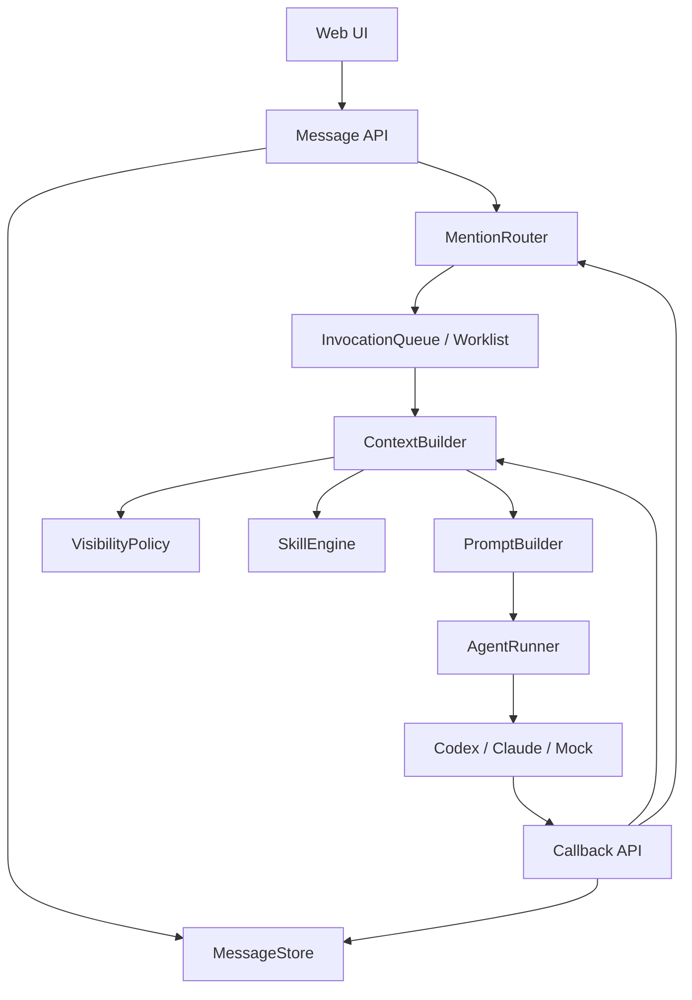

# TheTower 协作上下文与 Skills 升级方案

参考项目：Cat Cafe / Clowder AI

生成时间：2026-06-25

分阶段开发文档：[docs/phases/README.md](./phases/README.md)

## 1. 背景

TheTower 当前已经具备基础多 Agent 通信能力：

- 用户消息写入 thread。
- 后端解析 `@mention`。
- Worklist 按顺序调用 Agent。
- Agent 可通过最终回复继续触发下一个 Agent。
- Codex CLI 已接入 HTTP callback prompt fallback。

但当前上下文模型仍然是公开 thread 模型：调用任意 Agent 前，后端会把同一个 thread 的最近消息直接传入 runner。这个模式适合早期调试和简单协作，但不利于后续扩展：

- 无法区分公开消息、私密消息、系统 briefing、工具结果、运行过程输出。
- 无法实现按 Agent 过滤上下文。
- 无法稳定支持复杂 A2A 交接、角色扮演、隐藏信息任务。
- 缺少统一的协作行为规范，Agent 交接质量依赖 prompt 临场发挥。

Cat Cafe 的协作上下文值得参考。它的普通多 Agent 协作并不是复杂游戏上下文，而是以 thread message 为主，同时增加了 message visibility、viewer 过滤、origin 分类、callback 工具和 skills 行为协议。

本方案只讨论协作上下文，不纳入狼人杀等 GameRuntime / GameView 机制。

## 2. Cat Cafe 协作上下文总结

### 2.1 Thread 是协作上下文真相源

Cat Cafe 普通协作围绕 thread 展开。用户消息、Agent 消息、callback 写回、A2A handoff 都落到同一个 thread。

核心 callback 工具：

```text
POST /api/callbacks/post-message
GET  /api/callbacks/thread-context
GET  /api/callbacks/pending-mentions
```

Agent 运行中可以主动写回消息，也可以读取当前 thread 上下文，而不是只能依赖最终回复。

### 2.2 默认公开，但支持可见性过滤

Cat Cafe message 模型支持：

```ts
visibility?: "public" | "whisper";
whisperTo?: readonly CatId[];
revealedAt?: number;
origin?: "stream" | "callback" | "briefing";
deliveryStatus?: "queued" | "delivered" | "canceled";
```

可见性规则：

- 用户视角可以看到全部消息。
- `public` 消息所有 Agent 可见。
- `whisper` 消息只对 `whisperTo` 中的 Agent 可见。
- `revealedAt` 后，原本 whisper 的消息变为所有人可见。
- `briefing` 不进入普通路由上下文。
- play 模式下，其他 Agent 的 `stream` 过程输出会被隐藏。

### 2.3 debug / play 两种读取模式

Cat Cafe thread 有 `thinkingMode`：

```ts
thinkingMode: "debug" | "play"
```

含义：

- `debug`：开发调试模式，Agent 更接近用户视角，可以看到更多上下文。
- `play`：协作隔离模式，Agent 使用自己的 viewer，只能看到自己有权限看到的消息。

这给平台提供了两个运行档位：

- 早期开发、排障、复盘时使用 `debug`。
- 角色扮演、隐藏信息、多方协作边界清晰时使用 `play`。

### 2.4 Skills 是协作行为协议层

Cat Cafe 的 `cat-cafe-skills` 不是工具层，也不是数据库层，而是 Agent 协作 SOP 层。

它解决的问题是：Agent 看到上下文后应该如何行动。

典型技能：

- `cross-cat-handoff`：规范跨 Agent 交接格式。
- `receive-handoff-grounding`：接收方先校验交接内容和证据。
- `request-review`：发起 review。
- `receive-review`：处理 review 意见。
- `quality-gate`：交付前检查。
- `context-self-management`：上下文过长时主动压缩和沉淀。

因此，协作上下文可以拆成两层：

```text
底层：thread message + visibility + callback routes + ContextBuilder
上层：skills + trigger rules + prompt injection + output contract
```

TheTower 应该从一开始引入 Skills 基础设施。否则后续每次新增协作模式都会变成改 rolePrompt，难以治理。

## 3. TheTower 目标架构

### 3.1 升级目标

本次升级目标不是实现游戏上下文，而是升级普通多 Agent 协作能力：

1. 增加 message visibility，支持公开消息和定向消息。
2. 增加 message origin，区分正式发言、运行过程、系统 briefing、工具结果。
3. 增加 ContextBuilder，按 Agent 和 thread mode 生成上下文。
4. 增加 thread mode：`debug | play`。
5. 增加 Skills 基础设施，作为 Agent 协作规范入口。
6. 让 callback 和 runner 都使用同一套上下文构建逻辑。

### 3.2 总体结构



### 3.3 核心原则

1. Thread 仍然是协作真相源。
2. Agent 之间默认通过公开消息和 line-start mention 交接。
3. 不做隐式点对点 RPC。
4. 私密消息可以存在，但必须可审计、可 reveal。
5. 所有 Agent 上下文都必须经过 ContextBuilder。
6. Skills 不直接执行业务逻辑，只改变 prompt、约束输出和触发流程。

## 4. 数据模型升级

### 4.1 Message

建议扩展当前 message 模型：

```ts
export type MessageVisibility = "public" | "private";

export type MessageOrigin =
  | "user"
  | "agent_final"
  | "agent_stream"
  | "callback"
  | "tool"
  | "system"
  | "briefing";

export type Message = {
  id: string;
  threadId: string;
  authorType: "user" | "agent" | "system";
  authorId: string | null;
  /** UI 默认展示的正文，即应该展示给用户的内容。 */
  content: string;
  mentions: string[];
  timestamp: number;

  visibility?: MessageVisibility;
  visibleToAgentIds?: string[];
  revealedAt?: number;

  origin?: MessageOrigin;
  replyTo?: string;
  invocationId?: string;
  deliveryStatus?: "queued" | "delivered" | "canceled";

  /**
   * 结构化交接上下文。
   * 用于注入给接收 Agent，不要求完整展示给用户。
   */
  handoffPayload?: HandoffPayload;
};
```

说明：

- `visibility` 默认值为 `public`。
- `private` 对应 Cat Cafe 的 `whisper`。
- `visibleToAgentIds` 只在 `private` 时生效。
- `revealedAt` 用于调试、复盘或用户手动公开。
- `origin=briefing` 的消息默认不进入 Agent 普通上下文。
- `origin=agent_stream` 表示运行过程输出，在 play 模式下不应暴露给其他 Agent。
- `content` 是用户默认看到的内容；`handoffPayload` 是 Agent 接球时使用的结构化上下文。
- A2A 五件套应优先写入 `handoffPayload`，而不是强迫 Agent 把 `### What / Why / Tradeoff` 全量暴露在公开消息里。

### 4.2 HandoffPayload

Cat Cafe 的经验是：交接内容必须结构化，但不一定要把完整结构化内容原样展示给用户。TheTower 应将“公开显示文本”和“接收方上下文”分开。

建议新增：

```ts
export type HandoffPayload = {
  fromAgentId: string;
  toAgentIds: string[];
  triggerMessageId?: string;

  what: string;
  why: string;
  tradeoff: string;
  openQuestions: string[];
  nextAction: string;

  evidenceRefs?: Array<{
    kind: "message" | "file" | "command" | "url" | "other";
    ref: string;
    note?: string;
  }>;

  riskLevel?: "low" | "medium" | "high";
  createdAt: number;
};
```

使用方式：

```text
公开 content:
@banshee 请基于 Ikora 的风格指南起草初稿，主题是“信息洪流中的注意力碎片”。

隐藏 handoffPayload:
{
  what: "Ikora 已完成鲁迅风格指南...",
  why: "Banshee 需要据此起草初稿...",
  tradeoff: "选择注意力碎片而非算法牢笼...",
  openQuestions: ["结尾是否保留开放性？"],
  nextAction: "写 800-1200 字初稿..."
}
```

UI 默认只显示 `content`。后续可以提供“展开交接详情”用于调试和复盘。

Runner prompt 构建时应把目标 Agent 可见的 `handoffPayload` 注入到“本轮交接上下文”区域。这样可以满足：

- Agent 内部有完整五件套。
- 用户看到的是自然协作消息。
- 高风险任务仍可在 UI 中展开审计。

### 4.3 BriefingMessage

`briefing` 用于系统生成的上下文摘要、长 thread 导航、hidden handoff bootstrap 等。它和普通公开消息不同：默认不触发路由，也不作为普通对话展示。

建议用 `origin=briefing` 表示：

```ts
export type BriefingKind =
  | "context_summary"
  | "handoff_payload"
  | "routing_hint"
  | "system_digest";

export type BriefingMessage = Message & {
  authorType: "system";
  origin: "briefing";
  briefingKind: BriefingKind;
  visibleToAgentIds?: string[];
};
```

规则：

- `briefing` 默认不进入普通 UI 时间线，或以折叠卡片显示。
- `briefing` 不触发 mention 路由。
- `thread-context` 在普通模式下排除 `briefing`，但 `ContextBuilder` 可以按目标 Agent 显式注入相关 briefing。
- `handoff_payload` 类型 briefing 可用于跨 session / 长上下文接力。

### 4.4 Thread

建议扩展 thread：

```ts
export type ThreadMode = "debug" | "play";

export type Thread = {
  id: string;
  title: string;
  createdAt: number;
  updatedAt: number;
  mode: ThreadMode;
};
```

默认值建议：

```text
mode = "debug"
```

原因：

- 开发阶段透明度更高。
- 方便排查 callback、routing、prompt 问题。
- 后续用户可在 UI 上切换为 `play`。

## 5. ContextBuilder

### 5.1 职责

当前 TheTower 不应该继续由 `CommunicationService` 直接：

```ts
messageStore.listByThread(threadId, 100)
```

然后把结果传给 runner。

应该改成：

```ts
contextBuilder.buildForAgent({
  threadId,
  agentId,
  mode,
  limit,
  invocationId,
});
```

### 5.2 输入输出

```ts
export type BuildAgentContextInput = {
  threadId: string;
  agentId: string;
  mode: "debug" | "play";
  limit?: number;
  invocationId?: string;
};

export type AgentContext = {
  threadId: string;
  agentId: string;
  mode: "debug" | "play";
  messages: Message[];
  activeSkills: ResolvedSkill[];
  availableAgents: Agent[];
};
```

### 5.3 过滤规则

debug 模式：

- 用户可见消息全部保留。
- 可包含其他 Agent 的过程输出。
- 可包含 revealed private 消息。
- 可选：仍然排除 `deliveryStatus=canceled` 和 `origin=briefing`。

play 模式：

- `public` 可见。
- `private` 仅当 `visibleToAgentIds` 包含当前 Agent 时可见。
- `revealedAt` 后可见。
- 隐藏其他 Agent 的 `agent_stream`。
- 隐藏 `briefing`，除非 briefing 明确发给当前 Agent。
- 隐藏未 delivered / canceled 消息。

### 5.4 VisibilityPolicy

建议单独抽出纯函数：

```ts
export type ContextViewer =
  | { type: "user" }
  | { type: "agent"; agentId: string };

export function canViewMessage(message: Message, viewer: ContextViewer): boolean {
  if (viewer.type === "user") return true;

  if (!message.visibility || message.visibility === "public") return true;

  if (message.visibility === "private") {
    if (message.revealedAt) return true;
    return message.visibleToAgentIds?.includes(viewer.agentId) ?? false;
  }

  return false;
}
```

## 6. Skills 基础设施

### 6.1 为什么第一阶段就做

Skills 必须从一开始加入，原因是：

1. A2A 的质量不是路由器能单独解决的，必须约束 Agent 如何交接。
2. 如果只靠 rolePrompt，后续会出现重复 prompt、冲突 prompt、难以审计的问题。
3. Skills 可以作为后续 review、planning、debug、handoff、memory 的统一扩展点。
4. Cat Cafe 的经验说明，skills 是协作规范层，不是锦上添花。

### 6.2 第一阶段不做复杂插件系统

第一阶段只做文件型 skills，不做市场、不做安装器、不做 UI 编辑器。

推荐目录：

```text
packages/api/src/skills/
  SkillTypes.ts
  SkillRegistry.ts
  SkillResolver.ts
  PromptSkillInjector.ts

skills/
  cross-agent-handoff/
    skill.yaml
    SKILL.md
  receive-handoff-grounding/
    skill.yaml
    SKILL.md
  quality-gate/
    skill.yaml
    SKILL.md
```

### 6.3 Skill Manifest

```yaml
id: cross-agent-handoff
name: Cross Agent Handoff
description: 规范 Agent 将任务交接给另一个 Agent 的格式
enabled: true
triggers:
  mention_line_start: true
  keywords:
    - 交给
    - 继续
    - review
    - 检查
appliesTo:
  providers:
    - codex
    - claude
    - mock
outputContract:
  requiredSections:
    - What
    - Why
    - Next Action
priority: 100
```

### 6.4 Skill 内容

`SKILL.md` 示例：

```md
# Cross Agent Handoff

当你需要把任务交给另一个 Agent 时，必须使用行首 mention。

交接消息应包含：

- What：当前已经完成什么。
- Why：为什么需要对方继续。
- Context：对方需要知道的关键上下文。
- Open Questions：仍未解决的问题。
- Next Action：希望对方具体做什么。

不要在确认、致谢、总结完成时继续 mention。
```

### 6.5 SkillResolver

第一阶段可以用规则触发：

```ts
export type SkillTriggerInput = {
  agent: Agent;
  thread: Thread;
  messages: Message[];
  currentUserMessage?: Message;
  invocationState: InvocationState;
};

export type ResolvedSkill = {
  id: string;
  priority: number;
  prompt: string;
};
```

触发规则：

- 当前回复可能包含 line-start mention：注入 `cross-agent-handoff`。
- 当前 Agent 是被其他 Agent mention 唤醒：注入 `receive-handoff-grounding`。
- 当前 Agent 是 worklist 最后一个：注入 `quality-gate`。
- 用户要求 review：注入 `request-review` 或 `receive-review`。

### 6.6 Prompt 注入顺序

推荐顺序：

```text
1. 平台系统规则
2. Agent 身份与 rolePrompt
3. 当前 invocation / worklist 状态
4. 可用 Agent 列表
5. 可用 callback 工具说明
6. Resolved Skills
7. Thread Context
8. 当前任务
```

Skills 应该靠后注入，贴近当前任务，但仍在 thread context 前，这样 Agent 会先知道行为规范，再阅读上下文。

## 7. Callback API 升级

### 7.1 保留现有接口

```text
POST /api/callbacks/post-message
GET  /api/callbacks/thread-context
```

### 7.2 post-message 可见性分阶段开放

`callback post-message` 是 Agent 运行中主动写回 thread 的通道。长期看，它需要支持 private message；但不建议在 Phase 2 立刻向所有 runner / MCP 工具开放 private 参数。

原因：

- private callback 会影响 A2A 路由、reply preview、UI 审计和 ContextBuilder，必须等这些基础能力稳定后再开放。
- 如果 UI 没有审计入口，用户会看到断裂的公开 timeline，却不知道 Agent 之间传递了什么。
- 如果 `targetAgents` 和 `visibleToAgentIds` 混淆，可能出现“路由给 A，但 A 看不到消息”的错误。
- Cat Cafe 的底层 message 支持 `whisper`，但它的 MCP / callback `post-message` 路径主要作为公开 A2A 发言使用，当前没有把 whisper 参数直接暴露给 post-message。

因此 TheTower 采用两阶段策略。

Phase 2 / Phase 3：

```text
Message 模型支持 private。
ContextBuilder 支持 private 过滤。
handoffPayload 支持只注入目标 Agent。
callback post-message 仍默认 public，不暴露 private 参数。
```

Phase 4：

```text
callback post-message 增加 visibility / visibleToAgentIds。
MCP post_message 工具同步扩展 schema。
UI 提供 private 审计和 reveal。
reply preview 完成防泄漏校验。
```

Phase 4 目标 schema：

```ts
type PostMessageBody = {
  invocationId: string;
  callbackToken: string;
  content: string;
  targetAgents?: string[];
  visibility?: "public" | "private";
  visibleToAgentIds?: string[];
  handoffPayload?: HandoffPayload;
  replyTo?: string;
};
```

规则：

- 默认 `visibility=public`。
- Agent 只能给自己和明确指定的 Agent 发 private。
- `targetAgents` 表示路由目标；`visibleToAgentIds` 表示可见目标，二者不能混用。
- 当 `visibility=private` 时，`visibleToAgentIds` 必填。
- 当 `visibility=private` 且传入 `targetAgents` 时，`targetAgents` 必须是 `visibleToAgentIds` 的子集，或由服务端自动并入 `visibleToAgentIds`。
- private 消息仍然写入 thread，只是普通 Agent context 不可见。
- 用户 UI 可以有开关显示或 reveal private 消息。

### 7.3 thread-context 必须走 ContextBuilder

当前 callback 获取上下文时，也必须使用：

```ts
contextBuilder.buildForAgent({
  threadId,
  agentId: principal.agentId,
  mode: thread.mode,
  limit,
});
```

这样 runner 初始 prompt 和 Agent 运行中主动读取上下文使用同一套可见性逻辑。

## 8. UI 升级

第一阶段 UI 只需要暴露最少能力：

1. Thread mode 切换：`debug / play`。
2. Message badge：
   - `public`
   - `private`
   - `callback`
   - `stream`
   - `system`
3. private 消息默认折叠，显示“仅 zavala / ikora 可见”。
4. 用户可以 reveal private 消息。
5. Agent 面板显示当前启用 skills。

不要一开始做复杂 skill 编辑器。Skills 先通过文件配置，UI 只读展示。

## 9. 开发阶段

### Phase 1：Skills 基础设施

目标：先把协作规范层搭好。

任务：

1. 新增 `skills/` 根目录。
2. 新增三个内置 skill：
   - `cross-agent-handoff`
   - `receive-handoff-grounding`
   - `quality-gate`
3. 实现 `SkillRegistry`，从文件读取 manifest 和 `SKILL.md`。
4. 实现 `SkillResolver`，基于 invocation/worklist/message 触发 skill。
5. 在 `CliPromptBuilder` 中注入 resolved skills。
6. 为 SkillResolver 增加单元测试。

验收：

- Agent A 交接给 Agent B 时，prompt 中包含 handoff skill。
- Agent B 被 A 唤醒时，prompt 中包含 receive-handoff skill。
- worklist 最后一个 Agent 的 prompt 中包含 quality-gate skill。

### Phase 2：Message 可见性模型

目标：message 支持公开和私密。

#### Phase 2 与 Cat Cafe 对照

Cat Cafe 的协作上下文不是简单“所有消息全量给所有猫”，而是在普通 thread message 上增加了可见性和来源过滤。Phase 2 要对齐的是这部分能力，不是狼人杀的 GameView。

| 能力 | Cat Cafe | TheTower Phase 2 设计 | 设计理由 |
| --- | --- | --- | --- |
| 公开消息 | `visibility` 为空或 `public` | `visibility` 为空或 `public` | 保持当前默认公开协作体验，兼容已有消息 |
| 私密消息 | `visibility='whisper'` + `whisperTo` | `visibility='private'` + `visibleToAgentIds` | 命名更平台化，不绑定猫咖语义；本质一致 |
| 私密 reveal | `revealedAt` 存在后所有 viewer 可见 | `revealedAt` 存在后所有 viewer 可见 | 用户调试、复盘、审计需要可公开私密上下文 |
| 用户视角 | co-creator 看到全部 | user/admin viewer 看到全部 | 用户是系统 owner，不能被 Agent 隐藏状态 |
| Agent 视角 | play 模式下用 cat viewer 过滤 | play 模式下用 agent viewer 过滤 | 为后续隐藏信息任务、角色协作、私密 handoff 打基础 |
| 运行过程输出 | `origin='stream'`，play 模式隐藏其他猫 stream | `origin='agent_stream'`，play 模式隐藏其他 Agent stream | 避免把其他 Agent 的过程性思考泄露给当前 Agent |
| 系统简报 | `origin='briefing'`，非路由、默认不进普通上下文 | `origin='briefing'`，由 ContextBuilder 显式注入 | 支持 hidden handoff payload、上下文摘要、长 thread 导航 |
| 回复引用防泄漏 | reply parent 也走同一套可见性过滤 | replyTo 解析必须走 VisibilityPolicy | 防止公开回复通过 preview 引用泄露 private/briefing 内容 |

#### Phase 2 的核心判断

Phase 2 不是为了“让 Agent 私聊”，而是为了把上下文从单一公开流升级为可控的协作上下文。

必须坚持三条边界：

1. **Thread 仍是真相源**  
   private message 仍然写入 thread，只是不同 viewer 看到的上下文不同。不要做不可审计的 Agent 点对点黑箱通信。

2. **用户拥有全量审计权**  
   private 不是对用户隐藏，只是对其他 Agent 隐藏。UI 可以默认折叠，但用户必须能展开、reveal、复盘。

3. **Agent 上下文必须统一入口过滤**  
   runner 初始 prompt、callback `thread-context`、reply preview、未来 search/context summary 都不能各自手写过滤逻辑，必须走同一套 `VisibilityPolicy / ContextBuilder`。

#### Phase 2 与 handoffPayload 的关系

上一节新增的 `handoffPayload` 解决的是“五件套必须存在，但不必全量展示给用户”的问题。它依赖 Phase 2 的可见性模型：

```text
Message.content
  给 UI 默认展示，即这条消息应该展示给用户的内容。

Message.handoffPayload
  给目标 Agent 注入完整五件套。

Message.visibility / visibleToAgentIds
  控制哪些 Agent 能看到这条交接和 payload。

origin='briefing'
  可承载系统生成的隐藏接球摘要，不触发普通路由。
```

因此 Phase 2 的理性顺序是：

```text
先做 message visibility
→ 再做 ContextBuilder
→ 再让 handoffPayload / briefing 进入目标 Agent prompt
```

如果先做 `handoffPayload` 而没有 visibility/context 过滤，完整五件套仍可能通过 thread-context 泄露给不该看到的 Agent。

#### Phase 2 与 CLI JSON 事件解析的关系

CLI JSON 事件解析的价值是把 Codex / Claude 等 CLI 运行中的结构化事件解析出来，让前端能看到更接近实时的状态，例如：

- 当前 Agent 已开始执行。
- 当前 Agent 正在生成文本。
- 当前 Agent 调用了 shell / MCP / callback。
- 当前 Agent 产出了可展示的增量文本。
- 当前 Agent 最终完成或失败。

但 CLI 事件不应该直接等同于协作上下文。实时事件有三个风险：

1. **过程内容未必是稳定结论**  
   CLI 流式输出可能包含半句话、修正前的计划、工具调用前的试探性判断。把这些内容直接作为 thread 事实给其他 Agent，会放大误路由和误理解。

2. **过程输出可能包含不该共享的信息**  
   Cat Cafe 在 play 模式下会隐藏其他 Agent 的 `origin='stream'` 内容，本质就是防止一个 Agent 看到另一个 Agent 的过程性思考。TheTower 的 CLI 事件解析也应遵守同样原则。

3. **屏幕可见不代表 Agent 可见**  
   用户可以在 UI 上看到运行过程用于调试，但其他 Agent 是否能看到，必须由 `VisibilityPolicy` 决定。否则前端调试能力会反向破坏上下文隔离。

因此 CLI 事件进入系统时建议分三层处理：

```text
CLI raw event
  原始事件，只用于解析，不直接进入 thread。

RunEvent / ScreenEvent
  前端实时展示事件，可短期保存在 invocation event log。

Message
  经过确认后写入 thread 的协作事实，必须带 origin / visibility。
```

对应写入规则：

| CLI 事件解析产物 | 是否写入 thread | 推荐 origin | Agent 可见性 |
| --- | --- | --- | --- |
| runner started / completed | 否，或写 invocation log | 无 | 不进入 Agent 上下文 |
| token delta / partial text | 默认否 | 无，或 `agent_stream` | 仅 UI 调试展示；play 模式不对其他 Agent 可见 |
| tool call event | 视情况 | `tool` / `agent_stream` | 默认不进入普通 Agent 上下文 |
| callback `post-message` | 是 | `callback` | 按 callback 指定 visibility |
| final response | 是 | `agent_final` | 按 message visibility |
| hidden handoff payload | 是，作为 message 字段 | `agent_final` 或 `callback` | 只注入给目标 Agent |

这也是 Phase 2 需要先做可见性模型的原因：CLI 事件解析会让平台更早拿到更多运行中信息，如果没有 `origin` 和 `visibility`，这些信息很容易被误当作普通公开消息。

最终原则：

```text
屏幕实时展示可以快。
Agent 协作上下文必须稳。
用户审计视角可以全。
Agent 可见内容必须按策略过滤。
```

任务：

1. 扩展 Message 类型。
2. 扩展 MessageStore append/list。
3. 新增 `VisibilityPolicy`。
4. 增加 invocation event log，用于承载 CLI 运行事件。
5. 明确 `agent_stream` 默认不作为普通协作上下文。
6. `replyTo` / preview 解析必须复用 `VisibilityPolicy`。
7. 增加 private message 测试。
8. UI 显示 visibility / origin badge。
9. UI 支持用户展开 / reveal private 消息。

验收：

- public 消息所有 Agent 可见。
- private 消息只对指定 Agent 可见。
- 用户视角仍可审计全部消息。
- revealed private 消息恢复为全员可见。
- public reply 不能引用 unrevealed private / briefing / hidden stream 作为 preview。
- CLI token delta 不会默认触发 A2A 路由。
- play 模式下，Agent 看不到其他 Agent 的 `agent_stream` 事件。

### Phase 3：ContextBuilder

目标：所有 Agent 上下文都通过统一入口构建。

任务：

1. 新增 `ContextBuilder`。
2. `CommunicationService` 改用 `ContextBuilder`。
3. callback `thread-context` 改用 `ContextBuilder`。
4. 支持 `debug / play` 模式。
5. 增加上下文过滤测试。

验收：

- debug 模式下保持当前调试体验。
- play 模式下隐藏其他 Agent private 和 stream 消息。
- runner 初始上下文与 callback 读取上下文一致。

### Phase 4：Callback 可见性升级

目标：Agent 可以通过 callback 发 private message。

任务：

1. `POST /api/callbacks/post-message` 支持 `visibility`。
2. prompt callback 说明补充 private 用法。
3. 增加权限校验。
4. 增加 reveal API。

验收：

- Agent 能写 public message。
- Agent 能写给指定 Agent 的 private message。
- private message 不会触发非 recipient Agent。

### Phase 5：协作行为治理

目标：减少无效 ping-pong，提高交接质量。

任务：

1. line-start mention 继续作为唯一 A2A 路由触发。
2. inline mention 只显示，不路由。
3. handoff skill 要求 `Next Action`。
4. receive skill 要求先复述接收到的任务边界。
5. quality-gate skill 要求最后一个 Agent 总结完成状态。

验收：

- “收到”“已完成”不会继续 @ 下一个 Agent。
- 多 Agent 接力时，每次交接都有明确任务。
- 用户可以从 thread 中复盘完整协作链。

## 10. 优先级建议

建议先做：

```text
Phase 1 Skills
→ Phase 3 ContextBuilder 骨架
→ Phase 2 Message Visibility
→ Phase 4 Callback Visibility
→ Phase 5 Governance
```

实际开发时，Phase 2 和 Phase 3 可以交叉推进，但 Skills 必须先做，因为它会影响 PromptBuilder 的形态。如果等所有通信能力完成后再补 Skills，后续会重构 prompt 注入顺序。

## 11. 非目标

本升级阶段不做：

- 狼人杀 GameRuntime。
- faction / seat scope。
- 长期记忆和向量检索。
- Skill marketplace。
- 图形化 Skill 编辑器。
- 多租户权限系统。
- Redis 分布式队列。

这些能力后续可以基于 ContextBuilder 和 Skills 继续扩展。

## 12. 对当前 TheTower 的直接改造点

当前最关键的代码改造点：

1. `packages/api/src/agents/runners/CliPromptBuilder.ts`
   - 增加 skills 注入区。
   - 减少硬编码协作规则。

2. `packages/api/src/services/CommunicationService.ts`
   - 将直接 `messageStore.listByThread(...)` 改为 `contextBuilder.buildForAgent(...)`。

3. `packages/api/src/routes.ts` 或 callback routes
   - `thread-context` 统一走 ContextBuilder。
   - `post-message` 支持 visibility。

4. `packages/api/src/stores/MessageStore.ts`
   - 扩展 message schema。
   - 增加 visibility/reveal 相关方法。

5. 新增：
   - `packages/api/src/context/ContextBuilder.ts`
   - `packages/api/src/context/VisibilityPolicy.ts`
   - `packages/api/src/skills/SkillRegistry.ts`
   - `packages/api/src/skills/SkillResolver.ts`
   - `packages/api/src/skills/PromptSkillInjector.ts`

## 13. 最终判断

TheTower 不需要马上实现 Cat Cafe 的游戏上下文，但需要尽快升级协作上下文。

推荐路线是：

```text
公开 thread 协作
→ Skills 行为协议
→ ContextBuilder 统一上下文入口
→ Message visibility
→ debug/play 双模式
→ callback 私密写回
```

这样既保留当前快速调试能力，又为后续隐藏信息、多角色协作、复杂 review 流程和长期记忆打好架构基础。

## 14. Cat Cafe 对照校验

本节用于判断 TheTower 当前升级方案是否合理、是否覆盖 Cat Cafe 普通协作上下文的关键能力。

### 14.1 对照结论

结论：当前 TheTower 方案在普通多 Agent 协作上下文上是合理的，主干能力完整；它没有复刻 Cat Cafe 的游戏上下文和长期记忆系统，但这些能力不是当前阶段目标。

核心判断：

- TheTower 继续使用 thread 作为真相源，和 Cat Cafe 一致。
- TheTower 引入 `visibility / visibleToAgentIds / revealedAt`，与 Cat Cafe 的 `visibility / whisperTo / revealedAt` 等价。
- TheTower 引入 `origin=agent_stream | callback | briefing`，与 Cat Cafe 的 `origin=stream | callback | briefing` 对齐。
- TheTower 引入 `ContextBuilder + VisibilityPolicy`，对齐 Cat Cafe 的 viewer 过滤和 context assembly。
- TheTower 用 `handoffPayload` 承载五件套，解决 Cat Cafe 当前容易把五件套直接展示到 timeline 的问题，是合理增强。
- TheTower 把 CLI 实时事件和正式 Message 分离，符合 Cat Cafe 对 `stream` 过程输出的隔离思路。

### 14.2 能力对照表

| 维度 | Cat Cafe 实现 | TheTower 设计 | 完整性判断 |
| --- | --- | --- | --- |
| Thread 真相源 | 用户消息、Agent 消息、callback、A2A 都落 thread | 所有用户 / Agent / callback 消息写入 thread | 已对齐 |
| Message visibility | `public` / `whisper` | `public` / `private` | 已对齐，命名更通用 |
| 定向可见 | `whisperTo` | `visibleToAgentIds` | 已对齐 |
| Reveal | `revealedAt` | `revealedAt` | 已对齐 |
| Message origin | `stream` / `callback` / `briefing` | `agent_stream` / `callback` / `briefing` / `tool` / `agent_final` | 已对齐，并更细分 |
| Delivery lifecycle | `queued` / `delivered` / `canceled` | `deliveryStatus` | 模型已覆盖，实现阶段必须过滤 |
| Context 过滤 | viewer + context assembler | `ContextBuilder + VisibilityPolicy` | 架构已对齐 |
| Debug / play | `thinkingMode=debug/play` | `mode=debug/play` | 已对齐 |
| 其他 Agent stream 隔离 | play 下隐藏其他 Agent `stream` | play 下隐藏其他 Agent `agent_stream` | 已对齐 |
| Briefing | `origin=briefing`，非路由、默认不进普通 prompt | `origin=briefing`，由 ContextBuilder 显式注入 | 已对齐 |
| Reply 防泄漏 | reply parent 也走 visibility / origin / delivery 检查 | `replyTo` / preview 必须走 `VisibilityPolicy` | 架构已覆盖，Phase 2 必须实现 |
| A2A 展示 | 单独 `a2a_handoff` UI 事件，展示 A → B | 普通 message `content` 展示用户应看到内容，`handoffPayload` 注入目标 Agent | 方向合理，比直接展示五件套更干净 |
| Callback 发言 | `post-message` 写回 thread | `post-message` 写回 thread | 已有基础，Phase 4 补 visibility |
| Callback 读上下文 | `thread-context` 读取过滤后的上下文 | `thread-context` 必须走 ContextBuilder | 架构已覆盖，Phase 3 必须实现 |
| Pending mentions | `pending-mentions` 支持 Agent 主动拉待处理 mention | 当前依赖后端 worklist 路由 | 暂可不做，后续复杂协作建议补 |
| Skills | `manifest.yaml + SKILL.md` | `skills/manifest.yaml + SKILL.md` | Phase 1 已对齐 |

### 14.3 TheTower 方案比 Cat Cafe 更适合当前项目的点

1. **`handoffPayload` 把“交接事实”和“UI 展示文本”分开**  
   Cat Cafe 的 `cross-cat-handoff` 强调五件套，但如果 Agent 把五件套直接写进公开消息，用户 timeline 会变重。TheTower 的 `handoffPayload` 保留完整结构化交接，同时让 UI 展示真正应该给用户看的内容。

2. **`agent_final` 和 `agent_stream` 明确分开**  
   Cat Cafe 用 `origin=stream` 表示 CLI stdout / thinking，用 `origin=callback` 表示工具写回。TheTower 增加 `agent_final`，可以更清楚地区分最终回复、运行过程、callback 发言。

3. **CLI 事件先进入 invocation event log，不默认成为 Message**  
   这避免把 token delta、工具事件、半成品文本误当作协作事实，适合 Codex / Claude CLI 并存的场景。

### 14.4 当前方案还必须补齐的实现点

要称为 Phase 2 完成，不能只停在类型字段，必须实现以下闭环：

1. `MessageStore.append/list/getById` 支持并保留：
   - `visibility`
   - `visibleToAgentIds`
   - `revealedAt`
   - `origin`
   - `deliveryStatus`
   - `handoffPayload`

2. 所有 Agent 上下文入口必须走 `ContextBuilder`：
   - runner 初始 prompt
   - callback `thread-context`
   - reply preview
   - 后续单条 message 读取接口

3. `VisibilityPolicy` 必须覆盖：
   - user/admin viewer 看全部
   - public 全员可见
   - private 仅 recipient 可见
   - revealed private 全员可见
   - briefing 默认不进普通 Agent 上下文
   - play 模式隐藏其他 Agent 的 `agent_stream`
   - canceled / queued 不进普通上下文

4. `replyTo` 防泄漏必须作为硬规则：
   - private 未 reveal 不能被 public reply 引用预览。
   - briefing 不能被普通 reply 引用。
   - 其他 Agent 的 hidden stream 不能通过 preview 泄露。

5. `handoffPayload` 注入必须只给目标 Agent：
   - public message 可以所有人看到 `content`。
   - 完整五件套只注入给 `toAgentIds`。
   - 非目标 Agent 的 thread context 不应包含该 payload。

6. UI 必须区分展示层和上下文层：
   - 用户可看到或展开审计全部消息。
   - Agent 看到什么由 ContextBuilder 决定。
   - CLI 实时输出只作为运行态展示，不默认触发 A2A。

7. callback private 必须分阶段开放：
   - Phase 2 / Phase 3 只要求底层模型和 ContextBuilder 能正确处理 private。
   - MCP / callback `post-message` 默认仍写 public 消息。
   - Phase 4 再开放 `visibility=private` 和 `visibleToAgentIds`。
   - 开放前必须完成 UI 审计、reply 防泄漏、`targetAgents` 与 `visibleToAgentIds` 的校验。

### 14.5 暂不纳入当前阶段的 Cat Cafe 能力

以下能力 Cat Cafe 有，但 TheTower 当前阶段不需要实现：

- 狼人杀 / GameRuntime / GameView。
- faction / seat / hidden role scope。
- 长期记忆、图谱检索、向量检索。
- cross-thread post-message。
- `pending-mentions` 主动拉取模式。
- proposal / permission / task lifecycle 的完整 callback 工具体系。
- Redis 分布式运行队列。

这些能力不影响当前 A2A 协作上下文的合理性。只要 Phase 2 / Phase 3 的可见性和 ContextBuilder 做对，后续都可以在同一套模型上继续扩展。

### 14.6 最终架构判定

TheTower 的 A2A 信息传递最终应采用：

```text
公开 Message.content
  负责 UI 展示和普通 thread 历史。

隐藏 Message.handoffPayload
  负责目标 Agent 的结构化接球上下文。

Message.visibility
  控制哪些 Agent 能看见 message 和 payload。

Message.origin
  控制消息是否是最终回复、运行过程、callback、tool、briefing。

ContextBuilder
  统一构造 Agent 可见上下文。

VisibilityPolicy
  统一判断 user / agent viewer 能否读取 message。

Skills
  约束 Agent 如何交接、接球、review、收尾。
```

这个架构与 Cat Cafe 的协作上下文主干一致，并针对 TheTower 的问题做了必要增强：五件套不污染 UI、实时 CLI 输出不污染协作事实、所有可见性从统一入口控制。
