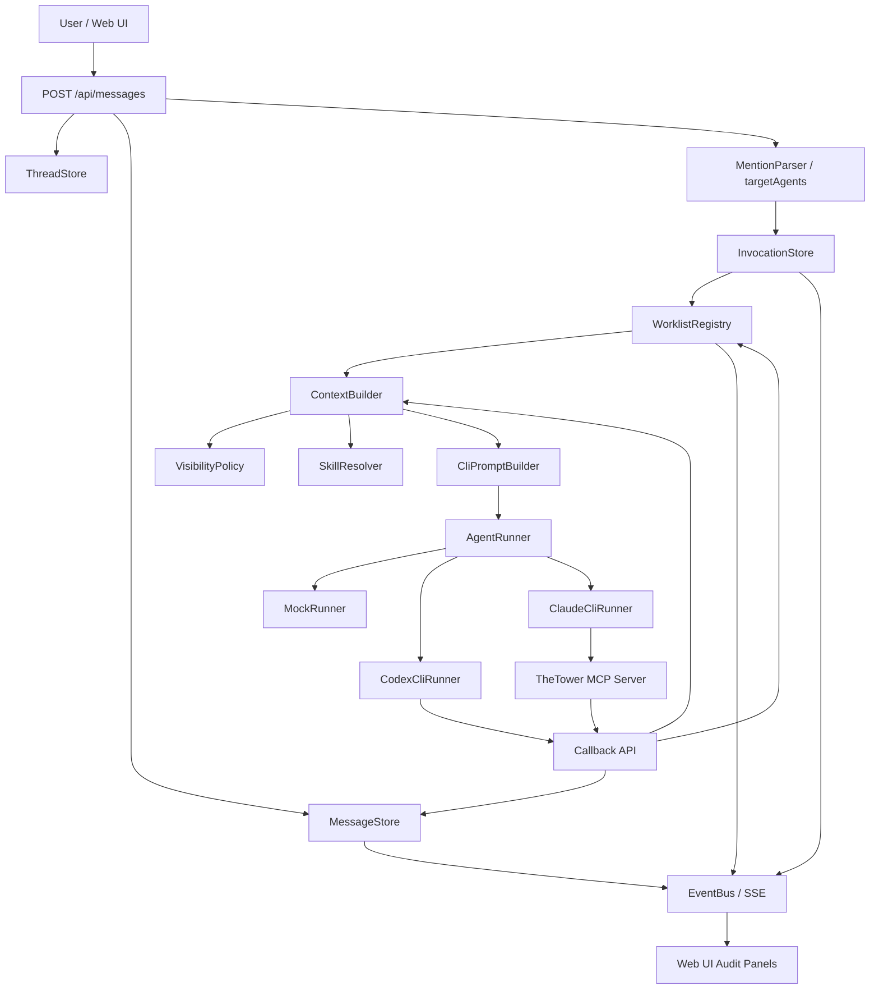
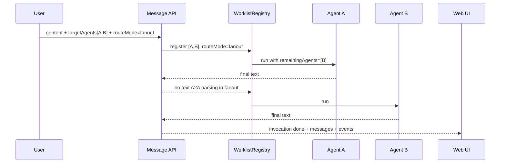
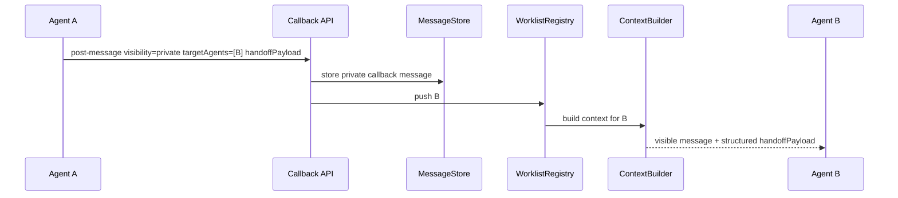
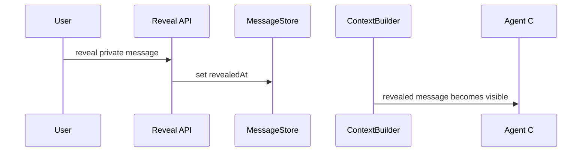

# TheTower 当前 A2A 整体架构说明

生成时间：2026-06-27

本文描述 Phase 1-5 完成后的 TheTower A2A 架构当前态。它不是早期设计草案，而是对现有实现的系统说明。

相关分阶段文档：

- [Phase 1：Skills 基础设施](./phases/phase-1-skills-infrastructure.md)
- [Phase 2：Message 可见性模型](./phases/phase-2-message-visibility.md)
- [Phase 3：ContextBuilder 统一上下文入口](./phases/phase-3-context-builder.md)
- [Phase 4：Callback 与 MCP 可见性升级](./phases/phase-4-callback-mcp-visibility.md)
- [Phase 5：A2A 协作治理与 UI 完成态](./phases/phase-5-a2a-governance-ui.md)

## 1. 架构目标

TheTower 当前 A2A 架构的目标是：让多个 Agent 在同一个 thread 中协作，同时保证协作过程可治理、可审计、可控可见。

核心能力：

1. Thread 是协作真相源。
2. Agent 通过 message、callback、MCP 写回进行协作，不做黑箱点对点通信。
3. Message 支持 public / private 可见性。
4. Agent 上下文统一由 `ContextBuilder` 构造。
5. 可见性判断统一由 `VisibilityPolicy` 负责。
6. A2A 路由由 worklist 和 `routeMode` 治理。
7. Skills 约束 Agent 如何交接、接球、review 和收尾。
8. UI 提供 message、private、handoff、invocation、event 的审计视图。

## 2. 总体架构



总体架构图可以按“一条消息如何变成多 Agent 协作”来理解。

**1. 用户入口**

用户在 Web UI 发消息，进入：

```text
POST /api/messages
```

后端会做三件事：

- 把用户消息写入 `MessageStore`
- 确保 thread 存在于 `ThreadStore`
- 解析消息里的路由目标，也就是 `@mention` 或结构化 `targetAgents`

这里的核心原则是：所有协作都先落到 thread，不让 Agent 私下黑箱互调。

**2. 路由与 Invocation**

解析出目标 Agent 后，系统创建一次 `Invocation`：

```text
InvocationStore
```

`Invocation` 表示这次用户请求触发的一整轮协作。它记录：

- 当前状态：queued / running / done / failed
- 目标 Agent
- `routeMode`：single / serial / fanout / parallel
- root message

然后 `WorklistRegistry` 会创建执行列表，比如：

```text
[ikora, banshee, shaxx]
```

这个 worklist 是 A2A 的调度核心。

**3. Agent 运行前构造上下文**

每次要调用某个 Agent 时，不是直接把 thread 全量塞给它，而是走：

```text
ContextBuilder
  ↓
VisibilityPolicy
```

这一步决定 Agent 能看到哪些消息。

例如：

- public message 所有 Agent 可见
- private message 只给 `visibleToAgentIds`
- revealed private message 全员可见
- play 模式隐藏其他 Agent 的 stream
- briefing 默认不进入普通上下文

所以 Agent 收到的是“按身份过滤后的 thread 上下文”。

**4. Skills 和 Prompt**

上下文准备好后，系统再通过：

```text
SkillResolver
CliPromptBuilder
```

生成 Agent prompt。

这里会注入：

- Agent 身份
- 当前 thread / invocation
- 当前 `routeMode`
- 当前 worklist
- remainingAgents
- 可协作 Agent 名册
- 当前启用的 skills
- 可见消息
- 针对目标 Agent 的 `handoffPayload`

Skills 负责约束行为，比如：

- 如何交接
- 如何接球
- review 怎么写
- 最后一棒怎么做 quality gate
- fanout 下不要重复 @ 等待执行的 Agent

**5. Runner 调用 Agent**

Prompt 生成后进入：

```text
AgentRunner
```

当前支持：

- `MockRunner`
- `CodexCliRunner`
- `ClaudeCliRunner`

Runner 负责真正调用 Agent CLI 或 mock 实现。

Agent 的最终输出会写回 thread，形成新的 `Message`。

**6. Callback / MCP 写回**

Agent 运行中也可以主动写回：

```text
Callback API
MCP Server
```

例如 Agent 可以调用：

```text
post_message
get_thread_context
```

它可以：

- 发公开 callback message
- 发 private callback message
- 写入 `handoffPayload`
- 指定 `targetAgents`
- 读取自己可见的 thread context

关键点是：callback 也不会绕过可见性规则。`get_thread_context` 仍然走 `ContextBuilder`。

**7. Worklist 继续推进**

如果 Agent 输出或 callback 指定了新的目标 Agent，系统会更新：

```text
WorklistRegistry
```

然后继续调用下一个 Agent。

但 Phase 5 加了治理规则：

- `single` / `serial` 下可以继续文本 A2A
- `fanout` / `parallel` 下普通 Agent 文本默认不继续解析 A2A
- 显式 `targetAgents` 仍可路由

这解决了 fanout 场景下重复唤醒的问题。

**8. EventBus / SSE / UI 审计**

所有关键事件都会通过：

```text
EventBus / SSE
```

推给 Web UI，包括：

- message created / updated
- invocation running / done / failed
- worklist updated
- agent text / tool / error / done
- callback write

UI 因此可以展示：

- message timeline
- private / public badge
- handoffPayload 展开
- private reveal
- invocation 面板
- live events 原始审计

**一句话总结**

这张图表达的是：

```text
用户消息进入 thread
→ 系统解析目标并创建 invocation/worklist
→ 每个 Agent 运行前通过 ContextBuilder 获取可见上下文
→ Skills 和 PromptBuilder 约束协作行为
→ Runner 调用 Agent
→ Agent 通过最终回复、callback 或 MCP 写回 thread
→ Worklist 继续推进
→ EventBus 把全过程推给 UI 审计
```

核心设计思想是：**Thread 做真相源，ContextBuilder 控制可见性，Worklist 控制协作顺序，Skills 控制协作质量，UI 提供全量审计。**

## 3. 核心模块

| 模块 | 位置 | 职责 |
| --- | --- | --- |
| `AgentRegistry` | `packages/api/src/agents/AgentRegistry.ts` | 管理可用 Agent、mention handle、provider、model |
| `MessageStore` | `packages/api/src/stores/MessageStore.ts` | 持久化 thread message 和 visibility / origin / handoff 字段 |
| `ThreadStore` | `packages/api/src/stores/ThreadStore.ts` | 持久化 thread 和 `mode=debug|play` |
| `InvocationStore` | `packages/api/src/stores/InvocationStore.ts` | 持久化 invocation、状态、目标 Agent、`routeMode` |
| `WorklistRegistry` | `packages/api/src/routing/WorklistRegistry.ts` | 管理当前 invocation 的 Agent 执行列表、深度、防 ping-pong |
| `MentionParser` | `packages/api/src/routing/MentionParser.ts` | 解析普通 mention 和行首 A2A mention cluster |
| `A2ARoutingPolicy` | `packages/api/src/routing/A2ARoutingPolicy.ts` | 判断确认类回复是否应继续路由 |
| `VisibilityPolicy` | `packages/api/src/context/VisibilityPolicy.ts` | 判断消息是否能被用户或指定 Agent 看见 |
| `ContextBuilder` | `packages/api/src/context/ContextBuilder.ts` | 构造 Agent 可见上下文 |
| `SkillResolver` | `packages/api/src/skills/SkillResolver.ts` | 根据当前 worklist 和上下文启用协作 skills |
| `CommunicationService` | `packages/api/src/services/CommunicationService.ts` | A2A 主编排服务：发消息、启动 invocation、执行 worklist、处理 callback |
| `EventBus` | `packages/api/src/events/EventBus.ts` | 向 UI 推送 message、invocation、worklist、agent event、callback write |
| Web UI | `packages/web/src/App.tsx` | 展示 thread、message audit、private reveal、handoff、invocation、live events |

## 4. 数据模型

### 4.1 Thread

`Thread` 当前支持运行模式：

```ts
export type ThreadMode = "debug" | "play";
```

含义：

- `debug`：调试模式，保留更多上下文可见性，方便开发排障。
- `play`：隔离模式，严格隐藏其他 Agent 的 private message 和 hidden stream。

### 4.2 Message

核心字段：

```ts
export type MessageVisibility = "public" | "private";

export type MessageOrigin =
  | "user"
  | "agent_final"
  | "agent_stream"
  | "callback"
  | "tool"
  | "system"
  | "briefing";

export interface Message {
  id: string;
  threadId: string;
  senderType: "user" | "agent" | "system";
  senderId?: string;
  content: string;
  mentions: string[];
  visibility?: MessageVisibility;
  visibleToAgentIds?: string[];
  revealedAt?: number;
  origin?: MessageOrigin;
  deliveryStatus?: "queued" | "delivered" | "canceled";
  handoffPayload?: HandoffPayload;
  invocationId?: string;
  replyTo?: string;
  createdAt: number;
}
```

语义：

- `content` 是默认展示给用户的正文。
- `visibility=public` 时所有 Agent 可见。
- `visibility=private` 时只有 `visibleToAgentIds` 中的 Agent 可见。
- 用户视角始终可以审计所有消息。
- `revealedAt` 设置后，private message 对所有 Agent 可见。
- `origin` 用于区分用户消息、Agent 最终回复、callback、tool、briefing 等来源。
- `handoffPayload` 用于结构化交接，不默认污染用户 timeline。

### 4.3 HandoffPayload

```ts
export interface HandoffPayload {
  fromAgentId: string;
  toAgentIds: string[];
  triggerMessageId?: string;
  what: string;
  why: string;
  tradeoff: string;
  openQuestions: string[];
  nextAction: string;
  evidenceRefs?: Array<{
    kind: "message" | "file" | "command" | "url" | "other";
    ref: string;
    note?: string;
  }>;
  riskLevel?: "low" | "medium" | "high";
  createdAt: number;
}
```

设计意图：

- 用户看到自然语言 `content`。
- 目标 Agent 接球时看到完整结构化五件套。
- UI 可展开审计，但默认不强制展示完整五件套。

### 4.4 Invocation 与 Worklist

`Invocation` 表示一次用户请求触发的协作执行。

```ts
export type A2ARouteMode = "single" | "serial" | "fanout" | "parallel";

export interface Invocation {
  id: string;
  threadId: string;
  rootMessageId: string;
  status: "queued" | "running" | "done" | "failed" | "cancelled";
  targetAgents: string[];
  routeMode?: A2ARouteMode;
  depth: number;
  createdAt: number;
  finishedAt?: number;
}
```

`WorklistEntry` 是运行时状态：

```ts
export interface WorklistEntry {
  invocationId: string;
  threadId: string;
  list: string[];
  routeMode: A2ARouteMode;
  currentIndex: number;
  depth: number;
  maxDepth: number;
  a2aFrom: Record<string, string>;
  triggerMessageId: Record<string, string>;
  abortController: AbortController;
  pingPong?: {
    from: string;
    to: string;
    count: number;
  };
}
```

## 5. A2A 路由模型

### 5.1 路由入口

A2A 路由有两种入口：

1. 文本路由：行首 `@handle`。
2. 结构化路由：API / callback / MCP 中的 `targetAgents`。

普通句中 mention 不触发 A2A：

```text
可用队友包括 @banshee。
```

行首 mention 触发 A2A：

```text
@banshee 请 review 当前实现。
```

多目标 mention cluster：

```text
请大家分别做一个简短自我介绍。

@ikora @banshee @shaxx
```

### 5.2 routeMode

| routeMode | 语义 | 行为 |
| --- | --- | --- |
| `single` | 单个 Agent 处理 | 允许普通文本行首 mention 继续 A2A |
| `serial` | 串行接力 | 允许当前 Agent 把球交给下一棒 |
| `fanout` | 多个 Agent 各自执行 | Agent 普通文本输出默认不继续解析 A2A |
| `parallel` | 多个 Agent 并行产出 | Agent 普通文本输出默认不继续解析 A2A |

默认推断：

- 单目标默认为 `single`。
- 多目标默认为 `fanout`。

### 5.3 fanout / parallel 防重复路由

在 `fanout` / `parallel` 下：

- worklist 已经包含等待执行的 Agent。
- 当前 Agent 只需要完成自己的部分。
- 系统默认不从 Agent 普通文本输出中继续解析 A2A。
- 显式 `targetAgents` 仍可路由，用于高级场景或明确子任务。

这样可以避免以下问题：

```text
user:
都自我介绍下

zavala:
请大家依次做一个简短自我介绍。

@ikora @banshee @shaxx

ikora:
我是 Ikora...
@banshee 请继续自我介绍。
```

优化后，Ikora 不会重复唤醒 Banshee，因为 Banshee 已在 worklist 中等待执行。

## 6. 上下文构造与可见性

### 6.1 VisibilityPolicy

用户视角：

- 可以审计所有消息。

Agent 视角：

- public message 可见。
- private message 只对 `visibleToAgentIds` 可见。
- revealed private message 对所有 Agent 可见。
- canceled / queued message 不进入普通 Agent 上下文。
- briefing 默认不进入普通上下文。
- play 模式下隐藏其他 Agent 的 `agent_stream`。

### 6.2 ContextBuilder

所有 Agent 上下文统一通过：

```ts
ContextBuilder.buildForAgent({
  threadId,
  agentId,
  mode,
  limit,
});
```

使用位置：

- runner 初始 prompt。
- callback `get_thread_context`。
- reply parent 校验相关逻辑。

结果：

- runner 和 callback 看到同一套可见上下文。
- private message 不会被非 recipient Agent 通过 callback 读取。
- `handoffPayload` 只注入给目标 Agent。

## 7. Callback / MCP 写回模型

### 7.1 Callback API

核心接口：

```text
POST /api/callbacks/post-message
GET  /api/callbacks/thread-context
```

`post-message` 支持：

```ts
{
  invocationId: string;
  callbackToken: string;
  agentId: string;
  content: string;
  targetAgents?: string[];
  routeMode?: "single" | "serial" | "fanout" | "parallel";
  visibility?: "public" | "private";
  visibleToAgentIds?: string[];
  handoffPayload?: HandoffPayload;
  replyTo?: string;
}
```

规则：

- 默认 `visibility=public`。
- private 必须显式声明。
- private message 自动把 sender 加入 `visibleToAgentIds`。
- `targetAgents` 是路由目标，不等于可见范围。
- private callback 可审计、可 reveal。
- callback `thread-context` 不接受任意 viewer 参数，而是通过 invocation / token 识别当前 Agent。

### 7.2 MCP Server

MCP 工具：

```text
post_message
get_thread_context
```

MCP `post_message` 与 callback 保持同语义：

- 支持 `targetAgents`。
- 支持 `routeMode`。
- 支持 private / visibleToAgentIds。
- 支持 `handoffPayload`。

Claude runner 使用 MCP；Codex runner 当前通过 HTTP fallback prompt 暴露 callback 用法。

## 8. Runner Prompt 与 Skills

### 8.1 Prompt 注入内容

每次 Agent run 前，`CliPromptBuilder` 会注入：

- Agent 身份。
- 当前 threadId / invocationId。
- 当前协作状态。
- `routeMode`。
- 当前 worklist。
- `remainingAgents`。
- A2A 是否可继续。
- 可协作 Agent 名册。
- 当前启用 skills。
- 最近可见上下文。
- 针对目标 Agent 的 `handoffPayload`。

### 8.2 Skills 分层

Skills 是协作行为协议层，不决定数据可见性，也不直接执行路由。

当前关键 skills：

| Skill | 职责 |
| --- | --- |
| `thread-orchestration` | 总体 A2A 路由和协作规则 |
| `cross-agent-handoff` | 交接五件套与 callback / handoffPayload 规范 |
| `receive-handoff-grounding` | 接球 Agent 先校验任务边界 |
| `request-review` | 发起 review |
| `receive-review` | 处理 review 意见 |
| `quality-gate` | worklist 末尾交付前检查 |
| `context-self-management` | 上下文过长时自我管理 |

关键规则：

- 不伪造其他 Agent 发言。
- 不把 hidden handoffPayload 原样当作用户最终回复。
- fanout / parallel 下不要 `@` 当前 worklist 中等待执行的 Agent。
- review 区分 blocking / non-blocking。
- 最后一位 Agent 做 quality gate。

## 9. UI 审计模型

Web UI 当前提供：

1. Agents 面板：
   - provider
   - model
   - enabled 状态
2. Threads 面板：
   - thread 列表
   - debug / play mode badge
3. Thread 面板：
   - message timeline
   - origin / visibility / status
   - mentions
   - visibleTo
   - private reveal
   - handoffPayload 展开
4. Audit filter：
   - all
   - private
   - callback
   - private callback
   - revealed
   - handoff
5. Invocation 面板：
   - invocation status
   - routeMode
   - targets
   - started time
   - related live events
6. Events 面板：
   - 原始 SSE event JSON

用户审计能力包括：

- 查看所有 private message。
- reveal private message。
- 查看 callback write。
- 查看 worklist 更新。
- 查看 agent text / tool / error / done event。
- 查看 invocation running / done / failed / cancelled 状态。

## 10. 关键流程

### 10.1 用户触发 fanout



### 10.2 Agent private callback handoff



### 10.3 User reveal



## 11. 测试与验收覆盖

当前测试覆盖：

- `MessageStore` visibility / origin / handoffPayload round-trip。
- legacy message / thread schema migration。
- `VisibilityPolicy` public / private / revealed / briefing / stream。
- `ContextBuilder` debug / play 差异。
- callback private 写回和 context 过滤。
- `handoffPayload` normalization 和目标路由。
- `replyTo` 防泄漏。
- `MentionParser` 行首 mention 和 mention cluster。
- `WorklistRegistry` dedupe、depth limit、ping-pong 防护。
- `routeMode` prompt 注入。
- `fanout` 下文本输出不重复路由。
- structured `targetAgents` 显式路由。
- SDK / MCP routeMode 和 private handoff 透传。
- mock runner fanout / serial 集成验收。

验证命令：

```bash
pnpm -r test
pnpm -r build
pnpm -r lint
```

