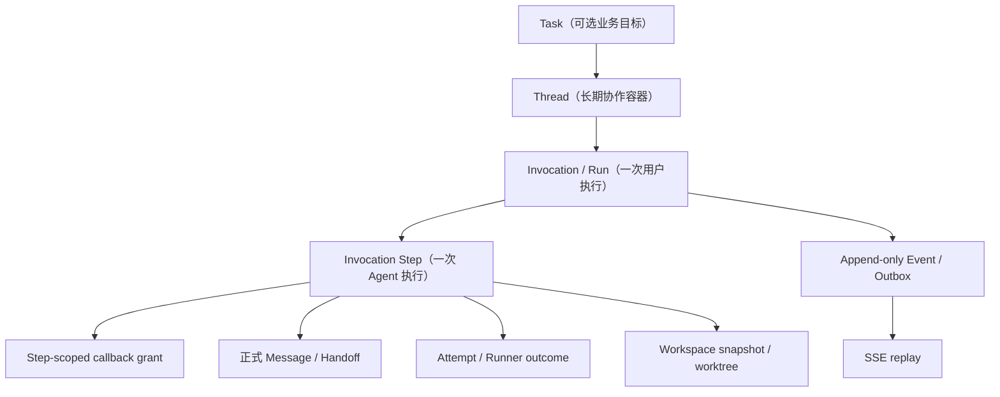

# TheTower 架构可靠性与交互整改开发计划

> 文档状态：Superseded（历史整改计划）
> 替代来源：[技术 Roadmap](../ROADMAP.md)、[能力矩阵](./capability-matrix.md)
> 保留目的：记录 2026-07-10 风险审查和阶段拆解；其中“当前状态”不得再用于发布判断。
>
> 历史状态：Phase 0 已完成；Phase 1、Phase 3 曾完成第一轮实现与自动化验证。
> 基线：2026-07-10 当前实现  
> 适用范围：`packages/api`、`packages/mcp-server`、`packages/sdk`、`packages/shared`、`packages/web` 及测试、文档和开发脚本

## 1. 目的

本文把当前架构审查中发现的问题转化为可交付的开发计划。目标不是立即把 TheTower 改造成分布式平台，而是先让它成为一个**可信的单机多 Agent 运行时**：失败状态真实、身份不可伪造、取消真的停止、重启不会留下假运行、界面不误导用户。

当前项目的包分层、上下文过滤、Runner 抽象和 Workspace 文件工具已具备可复用基础；本计划重点补齐运行时契约和安全边界。

## 2. 执行原则

1. **先修正语义，再增加能力。** 在失败会显示为成功、`parallel` 未真正并行的前提下，不新增 Provider、并行模式或新的管理页面。
2. **服务端是唯一事实源。** UI 只能投影持久化的 Invocation、Step、Message 和 Event，不能依赖内存 worklist 推断历史。
3. **授权应随执行 Step 缩小。** callback grant 必须绑定 `invocationId`、`stepId`、`agentId`、能力范围与过期时间。
4. **默认安全，危险能力显式开启。** Shell、写文件、网络、宿主 secret 和宽松 CLI 权限不能作为默认值。
5. **每项“完成”都有自动化证据。** 设计文档、代码、测试与 CI 必须同时更新；“已实现”不等于“已验证”。
6. **渐进式迁移。** 在语义冻结和测试补齐前，不对 `CommunicationService` 做大爆炸重构。

## 3. 当前能力边界

在完成 Phase 1 前，产品只支持以下运行形态：

```text
单机 + 单操作员 + loopback API + 可信 Workspace + 单活跃 API 进程
```

以下能力在完成对应阶段前不得对外宣称支持：

| 能力 | 当前状态 | 解锁阶段 |
| --- | --- | --- |
| `fanout` / `parallel` | 类型已暴露，执行仍串行 | Phase 4 |
| Gemini / OpenAI API / Custom provider | 静默回退 Mock | Phase 5 |
| 远程访问 / 多用户 | 无认证与租户隔离 | Phase 1、5 |
| 断线事件补偿 | SSE 无 replay | Phase 3 |
| 任务恢复 | worklist 仅在内存 | Phase 2 |
| 安全 shell 执行 | 当前脚本解释器可绕过限制 | Phase 1、4 |

短期决策：API 只接受 `single` 和 `serial`；`fanout`、`parallel` 返回 `422 unsupported`。未实现 Provider 在保存配置或调度时返回明确的 `unsupported_provider`，不得执行 MockRunner。

## 4. 风险登记册

| ID | 优先级 | 问题 | 当前影响 | Phase |
| --- | --- | --- | --- |
| R-01 | P0 | Runner `error` 后 Invocation 仍可能进入 `done` | 失败率、Task 状态与用户判断失真 | 1 |
| R-02 | P0 | callback token 仅绑定 invocation，且 `agentId` 可由请求伪造 | 伪造发言、私密上下文越权、审计失真 | 1 |
| R-03 | P0 | 宽松 CORS、无 Operator 认证、目录浏览未受 Workspace 策略约束 | 本机控制面可被非可信网页或局域网调用 | 1 |
| R-04 | P0 | `write_file + shell_exec + node/python` 可执行任意脚本，并传递宿主 token | Workspace 边界被绕过、宿主 secret 泄漏 | 1 |
| R-05 | P1 | 删除 Thread 或取消 Invocation 不保证子进程已退出 | 孤儿进程继续修改文件、审计缺口 | 1 |
| R-06 | P1 | worklist、事件、运行态不可恢复 | 重启后永久 running、Telemetry 丢失 | 2 |
| R-07 | P1 | Agent runtime status 以 `agentId` 为主键 | 并发 Thread 时状态、token usage 互相覆盖 | 2 |
| R-08 | P1 | Workspace 在运行中重新解析，未快照 | 同一 Invocation 可跨项目运行/写文件 | 2 |
| R-09 | P1 | route mode 与实际调度不一致；动态 worklist 不持久化 | 用户、SDK、Telemetry 对执行路径理解错误 | 2、4 |
| R-10 | P1 | 默认 MockRunner 不产生正式 callback 输出 | 默认演示无法证明真实 A2A 协作 | 1 |
| R-11 | P1 | 前端消息投影忽略 visibility/visibleTo | 相同内容的公开/私密消息可能被错误合并 | 3 |
| R-12 | P1 | SSE 每事件全量刷新且不能 catch-up | 请求风暴、乱序覆盖、重连后状态陈旧 | 3 |
| R-13 | P2 | 路由、编排、协议类型与 MCP 目录混杂 | 变更成本高、HTTP/MCP 契约容易漂移 | 2、5 |
| R-14 | P2 | 测试基线不稳定、Smoke 命令缺失 | CI 不能作为交付门禁 | 0 |

## 5. 目标运行时模型

### 5.1 实体层级



术语约定：面向普通用户的界面可显示“Run”，Telemetry 才显示 “Invocation”；“Step”是调度与审计的最小单位。

### 5.2 状态机

Invocation 状态：

```text
accepted → queued → running → succeeded
                         ├→ failed
                         ├→ cancelling → cancelled
                         └→ interrupted
```

Step 状态：

```text
queued → leased → running → succeeded
                         ├→ failed
                         ├→ cancelling → cancelled
                         └→ interrupted
```

约束：

- fatal `AgentEvent.error` 必须让当前 Step 进入 `failed`，之后由 route policy 决定 fail-fast、retry 或 continue。
- Invocation 只有在所有必需 Step 成功时才能进入 `succeeded`。
- `cancelled` 只能在子进程确认退出或被 supervisor 强制终止后写入。
- API 启动时，遗留 `queued/running/cancelling` 必须由 reconcile 过程明确转为可恢复任务或 `interrupted`。

### 5.3 三类消息通道

| 通道 | 持久化 | 进入后续 Agent 上下文 | 面向用户含义 |
| --- | --- | --- | --- |
| 正式消息（callback） | 是 | 按可见性规则 | 公开发言、私密交接、正式结果 |
| 执行流（stream） | 可选压缩持久化 | 默认否 | CLI 过程、thinking、工具进度 |
| 事件/审计 | 是 | 否 | 调度、状态、授权、工具、错误记录 |

每个成功 Step 必须产生以下二者之一：

1. 一条正式 Message；或
2. 结构化 `no_output` 结果，并写明原因。

这样可以避免“CLI 退出成功但团队与用户没有收到成果”的假成功。

### 5.4 授权模型

所有 callback、文件工具与未来的 shell 工具使用短期 grant：

```text
grant = {
  invocationId,
  stepId,
  threadId,
  agentId,
  capabilities: [post_message, read_context, read_file, write_file],
  expiresAt,
  revokedAt
}
```

规则：

- token 只通过 `Authorization: Bearer` 传递，不进入 URL、日志或 CLI argv。
- 服务端从 grant 推导 `agentId`，不信任请求体中的同名字段。
- callback 必须先验证 grant、Step 状态、能力范围和 Thread，再写 Message 或文件。
- Step 终止、Invocation 取消、lease 丢失时立即撤销 grant。

### 5.5 Workspace 快照与隔离

创建 Invocation 时固化：

```text
workspaceId
resolvedRealPath
workspaceFingerprint
agentConfigVersion
skillsVersion
worktreeId（写任务可选）
```

在 Invocation 结束前：

- Runner cwd、MCP 文件工具、审计记录都只使用该快照。
- `PATCH /threads/:id` 修改 Workspace 只影响下一次 Invocation。
- 对写任务，默认使用独立 worktree；同一 Workspace 的写 Step 需通过 scheduler 串行化或显式并发许可。

## 6. 分阶段实施计划

### Phase 0：可信基线与语义冻结

**目标：** 让测试、文档和已暴露 API 对当前语义达成一致。

主要工作：

1. 修复 ContextBuilder、ThreadStore 的过期测试预期，以及 Claude Runner 的 pending Promise/open handle。
2. 将脚本拆分为 `test:unit`、`test:integration`、`test:e2e`、`test:ci`；删除或补齐失效的 Web smoke 命令。
3. 增加 Fastify `app.inject()` 测试，至少覆盖消息发送、取消、callback、权限拒绝、SSE 格式与 Thread 删除。
4. 撰写三个 ADR：状态机、消息通道、route mode 支持矩阵。
5. 在 UI/API 中明确标记未实现 Provider、未实现 mode 与占位能力。
6. 建立能力矩阵：`planned / implemented / automated_verified / released`。

涉及区域：

```text
packages/api/test/
packages/web/test/
packages/*/package.json
package.json
docs/
```

验收标准：

- `pnpm test` 连续 10 次无失败、取消或 open handle。
- `pnpm build`、`pnpm lint` 在干净 checkout 中通过。
- 每个 API 宣称的 mode/provider 都有自动化验证，或明确返回 unsupported。
- CI 在 5 分钟内完成基础检查。

### Phase 1：安全与执行正确性止血

**目标：** 失败真实、身份不可伪造、取消可证明、默认能力安全。

主要工作：

1. 让 fatal Runner error 终止 Step，并由 Step 聚合 Invocation 终态。
2. 引入 Step-scoped grant；将 callback context 从 GET query 改为认证 POST/Authorization header。
3. 将 callback、文件工具的身份校验放在任何持久化动作之前。
4. 禁用 `shell_exec` 默认 profile，移除 `python3`/`node` 脚本执行和 `GITHUB_TOKEN` 传递；若保留，必须在独立 sandbox worker 中运行并中心审计。
5. 默认收紧 Codex/Claude 权限；危险 profile 需要显式环境变量和 UI 告警。
6. 引入 ProcessSupervisor：统一 SIGTERM、grace period、SIGKILL、超时与退出确认。
7. Thread 删除改为 archive 或 cancel-and-wait；不得直接删除有活跃 Step 的 Thread。
8. MockRunner 通过与真实 callback 等价的正式结果通道模拟输出。
9. 未实现 Provider 改为显式 `unsupported_provider`，禁止静默 Mock fallback。
10. 为 loopback/local 与 authenticated-network 建立启动 profile；非 loopback 未认证时 fail fast。

验收标准：

- 任一 Runner 非零退出或超时，Invocation 不会显示 `succeeded`。
- Agent A 的 grant 不能代表 Agent B、不能跨 Step、不能在取消或过期后使用。
- callback token 不出现于 URL、API 日志或命令行参数。
- Stop 后 5 秒内子进程退出；删除活跃 Thread 不留下孤儿进程。
- Mock serial 的下一棒能读取前一棒正式结果。
- 写脚本再执行、Workspace 外访问、symlink escape 和 secret 泄漏都有回归测试。

### Phase 2：持久执行状态机与恢复

**目标：** 重启、重试、审计和并发约束不再依赖内存 Map。

主要工作：

1. 新增 `invocation_steps`、`step_edges`、`step_attempts`、`callback_grants` 与事务 outbox。
2. 将用户消息、Invocation、初始 Step 和 outbox 放入同一 SQLite 事务。
3. 持久化 A2A edge、实际 target、blocked reason、hop depth 与 Step 结果。
4. 固化 Workspace、Agent 配置、Skill 版本快照。
5. API 启动执行 reconcile，标记孤儿任务 `interrupted` 或按策略重试。
6. runtime status 改为 `(invocationId, stepId)`，再派生 Agent 汇总视图。
7. 引入 MVP scheduler：Thread、Agent、Provider、Workspace 四级并发限制。

验收标准：

- 在 queued、running、callback-written、terminal 四个点强杀 API 后，重启不出现永久 running。
- 同一 Agent 并发执行两个 Thread 时，状态、token usage 与 liveness 不串线。
- 运行中修改 Thread Workspace 不影响当前 Invocation。
- callback 重试不会重复写 Message 或重复派发 Step。

### Phase 3：事件、审计与交互可靠性

**目标：** 断线可恢复、界面显示可信、审计可追溯。

主要工作：

1. 持久化 Event Log，SSE 增加 `id:`、heartbeat、`Last-Event-ID` replay 与背压处理。
2. 前端改为 SSE event reducer；仅对缺少 payload 的事件做局部补拉，并对高频 stream 做批处理。
3. 修复 Message projection key，将 visibility、visibleTo、handoff 与 replyTo 纳入身份。
4. 增加 Run Strip：当前 Step、已完成/等待 Agent、失败原因、Stop、Retry、Resume。
5. 重连状态显式显示 `reconnecting / catching-up / synced / stale`。
6. 对 Workspace/Provider 做发送前 preflight，避免用户在收到 202 后才发现无法运行。
7. 将用户概念统一为 `Task → Thread → Run → Step → Message/Activity`。

验收标准：

- SSE 断开 60 秒后重连，遗漏事件可恢复且不产生重复消息。
- 浏览器刷新或 API 重启后，UI 在 5 秒内恢复至服务端权威状态。
- 内容相同但 visibility 不同的 Message 均正确展示。
- 100 个 stream 事件不会触发 100 次全量 messages/invocations 请求。

### Phase 4：Scheduler、worktree 与真实路由模式

**目标：** 在可靠状态机上实现受控并发，而不是在内存 worklist 上叠加并行。

主要工作：

1. 完成严格 `single`、`serial`：下一 Step 只在前一 Step 有正式结果或显式 handoff 后释放。
2. 实现 `fanout(maxConcurrency)`：各 Agent 使用同一输入快照，结果进入显式 join/summary Step。
3. 仅在有明确产品差异时实现独立 `parallel` 模式；否则以 `fanout(maxConcurrency > 1)` 取代。
4. 写任务默认创建 invocation worktree；合并回主分支作为显式、可审计步骤。
5. 引入全局/Provider/Agent/Workspace semaphore、资源配额与 backpressure。

验收标准：

- serial 下一棒一定能看到上一棒的正式成果。
- fanout Agent 互不读取彼此运行中的输出，只读取共同快照。
- 实际子进程数不超过配置上限。
- 声称 parallel 时，相比 serial 有可测量的并发收益。
- 24 小时 soak test 无孤儿进程、无 stuck running、无重复 Step。

### Phase 5：Provider、部署与模块收敛

**目标：** 形成可维护的受支持部署形态，并安全扩展 Provider。

主要工作：

1. 将代码逐步拆分为 `contracts`、`orchestrator-core`、`runner adapters`、`mcp-contracts`、`mcp-server`，避免公开 DTO 与 `AbortController` 等服务端运行时类型混放。
2. Capability API 按 Agent、Provider、profile 返回实际生效的工具与权限。
3. 为 Gemini/OpenAI API/Custom provider 建立 probe、capability、取消、MCP、token usage 的 conformance suite 后再接入。
4. 提供备份/恢复、migration preflight、回滚、runbook、容器或服务管理示例。
5. 完成 Workspace、Settings、Task 中仍为 unavailable/pending 的能力，或从产品界面移除。

验收标准：

- 新 Provider 只有通过 conformance suite 才能在 UI 中启用。
- 新机器从配置到 ready 小于 15 分钟。
- 备份恢复演练满足 RTO 30 分钟、RPO 5 分钟。
- 支持的部署形态明确为单活跃 API + 持久卷，未完成前不宣称多副本支持。

## 7. 首两个 Sprint Backlog

### Sprint 1：测试与失败语义

| 优先级 | 工作项 | 依赖 | 完成定义 |
| --- | --- | --- | --- |
| S1-01 | 修复 3 个失败测试与 Claude Runner open handle | 无 | 全仓 unit 测试稳定通过 |
| S1-02 | 定义 Invocation/Step 状态机 ADR | 无 | 状态、终态和 retry 规则可评审 |
| S1-03 | 将 fatal `AgentEvent.error` 变为 Step failed | S1-02 | 非零 Runner 测试不再得到 done |
| S1-04 | 禁用未实现 Provider、`fanout`、`parallel` | S1-02 | API/UI 给出明确 unsupported 信息 |
| S1-05 | MockRunner 产生正式结果 | S1-03 | serial 集成测试验证下游输入 |
| S1-06 | Fastify inject 基础测试 | S1-03 | messages/cancel/callback 路由有覆盖 |
| S1-07 | 建立 capability matrix | 无 | 文档可区分已实现与已验证 |

### Sprint 2：授权、进程与危险工具

| 优先级 | 工作项 | 依赖 | 完成定义 |
| --- | --- | --- | --- |
| S2-01 | Step-scoped grant 与 Authorization header | S1-02 | 无法伪造 agentId 或跨 Step 调用 |
| S2-02 | callback/文件工具先鉴权再持久化 | S2-01 | caller mismatch 不产生已送达消息 |
| S2-03 | shell_exec 默认关闭、移除宿主 secret | 无 | 不能通过写脚本获得任意代码执行 |
| S2-04 | ProcessSupervisor 与 cancel-and-wait | S1-03 | Stop/timeout/delete 可证明清理子进程 |
| S2-05 | loopback profile、Origin/CORS 约束 | S2-01 | 非授权控制面请求被拒绝 |
| S2-06 | Thread archive/active delete guard | S2-04 | 活跃 Thread 不会直接级联删除 |

## 8. 测试与发布门禁

建议脚本结构：

```text
pnpm test:unit
pnpm test:integration
pnpm test:e2e
pnpm test:ci
pnpm lint
pnpm build
```

最低门禁：

| 类别 | 必测场景 |
| --- | --- |
| 状态机 | Runner 非零退出、超时、cancel、retry、重启 reconcile |
| 授权 | grant 过期、跨 Agent、跨 Step、跨 Invocation、token 日志泄漏 |
| Workspace | symlink escape、Thread 重绑、并发写锁、worktree 清理 |
| A2A | serial handoff、fanout snapshot、重复 callback、blocked route reason |
| SSE | 断线 replay、重复 event 幂等、慢客户端与 heartbeat |
| Web | 创建 Thread、发送、Stop、private reveal、失败重试、重连同步 |

发布前必须满足：

- 所有测试为绿，且无 cancelled/open handle。
- Schema migration 有 upgrade/rollback/backup 说明。
- Capability matrix 与实际测试结果一致。
- 安全回归覆盖 callback、文件、shell、CORS 和非 loopback 启动。

## 9. 迁移策略

1. **先加新表，不立刻移除旧字段。** 新增 Step、Event、Grant 表并双写；旧 `invocations.target_agents_json` 暂保留作兼容展示。
2. **读路径切换后再回填。** UI/SDK 先读取新的 Step projection，历史 Invocation 无 Step 时显示“legacy/no detailed steps”。
3. **版本化协议。** callback grant 和 SSE replay 需通过版本字段或新端点迁移，不能静默改变旧 MCP Client 行为。
4. **可回滚。** 每次 migration 前执行 SQLite 在线备份；迁移后保留只读兼容窗口。
5. **分 profile 发布。** 先仅启用 `local-loopback + collab-only/read-only MCP`，验证后再允许写文件和真实 Runner。

## 10. 文档治理

本文是后续整改工作的总控文档。已有 collaboration、workspace、frontend、agent-status phase 文档保留为历史设计参考，但不得单独用作“当前实现状态”的依据。

每个阶段结束时必须更新：

1. 本文的状态与 capability matrix；
2. [当前项目架构文档](../architecture/current-project-architecture.md)；
3. 对应 ADR、测试命令和验收证据；
4. 若旧 phase 文档已被替代，在原文顶部标注 `superseded by`。

## 11. 不在本计划中立即实施的事项

- 引入 Redis、消息队列或微服务拆分。
- 自动恢复真实 CLI 的中间会话。
- 多租户、组织管理、计费。
- 任意 shell、任意网络访问或宿主 secret 代理。
- 在没有 Step 状态机前实现真实 parallel。

这些不是不做，而是在可靠的单机执行内核建立后再评估。
