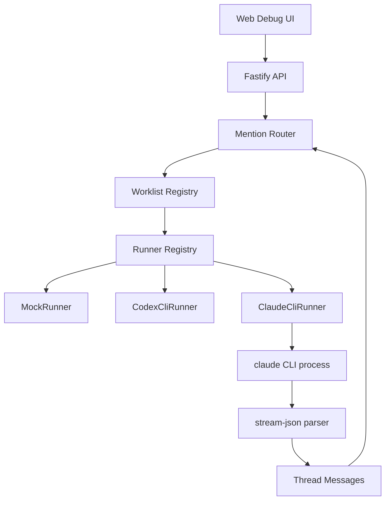

# Claude Code CLI 接入计划

> 文档状态：Superseded（已实施的历史接入方案）
> 当前来源：[当前项目架构](../architecture/current-project-architecture.md)、[能力矩阵](./capability-matrix.md)
> 保留目的：记录 Claude CLI 接入取舍；当前参数、权限默认值和能力以代码及当前文档为准。

生成时间：2026-06-24

参考项目：

- [Cat Cafe / Clowder AI](https://github.com/zts212653/clowder-ai)
- [cat-cafe-tutorials Lesson 05: MCP Callback](https://github.com/zts212653/cat-cafe-tutorials/blob/main/docs/lessons/05-mcp-callback.md)

## 1. 背景

TheTower 当前已经具备：

1. 多 Agent 配置与加载：`agent-template.json`、`.the-tower/agent-catalog.json`。
2. 多 Agent 通信核心：thread、message、mention parser、worklist、A2A 接力。
3. `MockRunner`：用于验证平台路由与前端调试。
4. `CodexCliRunner`：用于通过 Codex CLI 调用真实 Agent。

当前 `provider: "claude"` 仍然回退到 `MockRunner`。下一步目标是接入 **Claude Code CLI**，让同一套 TheTower 通信内核可以同时驱动 Codex Agent 和 Claude Agent。

## 2. Cat Cafe 方案参考

Cat Cafe / Clowder AI 的核心经验是：

1. 多 Agent 平台不直接依赖某一个模型 SDK，而是通过不同 CLI Provider 统一接入。
2. Claude Code CLI 支持更完整的动态 MCP 注入能力，可以通过 `--mcp-config` 在单次调用中挂载 callback 工具。
3. Codex / Gemini 在其教程实现中没有采用同等动态 MCP 注入，因此先通过 prompt injection + HTTP callback 兼容。
4. Claude 的真实运行路径采用流式 JSON 输出，平台解析 CLI 事件并写回 thread。

Cat Cafe 中 Claude 路径可以抽象为：

```text
TheTower API
  -> spawn Claude Code CLI
  -> Claude 读取系统提示词、上下文、Agent 身份
  -> Claude 输出 stream-json
  -> 平台解析 assistant text / tool event
  -> 写回 thread
  -> MentionParser 解析下一跳
  -> Worklist 继续调度
```

后续启用 MCP callback 后：

```text
Claude Code CLI
  -> native MCP tool call
  -> TheTower MCP Server
  -> Callback API
  -> Message Store
  -> A2A Router
```

## 3. 接入目标

### 3.1 MVP 目标

第一阶段只实现 **最终回复写回 thread**，不强制支持实时 token 流式输出，也不强制启用 MCP。

MVP 需要做到：

1. `provider: "claude"` 时使用 `ClaudeCliRunner`。
2. Claude Agent 能读取当前 thread 上下文。
3. Claude Agent 能看到可用 Agent 列表。
4. Claude Agent 能按 TheTower 的 A2A 规则使用行首 `@mention` 触发下一位 Agent。
5. CLI 执行失败、超时、取消时返回清晰错误。
6. 测试覆盖参数构造、prompt 注入、输出解析、错误路径和 abort。

### 3.2 非 MVP 目标

以下能力放到后续阶段：

1. Claude `--mcp-config` 动态注入。
2. MCP tool server。
3. token 级实时流式输出。
4. Claude session resume。
5. 多 Claude profile / 账号管理。
6. 前端单 Agent Provider 能力探测。

## 4. 总体架构



## 5. 代码改动计划

### 5.1 新增 ClaudeCliRunner

新增文件：

```text
packages/api/src/agents/runners/ClaudeCliRunner.ts
```

职责：

1. 实现 `AgentRunner`。
2. 构造 Claude Code CLI 参数。
3. 将 prompt 通过 stdin 传给 CLI，避免命令行参数泄漏上下文。
4. 读取 `stdout` 的 JSON line 事件。
5. 提取用户可见的 assistant 文本。
6. 在完成时返回 `AgentEvent.text` 和 `AgentEvent.done`。
7. 在失败、超时、abort 时返回 `AgentEvent.error`。

建议参数形态：

```text
claude
  -p
  --output-format stream-json
  --verbose
  --model <agent.model>
  --permission-mode <policy>
```

注意：具体 flag 需要先通过本机 `claude --help` 和 `claude -p --help` 确认。不要在未验证 CLI 版本前把参数写死为不可配置。

### 5.2 抽取通用 Prompt Builder

当前 `CodexCliRunner` 已经包含比较完整的多 Agent prompt，包括：

1. Agent 身份。
2. 角色 prompt。
3. 当前协作状态。
4. A2A 行首 `@mention` 规则。
5. 可用 Agent 目录。
6. 最近上下文。

为了避免 Codex 和 Claude 两套 prompt 逻辑分叉，建议抽取：

```text
packages/api/src/agents/runners/CliPromptBuilder.ts
```

导出：

```ts
export function buildAgentPrompt(input: AgentRunInput): string;
```

然后：

1. `CodexCliRunner` 改为调用 `buildAgentPrompt(input)`。
2. `ClaudeCliRunner` 也调用同一个函数。
3. Provider 差异只留在 runner 参数、输出解析和权限配置中。

### 5.3 更新 RunnerRegistry

当前逻辑：

```ts
case "claude":
  return this.mockRunner;
```

目标逻辑：

```ts
case "claude":
  return this.claudeRunner;
```

这样 `agent-template.json` 或前端中将 Agent provider 改为 `claude` 后，就会调用真实 Claude CLI。

### 5.4 更新 AgentConfigLoader

当前 `normalizeAgentModel(provider, model)` 只处理 `codex` 的 mock model 迁移。

需要增加 Claude 规则：

```text
provider === "claude" 且 model 仍是 mock-* 时：
  使用 CLAUDE_AGENT_MODEL
  如果未设置，则使用一个经过本机验证的默认 Claude model
```

原则：

1. 只迁移 `mock-*` 这种明显占位模型。
2. 用户手动配置的真实 Claude model 不要自动改写。
3. 默认模型必须可通过环境变量覆盖。

### 5.5 环境变量

建议新增：

| 变量 | 用途 | 默认值 |
| --- | --- | --- |
| `CLAUDE_CLI_BIN` | Claude CLI 可执行文件 | `claude` |
| `CLAUDE_RUNNER_CWD` | CLI 工作目录 | API 进程 cwd |
| `CLAUDE_RUNNER_TIMEOUT_MS` | 单次调用超时 | `300000` |
| `CLAUDE_RUNNER_PERMISSION_MODE` | Claude 权限模式 | 需本机验证后确定 |
| `CLAUDE_AGENT_MODEL` | mock model 迁移时使用的默认模型 | 需本机验证后确定 |

安全原则：

1. 不在日志中打印完整 prompt。
2. 不在错误信息中泄漏 API key 或本地 profile 细节。
3. `permission-mode` 必须可配置，避免把高权限模式写死。

## 6. Claude stream-json 解析策略

MVP 只提取最终可见文本。

解析原则：

1. `stdout` 按行读取。
2. 每一行尝试 `JSON.parse`。
3. 只提取 assistant message 中的 text content。
4. 忽略 status、metadata、tool internal event。
5. 如果 JSON 行无法解析，先保留到 debug buffer，不直接暴露给用户。
6. 进程退出码非 0 时返回 error。

伪代码：

```ts
for await (const line of stdoutLines) {
  const event = safeJsonParse(line);
  const text = extractAssistantText(event);

  if (text) {
    chunks.push(text);
  }

  if (isErrorEvent(event)) {
    return error(event);
  }
}

return text(chunks.join(""));
```

## 7. 后续 MCP Callback 方案

Claude CLI 接入稳定后，再进入第二阶段：MCP callback。

### 7.1 新增 MCP Server

建议新增 package：

```text
packages/mcp-server
```

提供工具：

| 工具 | 作用 |
| --- | --- |
| `post_message` | Agent 主动向 thread 写消息 |
| `get_thread_context` | Agent 获取当前 thread 上下文 |
| `list_agents` | Agent 获取当前可用 Agent |

这些工具最终仍然调用现有 API：

```text
POST /api/callbacks/post-message
GET  /api/callbacks/thread-context
```

不要让 MCP Server 绕过现有 Message Store 和 Worklist，否则会出现两套通信语义。

### 7.2 Claude 动态 MCP 注入

Claude runner 启动时生成 MCP config：

```json
{
  "mcpServers": {
    "the-tower": {
      "command": "node",
      "args": ["packages/mcp-server/dist/index.js"],
      "env": {
        "THE_TOWER_API_URL": "http://127.0.0.1:3001",
        "THE_TOWER_THREAD_ID": "...",
        "THE_TOWER_INVOCATION_ID": "...",
        "THE_TOWER_CALLBACK_TOKEN": "..."
      }
    }
  }
}
```

非 Windows 平台可以优先尝试 inline JSON：

```text
--mcp-config <json>
```

Windows 或命令行长度受限时写入临时 JSON 文件：

```text
--mcp-config /tmp/the-tower-claude-mcp-xxx.json
```

## 8. 实施阶段

### Phase 0：本机 CLI 能力确认

执行：

```bash
claude --version
claude --help
claude -p --help
```

确认：

1. 是否已安装 Claude Code CLI。
2. `-p` 是否支持 stdin prompt。
3. `--output-format stream-json` 是否可用。
4. `--model` 参数名称和可用模型。
5. `--permission-mode` 可选值。
6. 进程退出码和错误输出格式。

### Phase 1：ClaudeCliRunner MVP

交付内容：

1. 新增 `ClaudeCliRunner`。
2. 抽取 `CliPromptBuilder`。
3. `RunnerRegistry` 接入 `provider: "claude"`。
4. `AgentConfigLoader` 支持 Claude mock model 迁移。
5. 单元测试通过。
6. 手动验证 Claude Agent 可以在前端回复。

验收场景：

```text
@zavala 自我介绍一下
```

如果 `zavala.provider = "claude"`，应该由 Claude CLI 生成真实回复，并写回当前 thread。

### Phase 2：Claude MCP Callback

交付内容：

1. 新增 `packages/mcp-server`。
2. Claude runner 支持 `--mcp-config`。
3. callback token 通过 MCP env 注入。
4. Claude 可通过 MCP tool 写回 thread。
5. callback 写回仍然复用现有 MentionParser 和 Worklist。

验收场景：

```text
@zavala 让 ikora 和 shaxx 各写一句诗，最后你汇总
```

Claude coordinator 应该可以通过 tool 写回中间消息，平台继续路由后续 Agent。

### Phase 3：实时流式输出

交付内容：

1. 扩展 `AgentEvent`，增加 `delta` 或 `partial_text`。
2. 后端 SSE 推送 token / partial message。
3. 前端 thread UI 支持正在生成中的消息。
4. 进程结束后将完整消息落库。

该阶段不是接入 Claude 的前置条件。

## 9. 测试计划

### 9.1 单元测试

新增：

```text
packages/api/test/ClaudeCliRunner.test.ts
```

覆盖：

1. CLI 参数构造。
2. prompt 通过 stdin 写入。
3. prompt 包含 Agent 身份、Agent 目录和 A2A 规则。
4. stream-json assistant text 能被提取。
5. 非 0 exit code 返回 error。
6. timeout 会 kill 子进程。
7. abort signal 会 kill 子进程。
8. stderr 不应直接污染最终回复。

更新：

```text
packages/api/test/CodexCliRunner.test.ts
packages/api/test/AgentConfigLoader.test.ts
```

确保抽取 `CliPromptBuilder` 后 Codex 行为不变。

### 9.2 集成验证

手动验证：

1. 启动 `pnpm dev`。
2. 在 Agent 面板把某个 Agent provider 改为 `claude`。
3. 设置一个本机可用的 Claude model。
4. 发送单 Agent 消息。
5. 发送 A2A 接力消息。
6. 检查 thread 中消息顺序、mention 路由和错误提示。

## 10. 风险与边界

| 风险 | 应对 |
| --- | --- |
| Claude CLI flag 与本机版本不一致 | Phase 0 先确认 CLI help，再编码 |
| 权限模式过高 | `CLAUDE_RUNNER_PERMISSION_MODE` 可配置，不把高权限写死 |
| 输出事件格式变化 | parser 只依赖最小可见文本字段，未知事件忽略 |
| CLI 未安装 | 返回明确错误：未找到 Claude CLI |
| prompt 过长 | MVP 先复用现有上下文窗口策略，后续再做压缩 |
| MCP 引入后出现双路写入 | MCP tool 必须复用现有 Callback API |
| Agent 无限互相 mention | 继续复用 Worklist 的 depth、去重和 ping-pong 限制 |
| token 实时流复杂度高 | Phase 3 再做，不阻塞 MVP |

## 11. 推荐执行顺序

1. 先跑 Phase 0，确认本机 Claude CLI 参数。
2. 抽取 `CliPromptBuilder`，确保 Codex 测试仍通过。
3. 新增 `ClaudeCliRunner`，先用 fake spawn 写单元测试。
4. 接入 `RunnerRegistry`。
5. 更新 Claude model normalization。
6. 跑 API test 和 lint。
7. 前端手动切换一个 Agent 为 Claude 验证。
8. 稳定后再设计 MCP callback。

## 12. 当前结论

Claude Code CLI 可以作为 TheTower 的第二个真实 Agent Runner 接入。

建议不要一开始就做 MCP 和实时 token 流，因为当前平台最重要的是验证：

1. Claude Agent 能否稳定读 thread。
2. Claude Agent 能否遵守 A2A 行首 `@mention` 规则。
3. Claude Agent 的最终回复能否正确写回 thread。
4. 现有 Worklist 能否继续驱动 Claude 和 Codex 混合协作。

因此第一步应先完成 `ClaudeCliRunner` MVP，等多 Agent 调度稳定后，再补 Claude 原生 MCP callback。
