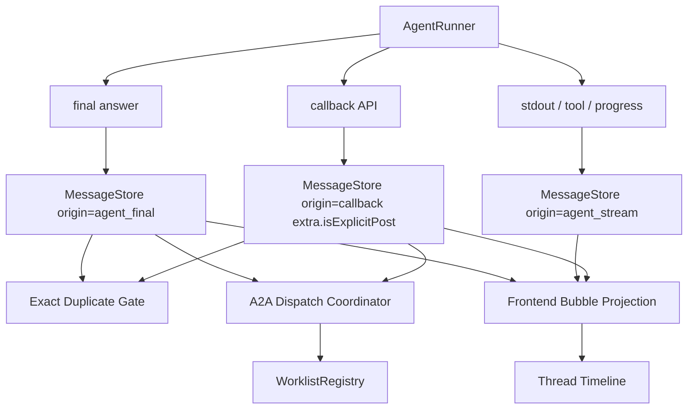

# Phase 6：A2A 通道语义与去重重构

## 背景

Phase 5 已经让 TheTower 具备基础 A2A 治理能力：

- `routeMode` 区分 `single` / `serial` / `fanout` / `parallel`。
- 行首 mention 触发 A2A 路由，inline mention 不路由。
- fanout / parallel 下普通文本 mention 默认不继续扩散。
- callback 支持公开和私密写回。
- `Message.origin` 已区分 `agent_final` / `agent_stream` / `callback` 等来源。

但当前实现仍存在一个关键语义问题：系统在同一 invocation 中看到 callback 后，会把后续不同内容的 agent final 降级成 `agent_stream` 并折叠展示。这会把真实的总结、补充说明、最终结论误判为 CLI output。

Phase 6 的目标是参考 Cat Cafe，把“消息通道语义”和“A2A 调度去重”分层实现，避免再用 UI 折叠规则掩盖后端调度问题。

## Cat Cafe 参考结论

本阶段参考 Cat Cafe / Clowder AI 的实现与 skill 约束。

### 1. 通道语义

Cat Cafe 不使用“同 invocation 有 callback 就隐藏 final”的规则，而是明确区分：

```text
post_message / callback
  Agent 主动公开或定向发言。
  origin = callback

CLI stdout / tool log / work log
  Agent 运行过程输出。
  origin = stream

final answer
  Agent 最终对 thread 的可见回答。
  不天然等于 stream。
```

对应源码参考：

- `/private/tmp/clowder-ai-research/packages/api/src/routes/callbacks.ts`
- `/private/tmp/clowder-ai-research/packages/api/src/domains/cats/services/agents/routing/route-serial.ts`
- `/private/tmp/clowder-ai-research/packages/web/src/stores/bubble-projection.ts`
- `/private/tmp/clowder-ai-research/packages/web/src/stores/chatStore.ts`

### 2. callback 显式发言不合并进 stream

Cat Cafe 显式 `post_message` 会带 `extra.isExplicitPost = true`。前端 dedupe 和 bubble projection 会把它视为独立 speech，不把它合并进 CLI Output。

只有很特殊的 terminal update / stream companion 场景，才会把 stream stdout 和 callback speech 拆成：

```text
speechContent
  主气泡正文。

cliStdout
  CLI Output 内容。
```

### 3. A2A 重复触发在调度层解决

callback 中的 `@mention` 不独立启动第二条路由路径，而是进入统一 worklist / invocation queue。重复目标在调度层 dedupe、coalesce 或 supersede。

这意味着：

- UI 不负责修正重复调度。
- final / callback 内容是否显示，与 A2A 是否重复调度是两个问题。
- 同一 invocation 内 callback 和 final 都提到同一目标时，应由 Worklist / Queue 保证目标只执行一次。

### 4. Skill / Prompt 层边界

Cat Cafe 的 skill 与 prompt 约束明确：

- 普通 `@队友` 优先写在最终回复里。
- 不要为了普通 `@队友` 去调用 `post_message`。
- callback 用于运行中主动发言、跨 thread 通知、任务状态、私密交接等。
- 如果 callback 已经发送了同一条内容，final 不要重复同一条内容。

参考：

- `/private/tmp/clowder-ai-research/cat-cafe-skills/refs/mcp-callbacks.md`
- `/private/tmp/clowder-ai-research/assets/prompt-templates/c1-mcp-callback.md`
- `/private/tmp/clowder-ai-research/assets/prompt-templates/l3-routing-rules.md`
- `/private/tmp/clowder-ai-research/assets/prompt-templates/a2a-ball-check.md`

## TheTower 当前差距

### 后端

当前关键问题集中在 `CommunicationService.postInternalAgentText()`：

```text
已有 callback speech
  内容相同 -> suppress final
  内容不同 -> append agent_stream
```

前半段“内容相同则 suppress”是正确方向；后半段“内容不同则降级为 `agent_stream`”是错误方向。

应改为：

```text
已有 callback speech
  内容相同 -> suppress exact duplicate
  内容不同 -> 继续写入 agent_final
```

真正的 `agent_stream` 应来自 runner 的 stdout / tool / progress channel，而不是 final fallback。

### 前端

当前 UI 直接根据 `origin === "agent_stream"` 折叠为 CLI Output。这个规则本身可以保留，但前提是后端不能错误标记 origin。

Phase 6 后，前端应进一步增加 projection 层：

```text
raw messages
  -> canonical UI bubbles
  -> visible message timeline
```

这样 callback、final、stream 的显示规则集中在一个纯函数里，避免散落在组件中。

### 数据模型

当前 `Message` 没有 `extra` 元数据，无法表达：

- 这是显式 callback 发言。
- 这是 stream companion。
- callback speech 和 stream stdout 的关联关系。

Phase 6 应补充轻量扩展点。

## 目标架构



核心原则：

1. `callback` 是 Agent 主动发言。
2. `agent_final` 是 Agent 最终可见回答。
3. `agent_stream` 只表示真实运行过程输出。
4. exact duplicate 在消息写入前或写入时 suppress。
5. A2A 重复触发在 dispatch / worklist 层解决。
6. 前端只做投影和展示，不承担调度纠错。

## 分阶段开发任务

### 6.1 回收错误降级规则

目标：先修复当前误折叠问题，保持行为最小变更。

任务：

- 修改 `CommunicationService.postInternalAgentText()`。
- 保留 callback 与 final 完全相同内容的 suppress。
- 删除“已有 callback 且内容不同则 append `agent_stream`”逻辑。
- 不同内容继续写入 `origin: "agent_final"`。
- 删除或废弃 `appendAgentStreamMessage()` 中由 final fallback 调用的路径。

验收：

- callback 与 final 内容相同，只保留 callback。
- callback 与 final 内容不同，两条消息都显示。
- final 中的行首 mention 仍按当前 `routeMode` 规则参与 A2A 路由。
- 最后总结不会被 CLI Output 折叠。

建议测试：

- `agent final is suppressed when callback already posted the same speech`
- `agent final remains visible when callback content differs`
- `different final after callback can still route line-start mention when routeMode allows`

### 6.2 增加 callback exact duplicate gate

目标：将 callback 自身重复提交也纳入内容级去重，避免网络重试或并发重复写入。

任务：

- 在 `MessageStore` 或 `CommunicationService.postAgentMessage()` 增加 callback exact duplicate 查询。
- 匹配维度建议：
  - `threadId`
  - `invocationId`
  - `senderId`
  - normalized `content`
  - `mentions`
  - `visibility`
  - `replyTo`
- 短窗口内命中时返回已有 message id，不重复 append。

验收：

- 同一 callback 请求重试不会生成两条相同消息。
- 内容不同的 callback 不被误删。
- private callback 的 visible targets 不同，不互相 dedupe。

### 6.3 引入 Message extra 元数据

目标：为后续 projection 和 stream/callback 关联提供稳定语义。

建议类型：

```ts
export interface MessageExtra {
  isExplicitPost?: boolean;
  stream?: {
    invocationId?: string;
    cliStdout?: string;
    speechContent?: string;
  };
}
```

任务：

- 扩展 shared `Message` 类型。
- 扩展 DB schema：新增 `extra_json`。
- `MessageStore` round-trip `extra`。
- callback 写入时设置 `extra.isExplicitPost = true`。
- 保持旧消息兼容：`extra` 可为空。

验收：

- callback API 写入消息包含 `extra.isExplicitPost`。
- 旧数据读取不报错。
- SDK 类型暴露新字段。

### 6.4 A2A Dispatch Coordinator

目标：将 final / callback 的 mention 路由统一进入调度层，并在此处去重。

当前已有 `WorklistRegistry.push()`，可先在它之上补强，不必一次性引入完整 InvocationQueue。

任务：

- 明确 `push()` 的幂等契约：
  - pending 中已有目标，不重复 push。
  - current agent 不 push 自己。
  - fanout / parallel 普通文本 mention 默认不路由。
  - 结构化 `targetAgents` 仍可路由。
- 增加 trigger provenance：
  - `triggerMessageId`
  - `callerAgentId`
  - `sourceOrigin`
- 对同一 invocation、同一 caller、同一 target 的重复触发返回 `duplicate`，但不影响消息正常显示。

验收：

- callback `@ada` 后 final 再 `@ada`，Ada 只执行一次。
- callback `@ada` 后 final `@ikora`，Ada 和 Ikora 都执行。
- fanout 中已在 worklist 的 agent 不被再次加入。
- duplicate routing 不导致消息隐藏。

### 6.5 真实 stream 通道

目标：让 `agent_stream` 只来自真实运行过程输出。

任务：

- 梳理 runner event 类型：
  - final text
  - stdout / stderr
  - tool_call
  - progress / debug
  - done
- 只有 stdout / stderr / tool progress 写入 `origin: "agent_stream"`。
- final text 永远优先写入 `origin: "agent_final"`，除非 exact duplicate 被 suppress。
- 如果当前 runner 暂时只能产出 final text，则不要生成 `agent_stream`。

验收：

- 无真实 stream 事件时，thread 不出现伪造 `agent_stream`。
- 有真实 stream 事件时，UI 显示 CLI Output。
- play 模式下其他 Agent 的 stream 仍按 `VisibilityPolicy` 隐藏。

### 6.6 前端 canonical bubble projection

目标：集中处理 callback / stream / final 的 UI 显示规则。

任务：

- 新增纯函数，例如 `projectMessagesToBubbles(messages)`。
- 规则：
  - `callback + extra.isExplicitPost` 独立气泡。
  - `agent_final` 正常气泡。
  - `agent_stream` 进入 CLI Output。
  - exact duplicate 不重复展示。
  - 未来如出现 stream/callback companion，可用 `extra.stream.cliStdout` 和 `speechContent` 分离显示。
- `MessageBubble` 只消费 projection 后的 UI model。

验收：

- callback speech 不被合并成 CLI Output。
- final summary 不被折叠。
- stream stdout 折叠到 CLI Output。
- debug footer 仍能显示原始 origin / visibility / mentions。

### 6.7 Skill / Prompt 对齐

目标：把 Cat Cafe 的通道边界沉淀为 TheTower 自己的协作规则。

任务：

- 更新 Codex / Claude prompt：
  - 普通 `@队友` 优先最终文本行首 @。
  - 不要为了普通 @ 调 callback。
  - callback 用于运行中主动发言、阶段性汇报、私密交接、需要继续执行前触发另一个 Agent。
  - 已 callback 发送同一内容时，final 不要重复。
- 将这些规则沉淀为 TheTower skill 或 docs 中的协作协议。
- 确保 prompt 示例不鼓励手写底层 HTTP，后续优先使用 SDK / MCP 工具。

验收：

- runner prompt 测试覆盖上述规则。
- Agent 不会被提示去用 callback 发送普通 @。
- callback 的使用场景更明确。

## 端到端验收矩阵

| 场景 | 输入 | 期望 |
|------|------|------|
| exact duplicate | callback 写“收到”，final 也输出“收到” | 只保留一条 callback |
| different final | callback 发“我先通知 Ada”，final 输出“总结如下...” | 两条都正常显示，final 不折叠 |
| duplicate route | callback `@ada`，final 再 `@ada` | Ada 只执行一次 |
| split route | callback `@ada`，final `@ikora` | Ada 和 Ikora 都执行 |
| fanout guard | fanout worklist 已含 Ada，某 agent final `@ada` | 不重复加入 Ada |
| structured route | fanout callback 带 `targetAgents: ["ada"]` | Ada 被路由 |
| stream display | runner stdout 产生 `agent_stream` | UI CLI Output 折叠显示 |
| final display | runner final 产生 `agent_final` | UI 主气泡正常显示 |
| private callback | private callback target Ada | 只有 Ada 和发送者在 agent context 可见，用户可审计 |

## 不做范围

Phase 6 不一次性引入 Cat Cafe 完整 InvocationQueue，也不实现跨 thread proposal / report-back。

暂不做：

- 多 thread 编排。
- QueueProcessor 自动抢占 / supersede 完整语义。
- rich block projection。
- 长期 memory / evidence callback。
- 生产级 Redis 原子去重。

这些能力可以在 Phase 7 之后单独设计。

## 完成标准

Phase 6 完成后，TheTower 应满足：

- callback 和 final 的显示语义正确分离。
- 不同内容的 final 不再因为 callback companion 被折叠。
- 完全相同的 callback/final 不重复显示。
- A2A 重复触发由 Worklist / Dispatch 层去重。
- `agent_stream` 只表示真实运行过程输出。
- 前端有集中 projection 层，不再把通道推断散落在组件里。
- prompt / skill 明确约束普通 @ 与 callback 的使用边界。
